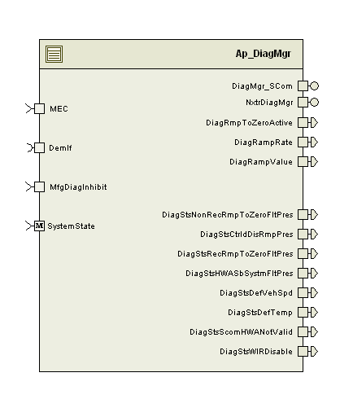

> **Converted document.** Source: `DiagMgr/doc/Diagnostics_Manager_MDD.docx` (Word .docx, converted automatically; formatting, tables and figures preserved as Markdown — consult the original for normative layout).

## Module --

## High-Level Description

Handle internal Nexteer Trouble Codes (NTCs) and update the Diagnostic Event Manager (DEM) via a client call to the DEM Interface module which handles the customer specific DTC setting requirements (e.g. DTC masking).

## Figures

### Component Diagram

## Variable Data Dictionary

| Module Inputs | Module Outputs | Module Outputs |
| --- | --- | --- |
| MEC_Cnt_enum | MEC_Cnt_enum | DiagRmpToZeroActive_Cnt_lgc |
| MfgDiagInhibit_Cnt_lgc | MfgDiagInhibit_Cnt_lgc | DiagStsDefTemp_Cnt_lgc |
|  |  | DiagStsHWASbSystmFltPres_Cnt_lgc |
|  |  | DiagStsCtrldDisRmpPres_Cnt_lgc |
|  |  | DiagStsDefVehSpd_Cnt_lgc |
|  |  | DiagRampRate_XpmS_f32 |
|  |  | DiagRampValue_Uls_f32 |
|  |  | DiagStsDefHWAScomExpVal_Cnt_lgc |
|  |  | DiagStsWIRDisable_Cnt_lgc |
|  |  | DiagStsNonRecRmpToZeroFltPres_Cnt_lgc |
|  |  | DiagStsRecRmpToZeroFltPres_Cnt_lgc |

### Module Internal Variables

| Variable Name |  | Resolution | Legal Range | Legal Range | Software Segment |
| --- | --- | --- | --- | --- | --- |
| NTCInfo_Cnt_M_str[512] |  | N/A |  |  | DIAGMGR_START_SEC_VAR_CLEARED_UNSPECIFIED |
| RspWhenProcessing_Cnt_M_b32 |  | 1 | FULL | FULL | DIAGMGR_START_SEC_VAR_CLEARED_32 |
| RampDownWhenProcessing_Cnt_M_lgc |  | N/A | FALSE | TRUE | DIAGMGR_START_SEC_VAR_CLEARED_UNSPECIFIED |
| ActiveRmpRate_UlspmS_M_f32 |  | Single precision float | 0.0001 | 0.5 | DIAGMGR_START_SEC_VAR_CLEARED_32 |
| DiagStatus_Cnt_D_b16 |  | 1 | FULL | FULL | DIAGMGR_START_SEC_VAR_CLEARED_16 |

#### User defined typedef definition/declaration

| Typedef Name | Element Name | User Defined Type | Legal Range | Legal Range |
| --- | --- | --- | --- | --- |
| typedef struct { } NTCInfo_Str | Param | uint8 | 0 | 255 |
| typedef struct { } NTCInfo_Str | Status | uint8 | 0 | 255 |
| typedef struct { } FltRsp_Str | Response | uint32 : 24 | FULL | FULL |
| typedef struct { } FltRsp_Str | DEMEventID | uint32 : 8 | 0 | 255 |

## Constant Data Dictionary

### Calibration Constants

| Constant Name |
| --- |
| k_FltRspTbl_Cnt_str[] |
| k_FltRmpRate_UlspmS_f32[] |

### Program(fixed) Constants

#### Embedded Constants

##### Local

| Constant Name | Resolution | Units | Value |
| --- | --- | --- | --- |
| D_FLTRSPNTCACTIVEBIT_CNT_B32 | N/A | Counts | 0x00800000 |
| D_FLTRSPRECOVERABLEBIT_CNT_B32 | N/A | Counts | 0x00400000 |
| D_FLTRSPHWASBSYSTMFLTBIT_CNT_B32 | N/A | Counts | 0x00200000 |
| D_FLTRSPDEFVEHSPDBIT_CNT_B32 | N/A | Counts | 0x00100000 |
| D_FLTRSPDEFTEMPBIT_CNT_B32 | N/A | Counts | 0x00080000 |
| D_FLTRSPSCOMHWANOTVALIDBIT_CNT_B32 | N/A | Counts | 0x00040000 |
| D_FLTRSPWIRDISABLEBIT_CNT_B32 | N/A | Counts | 0x00008000 |
| D_FLTRSPNTCINHIBITRUNBIT_CNT_B32 | N/A | Counts | 0x00000040 |
| D_FLTRSPNTCINHIBITNOTOPERATEBIT_CNT_B32 | N/A | Counts | 0x00000020 |
| D_FLTRSPRAMPBITS_CNT_B32 | N/A | Counts | 0x0000000F |
| D_TESTFAILEDBIT_CNT_B8 | N/A | Counts | 0x01 |
| D_TESTFAILEDTHISOPCYCLEBIT_CNT_B8 | N/A | Counts | 0x02 |
| D_PENDINGDTCBIT_CNT_B8 | N/A | Counts | 0x04 |
| D_CONFIRMEDDTCBIT_CNT_B8 | N/A | Counts | 0x08 |
| D_TESTNOTCOMPLETESINCELASTCLEARBIT_CNT_B8 | N/A | Counts | 0x10 |
| D_TESTFAILEDSINCELASTCLEARBIT_CNT_B8 | N/A | Counts | 0x20 |
| D_TESTNOTCOMPLETETHISOPCYCLEBIT_CNT_B8 | N/A | Counts | 0x40 |
| D_WARNINGINDICATORBIT_CNT_B8 | N/A | Counts | 0x80 |
| D_RAMPNONE_CNT_U8 | 1 | Counts | 0x0F |
| D_RAMPF2_CNT_U8 | 1 | Counts | 0x0E |
| D_RAMPF1_CNT_U8 | 1 | Counts | 0x0D |
| D_EVTFAILBITS_CNT_B8 | N/A | Counts | D_TESTFAILEDBIT_CNT_B8 \| D_TESTFAILEDTHISOPCYCLEBIT_CNT_B8 \| D_CONFIRMEDDTCBIT_CNT_B8 |
| D_EVTPASSBITS_CNT_B8 | N/A | Counts | D_TESTFAILEDBIT_CNT_B8 \| D_TESTNOTCOMPLETETHISOPCYCLEBIT_CNT_B8 |
| D_RAMP0PCT_ULS_F32 | N/A | Counts | 0.0 |
| D_IGNOREBITSFORSTORAGE_CNT_B8 | N/A | Counts | D_TESTNOTCOMPLETETHISOPCYCLEBIT_CNT_B8 |
| D_DIAGRMPRTLOLMT_ULSPMS_F32 | Single precision float | Uls/mS | 0.0001 |
| D_DIAGRMPRTHILMT_ULSPMS_F32 | Single precision float | Uls/mS | 0.5 |
| D_DIAGSTSNONRECRMPTOZEROBIT_CNT_B16 | N/A | Counts | 0x0001 |
| D_DIAGSTSCTRLDDISRMPBIT_CNT_B16 | N/A | Counts | 0x0002 |
| D_DIAGSTSRECRMPTOZEROBIT_CNT_B16 | N/A | Counts | 0x0004 |
| D_DIAGSTSHWASBSYSTMFLTBIT_CNT_B16 | N/A | Counts | 0x0008 |
| D_DIAGSTSDEFVEHSPDBIT_CNT_B16 | N/A | Counts | 0x0010 |
| D_DIAGSTSDEFTEMPBIT_CNT_B16 | N/A | Counts | 0x0020 |
| D_DIAGSTSSCOMHWANOTVALIDBIT_CNT | N/A | Counts | 0x0040 |
| D_DIAGSTSWIRDISABLEBIT_CNT_B16 | N/A | Counts | 0x0080 |

##### Global

| Constant Name |
| --- |
| <None> |

#### Module specific Lookup Tables Constants

| Constant Name | Resolution | Value | Software Segment |
| --- | --- | --- | --- |

## Functions/Macros used by the Sub-Modules

### Library Functions / Macros

The library and functions / Macros that are called by the various sub modules are identified below,

1. TableSize_m()
### Data Hiding Functions

1. <None>
### Global Functions/Macros Defined by this Module

#### Retrieve NTC Failure State

| **Function Name** | NxtrDiagMgr_GetNTCFailed | Type | Min | Max |
| --- | --- | --- | --- | --- |
| **Arguments Passed ** | NTC | NTCNumber | 0 | 511 |
|  | EventFailed | Boolean pointer | FULL | FULL |
| **Return Value** | (anonymous) | Std_ReturnType | RTE_E_OK | RTE_E_OK |

##### Description

#### Retrieve NTC Status

| **Function Name** | NxtrDiagMgr_GetNTCStatus | Type | Min | Max |
| --- | --- | --- | --- | --- |
| **Arguments Passed ** | NTC | NTCNumber | 0 | 511 |
|  | Status | uint8 pointer | FULL | FULL |
| **Return Value** | (anonymous) | Std_ReturnType | RTE_E_OK | RTE_E_OK |

##### Description

#### Reset Event Status

| **Function Name** | NxtrDiagMgr_ResetEventStatus | Type | Min | Max |
| --- | --- | --- | --- | --- |
| **Arguments Passed ** | None |  |  |  |
| **Return Value** | (anonymous) | Std_ReturnType | RTE_E_OK | RTE_E_OK |

##### Description

#### Set Status

| **Function Name** | NxtrDiagMgr_SetNTCStatus | Type | Min | Max |
| --- | --- | --- | --- | --- |
| **Arguments Passed** | NTC | NTCNumber | 0 | 511 |
|  | Param | UInt8 | 0 | 255 |
|  | Status | NxtrDiagMgrStatus | NTC_STATUS_PASSED | NTC_STATUS_PASSED |
| **Return Value** | (anonymous) | Std_ReturnType | RTE_E_OK | RTE_E_OK |

##### Description

#### Set Operation State

| **Function Name** | NxtrDiagMgr_SetOperationCycleState | Type | Min | Max |
| --- | --- | --- | --- | --- |
| **Arguments Passed ** | OperationCycle | NxtrOpCycle | FULL | FULL |
|  | CycleState | NxtrOpCycleState | FULL | FULL |
| **Return Value** | (anonymous) | Std_ReturnType | Std_ReturnType | Std_ReturnType |

##### Description

| **Function Name** |  | Type | Min | Max |
| --- | --- | --- | --- | --- |
| **Arguments Passed ** |  |  |  |  |
| **Return Value** |  |  |  |  |

##### Description

### Local Functions/Macros Used by this MDD only

#### Set Bits

| **Function Name** | SetBits_u8 | Type | Min | Max |
| --- | --- | --- | --- | --- |
| **Arguments Passed ** | Data | const uint8 pointer | 0 | 255 |
|  | BitMask | uint8 | 0 | 255 |
| **Return Value** | N/A |  |  |  |

##### Description

*Data |= BitMask

#### Clear Bits

| **Function Name** | ClrBits_u8 | Type | Min | Max |
| --- | --- | --- | --- | --- |
| **Arguments Passed ** | Data | const uint8 pointer | 0 | 255 |
|  | BitMask | uint8 | 0 | 255 |
| **Return Value** | N/A |  |  |  |

##### Description

*Data &= ~BitMask

#### Read Bit

| **Function Name** | ReadBit_u8 | Type | Min | Max |
| --- | --- | --- | --- | --- |
| **Arguments Passed ** | Data | uint8 | 0 | 255 |
|  | BitMask | uint8 | 0 | 255 |
| **Return Value** | (anonymous) | boolean | FULL | FULL |

##### Description

IF 0 = (Data & BitMask) THEN

return FALSE

ELSE

return TRUE

ENDIF

#### Set Bits

| **Function Name** | SetBits_u16 | Type | Min | Max |
| --- | --- | --- | --- | --- |
| **Arguments Passed ** | Data | const uint16 pointer | FULL | FULL |
|  | BitMask | uint16 | FULL | FULL |
| **Return Value** | N/A |  |  |  |

##### Description

*Data |= BitMask

#### Clear Bits

| **Function Name** | ClrBits_u16 | Type | Min | Max |
| --- | --- | --- | --- | --- |
| **Arguments Passed ** | Data | const uint16 pointer | FULL | FULL |
|  | BitMask | uint16 | FULL | FULL |
| **Return Value** | N/A |  |  |  |

##### Description

*Data &= ~BitMask

#### Read Bit

| **Function Name** | ReadBit_u32 | Type | Min | Max |
| --- | --- | --- | --- | --- |
| **Arguments Passed ** | Data | uint32 | 0x000000 | 0xFFFFFF |
|  | BitMask | uint32 | 0x000000 | 0xFFFFFF |
| **Return Value** | (anonymous) | boolean | FULL | FULL |

##### Description

IF 0 = (Data & BitMask) THEN

return FALSE

ELSE

return TRUE

ENDIF

#### Construct the Storage Array

| **Function Name** | CreateStorageArray | Type | Min | Max |
| --- | --- | --- | --- | --- |
| **Arguments Passed ** | OutputStrgPtr | const NTCStrgArray pointer | FULL | FULL |
| **Return Value** | N/A |  |  |  |

##### Description

#### Local Function #n

| **Function Name** | (Exact name used) | Type | Min | Max |
| --- | --- | --- | --- | --- |
| **Arguments Passed ** | (if none, write None) |  |  |  |
|  | (Insert more rows for additional passed arguments) |  |  |  |
| **Return Value** | (if no value returned, write N/A) |  |  |  |

##### Description

(Place flowchart/design for local function)

## Software Module Implementation

### Runtime Environment (RTE) Initial Values

| Data | Value |
| --- | --- |
| DiagRmpToZeroActive_Cnt_lgc | FALSE |
| DiagStsDefTemp_Cnt_lgc | FALSE |
| DiagStsHWASbSystmFltPres_Cnt_lgc | FALSE |
| DiagStsCtrldDisRmpPres_Cnt_lgc | FALSE |
| DiagStsDefVehSpd_Cnt_lgc | FALSE |
| DiagRampRate_XpmS_f32 | 0 |
| DiagRampValue_Uls_f32 | 0 |
| DiagStsNonRecRmpToZeroFltPres_Cnt_lgc | FALSE |
| DiagStsRecRmpToZeroFltPres_Cnt_lgc | FALSE |
| DiagStsScomHWANotValid_Cnt_lgc | FALSE |
| DiagStsWIRDisable_Cnt_lgc | FALSE |
| MEC_Cnt_enum | ProductionMode |
| MfgDiagInhibit_Cnt_lgc | FALSE |

### Initialization Functions

#### Init: _Init1

##### Design Rationale

None

##### Module Internals and Outputs

### Periodic Functions

#### Per: _Per1

##### Design Rationale

In this periodic information is collected about all NTCs mapped to given a DTC and the combined information is used to determine whether to update the DTC’s status information:

- DTCs are updated to FAILED if any associated NTC is currently failed regardless of whether all NTCs have been tested.
- DTCs are updated to PASSED if all associated NTCs have been tested and have passed; if any associated NTC has not been tested, the status of the DTC is not updated to PASSED.
- DTCs are not updated to FAILED if an applicable mask is active.
##### Program Flow Start

N/A

##### Store Module Inputs to Local copies

##### Set Appropriate Bits

##### Store Local copy of outputs into Module Outputs

None

##### Program Flow End

N/A

#### Per: _Trns1

##### Design Rationale

None

##### Program Flow Start

N/A

##### Store Module Inputs to Local copies

None

##### Construct the Storage Array

CreateStorageArray(Rte_Pim_NTCStrgArray())

Rte_Call_NTCStrgArray_SetRamBlockStatus(TRUE)

##### Store Local copy of outputs into Module Outputs

None

##### Program Flow End

N/A

#### Per: _Trns2

##### Design Rationale

##### Program Flow Start

N/A

##### Store Module Inputs to Local copies

None

##### Restart the DEM Operation Cycle

##### Store Local copy of outputs into Module Outputs

None

##### Program Flow End

N/A

### Fault Recovery Functions

None

### Shutdown Functions

None

### Interrupt Functions

None

### Fault Recovery Functions

None

### Shutdown Functions

None

### Interrupt Functions

None

### Serial Communication Functions

#### SComm: DiagMgr_SCom_ReadStrgArray

|  |  | Type | Min | Max |
| --- | --- | --- | --- | --- |
| **Arguments Passed ** | NTCStrgArrayPtr | NTCStrgArray pointer | FULL | FULL |
| **Return Value** | N/A |  |  |  |

##### Design Rationale

None

##### Program Flow Start

N/A

##### Store Module Inputs to Local copies

None

##### Construct the Storage Array

CreateStorageArray(NTCStrgArrayPtr)

##### Store Local copy of outputs into Module Outputs

None

##### Program Flow End

N/A

#### SComm: DiagMgr_SCom_GetNTCParamByte

|  |  | Type | Min | Max |
| --- | --- | --- | --- | --- |
| **Arguments Passed ** | NTC | NTCNumber | 0 | 511 |
|  | NTCParamByte | uint8 pointer | FULL | FULL |
| **Return Value** | N/A |  |  |  |

##### Design Rationale

None

##### Program Flow Start

N/A

##### Store Module Inputs to Local copies

None

##### Construct the Storage Array

*NTCParamByte = NTCInfo_Cnt_M_str[NTC].Param

##### Store Local copy of outputs into Module Outputs

None

##### Program Flow End

N/A

## Execution Requirements

### Execution Sequence of the Module

DiagMgr_Trns1 should run prior to the NVMWriteAll function call that occurs during the shutdown process.

### Execution Rates for sub-modules called by the Scheduler

This table serves as reference for the Scheduler design

| Function Name | Calling Frequency | System State(s) in which the function is called |
| --- | --- | --- |
| _Init1 | Once | COLD_INIT |
| _Per1 | 10 ms | ALL |
| _Trns1 | Triggered | On OFF mode entry |
| _Trns2 | Triggered | On OFF mode exit |

### Execution Requirements for Serial Communication Functions

| Function Name | Sub-Module called by (Serial Comm Function Name) |
| --- | --- |
| DiagMgr_SCom_ReadStrgArray | EPS_DiagSrvcs |
| DiagMgr_SCom_GetNTCParamByte | EPS_DiagSrvcs |

## Memory Map Definition Requirements

### Sub Modules (Functions)

This table identifies the software segments for functions identified in this module.

| Name of Sub Module | Software Segment |
| --- | --- |
| _Init1 |  |
| _Per1 |  |
| _Trns1 |  |
| _Trns2 |  |

### Global and Local Functions

This table identifies the software segments for local functions identified in this module.

| Name of Sub Module | Software Segment |
| --- | --- |
| NxtrDiagMgr_GetNTCFailed |  |
| NxtrDiagMgr_GetNTCStatus |  |
| NxtrDiagMgr_ResetEventStatus |  |
| NxtrDiagMgr_SetNTCStatus |  |
| NxtrDiagMgr_SetOperationCycleState |  |
| SetBits_u8 |  |
| ClrBits_u8 |  |
| ReadBit_u8 |  |
| SetBits_u16 |  |
| ClrBits_u16 |  |
| ReadBit_u32 |  |
| CreateStorageArray |  |

## Known Issues / Limitations With Design

1. (Item #1)
## Revision Control Log

| **Rev #** | **Change Description** | **Date ** | **Author Initials** |
| --- | --- | --- | --- |
| 1 | Initial MDD version | 30-Mar-11 | LW |
| 3 | Corrected typo in local function CreateStorageArray. | 04-Apr-11 | YY |
| 4 | Ensure that test-complete bit is accommodated. | 05-Apr-11 | YY |
| 5 | Correct strategy for selecting DTCs to retain in storage-array. | 05-Apr-11 | YY |
| 6 | States and Modes based changes for combining F1 and F2 outputs. | 11-Apr-11 | LWW |
| 7 | Removed Fault masking and replaced Dem direct Event Status access with DemIf Event Status call. | 7-Jun-11 | JJW |
| 8 | Updated for anomaly 3258. Removed unused local functions. | 17-Jun-11 | LWW |
| 9 | Added _Trns2 to restart DEM operation cycle on OFF mode exit (anomaly 2342)                                                                              CR#4270 | 17-Jun-11 | BDO |
| 10 | Initial component implementation | 13-Jan-12 | LWW |
| 11 | Changed NTCInfo_T to NTCInfo_Str for Data Dictionary compatibility | 27-Jan-12 | OT |
| 15 | Updates to support bit 5, 6 from DTC outline Structure Version 2. Changed the version to 15 to align with the version in synergy | 17-Apr-12 | VK |
| 16 | Updates to mask all faults when in OFF state | 22-Apr-12 | VK |
| 17 | Updates to inihibit warminit bit in all states except operate | 01-May-12 | VK |
| 18 | Anomaly 3313 (MaxRampRate overindexing) | 22-May-12 | OT |
| 19 | Update for new fault response bits | 20-Jun-12 | LWW |
