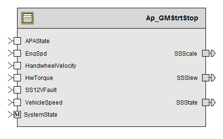

> **Converted document.** Source: `GMStrtStop/doc/GMStrtStop_MDD.docx` (Word .docx, converted automatically; formatting, tables and figures preserved as Markdown — consult the original for normative layout).

**For**

**GMStrtStop**

**9****, 2016**

**Prepared For:**

**Software Engineering**

**Nexteer Automotive****,**

**Saginaw, MI, USA**

**Prepared By: **

**Krishna Anne****,**

**Nexteer Automotive****,**

**Saginaw, MI, USA****Change**** History**

| **Description** | **Author** | **Version** | **Date** |
| --- | --- | --- | --- |
| Initial Version | Jared W Julien | 1.0 | 05/08/2014 |
| Updated sections 2, 2.1.1, 4.2, 6.1.1.3, 6.1.4 and 8.1 according to Unit Test Findings. | KPIT-SSK | 2.0 | 05/22/2014 |
| Updated to V002 of FDD | Krishna Anne | 3.0 | 05/20/2016 |
| Updated to V002 of FDD | Krishna Anne | 4.0 | 06/03/2016 |
| Range corrections done after UT | Krishna Anne | 5.0 | 07/19/2016 |

Table of Contents

## Introduction

### Purpose

MDD for GMStrtStop (CF12A).

## GMStrtStop & High-Level Description

Please refer the FDD.

## Design details of software module

Please refer the FDD.

### Graphical representation of <MDD Name>

### Data Flow Diagram

Please refer the FDD.

### Variable Data Dictionary

Please refer the FDD.

### Constant Data Dictionary

Please refer the FDD.

### Software Module Implementation

Please refer the FDD.

#### Module Internal (Local) Functions

##### Local Function #1

| **Function Name** | SlewRateCalc | Type | Min | Max |
| --- | --- | --- | --- | --- |
| **Arguments Passed ** | NA | NA | NA | NA |
| **Return Value** | SSSlewRate_UlspS_T_f32 | Float32 | 0.1 | 500.0 |

##### **Design Rationale**

##### This function corresponds to SlewRate block in FDD and is split from Per1 to handle the cyclomatic complexity and path count.

##### **Processing**

Please refer the below path in the Simulink model of FDD.

*CF12A_GMSS_v002/GMSS/GMSSPer1/**SlewRate*

##### Local Function #2

| **Function Name** | PreviousStCalc | Type | Min | Max |
| --- | --- | --- | --- | --- |
| **Arguments Passed ** | NA | NA | NA | NA |
| **Return Value** | NA | NA | NA | NA |

##### **Design Rationale**

##### This function corresponds to PreviousSt block in FDD and is split from Per1 to handle the cyclomatic complexity and path count.

##### **Processing**

Please refer the below path in the Simulink model of FDD.

*CF12A_GMSS_v002/GMSS/GMSSPer1/**PreviousSt*

## Known Limitations with Design

.

## UNIT TEST CONSIDERATION

None.

##### Abbreviations and Acronyms

| **Abbreviation**** or Acronym** | **Description** |
| --- | --- |

##### Glossary

**Note**: Terms and definitions from the source “Nexteer Automotive” take precedence over all other definitions of the same term.  Terms and definitions from the source “Nexteer Automotive” are formulated from multiple sources, including the following:

- ISO 9000
- ISO/IEC 12207
- ISO/IEC 15504
- Automotive SPICE® Process Reference Model (PRM)
- Automotive SPICE® Process Assessment Model (PAM)
- ISO/IEC 15288
- ISO 26262
- IEEE Standards
- SWEBOK
- PMBOK
- Existing Nexteer Automotive documentation
| **Term** | **Definition** | **Source** |
| --- | --- | --- |
| MDD | Module Design Document |  |
| DFD | Data Flow Diagram |  |

##### References

| **Ref. #** | **Title** | **Version** |
| --- | --- | --- |
| 1 | AUTOSAR Specification of Memory Mapping (Link:) | v1.3.0 R4.0 Rev 2 |
| 2 | MDD Guideline | EA3 01.04.00 |
| 3 |  | 1.0 |
| 4 | Software Design and Coding Standards.doc | 2.1 |
| 5 | CF012A_GMStrtStop_Design_2.1.0(FDD) | 2.1.0 |
