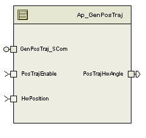

> **Converted document.** Source: `GenPosTraj/doc/GenPosTraj_MDD.docx` (Word .docx, converted automatically; formatting, tables and figures preserved as Markdown — consult the original for normative layout).

## Module  -- Generate Position Trajectory

## High-Level Description

Generate a position vs. time command from the current hand wheel position to a specified angle that does not exceed a specified maximum angular acceleration and velocity.  Figure 1 illustrates an example of the output of this function.

> **Figure not rendered:** `GenPosTraj_MDD-fig5.emf` is a Windows vector image (EMF/WMF) embedded in the original Word document and cannot be displayed in a browser. See the source `.docx` file for the diagram.

## Figures

### Diagram – Function Data Sharing

This diagram shows all data that is shared between functions within the module.

#### Diagram – Function (Name)

This diagram describes the functional characteristics and data flow of a given function.

### Variable Data Dictionary

| Module Inputs | Module Outputs | Module Outputs |
| --- | --- | --- |
| HwPosition_HwDeg_f32 | HwPosition_HwDeg_f32 | PosTrajHwAngle_HwDeg_f32 |
| PosTrajEnable_Cnt_lgc | PosTrajEnable_Cnt_lgc |  |

### Module Internal Variables

| Variable Name | Resolution | Legal Range | Legal Range | Software Segment |
| --- | --- | --- | --- | --- |
| TargetAngle_HwDeg_M_f32 | Single Precision Floating Point |  |  | GENPOSTRAJ_START_SEC_VAR_CLEARED_32 |
| TargetVelocity_HwDegpSec_M_f32 | Single Precision Floating Point |  |  | GENPOSTRAJ_START_SEC_VAR_CLEARED_32 |
| TargetAcceleration_HwDegpSecSqr_M_f32 | Single Precision Floating Point |  |  | GENPOSTRAJ_START_SEC_VAR_CLEARED_32 |
| TargetAngleInitial_HwDeg_M_f32 | Single Precision Floating Point |  |  | GENPOSTRAJ_START_SEC_VAR_CLEARED_32 |
| TargetVelocityInitial_HwDegpSec_M_f32 | Single Precision Floating Point |  |  | GENPOSTRAJ_START_SEC_VAR_CLEARED_32 |
| TargetAccelerationInitial_HwDegpSecSqr_M_f32 | Single Precision Floating Point |  |  | GENPOSTRAJ_START_SEC_VAR_CLEARED_32 |
| HwPosInitial_HwDeg_M_f32 | Single Precision Floating Point |  |  | GENPOSTRAJ_START_SEC_VAR_CLEARED_32 |
| CalculateFlag_Cnt_M_lgc | n/a |  |  | GENPOSTRAJ_START_SEC_VAR_CLEARED_ UNSPECIFIED |
| HwAngleOffsetIn_HwDeg_M_f32 | Single Precision Floating Point | 1440.11 | 1440.11 | GENPOSTRAJ_START_SEC_VAR_CLEARED_32 |
| StateTime_Sec_M_f32 | Single Precision Floating Point |  |  | GENPOSTRAJ_START_SEC_VAR_CLEARED_32 |

#### User defined typedef definition/declaration

| Typedef Name | Element Name | User Defined Type | Legal Range | Legal Range |
| --- | --- | --- | --- | --- |
| CmdState_Cnt_M_Enum | WAITING_STATE = 0            ACCELERATION_STATE = 1          CONSTANT_VEL_STATE = 2            DECELERATION_STATE = 3 | CMDSTATE_Enum | n/a | n/a |

## Constant Data Dictionary

### Calibration Constants

| Constant Name |
| --- |
| k_PosTrajMaxAngle_HwDeg_f32 |
| k_PosTrajMaxVelocity_HwDegpSec_f32 |
| k_PosTrajMaxAccel_HwDegpSecSqr_f32 |

### Program(fixed) Constants

#### Embedded Constants

##### Local

| Constant Name | Resolution | Units | Value |
| --- | --- | --- | --- |
| D_MINTRGTACCEL_HWDEGPSECSQR_F32 | Single Precision Floating Point | HWDEGPSECSQR | 0.1 |

##### Global

| Constant Name |
| --- |
| D_2MS_SEC_F32 |
| D_ZERO_ULS_F32 |

#### Module specific Lookup Tables Constants

| Constant Name | Resolution | Value | Software Segment |
| --- | --- | --- | --- |
| None |  |  |  |

## Functions/Macros used by the Sub-Modules

### Library Functions / Macros

The library and functions / Macros that are called by the various sub modules are identified below,

1. Limit_m
2. Abs_f32_m
3. Sign_f32_m
### Data Hiding Functions

1. <None>
### Global Functions/Macros Defined by this Module

#### Global Function #1

| **Function Name** | (Exact name used) | Type | Min | Max |
| --- | --- | --- | --- | --- |
| **Arguments Passed ** | (if none, write None) |  |  |  |
|  | (Insert more rows for additional passed arguments) |  |  |  |
| **Return Value** | (if no value returned, write N/A) |  |  |  |

##### Description

(Place flowchart/design for local function)

### Local Functions/Macros Used by this MDD only

#### Initialize Variables

| **Function Name** | InitializeVariables | Type | Min | Max | UT Tolerance |
| --- | --- | --- | --- | --- | --- |
| **Arguments Passed ** | pHwPosOffset_HwDeg_T_f32 | float32 pointer | -1440.11 | 1440.11 | 4.40E-02 |
|  | pSignDeltaTrgtAngle_Cnt_T_f32 | float32 pointer | -1, 1 | -1, 1 |  |
|  | pDeltaAccel_Sec_T_f32 | float32 pointer | 0.005 | 128 | 5.00E-04 |
|  | pDeltaVelocity_Sec_T_f32 | float32 pointer | 0 |  | 5.00E-04 |
|  | pMaxAccel_HwDegpSecSqr_T_f32 | float32 pointer | 0.1 | 000 | 5.00E-04 |
|  | pMaxVelocity_HwDegpSec_T_f32 | float32 pointer |  |  | 5.00E-04 |
| **Return Value** | N/A |  |  |  |  |

##### Description

#### Generate Signal

| **Function Name** | GenerateSignal | Type | Min | Max | UT Tolerance |
| --- | --- | --- | --- | --- | --- |
| **Arguments Passed ** | HwPosOffset_HwDeg_T_f32 | float32 | -1440.11 | 1440.11 |  |
|  | SignDeltaTrgtAngle_Cnt_T_f32 | float32 | -1, 1 | -1, 1 |  |
|  | DeltaAccel_Sec_T_f32 | float32 | 0.005 | 128 |  |
|  | DeltaVelocity_Sec_T_f32 | float32 |  |  |  |
|  | MaxAccel_HwDegpSecSqr_T_f32 | float32 | 0.1 | 000 |  |
|  | MaxVelocity_HwDegpSec_T_f32 | float32 |  |  |  |
|  | HwPosition_HwDeg_T_f32 | float32 | -1440.11 | 1440.11 |  |
|  | CalculateFlag_Cnt_T_lgc | boolean |  |  |  |
| **Return Value** | HwAngleCmd_HwDeg_T_f32 | float32 | -1440.11 | 1440.11 | 4.40E-02 |

##### Description

## Software Module Implementation

### Runtime Environment (RTE) Initial Values

| Data | Value |
| --- | --- |
| PosTrajEnable_Cnt_lgc | FALSE |
| PosServHwAngle_HwDeg_f32 | 0.0 |
| HwPosition_HwDeg_f32 | 0.0 |

### Initialization Functions

None

### Periodic Functions

#### Per: GenPosTraj_Per1

##### Design Rationale

None

##### Program Flow Start

Rte_Call_GenPosTraj_Per1_CP0_CheckpointReached()

##### Store Module Inputs to Local copies

HwPosition_HwDeg_T_f32 = Rte_IRead_GenPosTraj_Per1_HwPosition_HwDeg_f32()

CalculateFlag_Cnt_T_lgc = Rte_IRead_GenPosTraj_Per1_PosTrajEnable_Cnt_lgc()

##### Capture Inputs

If ((CalculateFlag_Cnt_M_lgc)) AND CalculateFlag_Cnt_T_lgc) Then

HwPosInitial_HwDeg_M_f32 = HwPosition_HwDeg_T_f32

TargetAngleInitial_HwDeg_M_f32 = TargetAngle_HwDeg_M_f32

TargetVelocityInitial_HwDegpSec_M_f32 = TargetVelocity_HwDegpSec_M_f32

TargetAccelerationInitial_HwDegpSecSqr_M_f32 =TargetAcceleration_HwDegpSecSqr_M_f32

End

##### Handle Subfunctions

InitializeVariables(&HwPosOffset_HwDeg_T_f32, &SignDeltaTrgtAngle_Cnt_T_f32, &DeltaAccel_Sec_T_f32, &DeltaVelocity_Sec_T_f32, &MaxAccel_HwDegpSecSqr_T_f32, &MaxVelocity_HwDegpSec_T_f32)

HwAngleCmd_HwDeg_T_f32 = GenerateSignal(HwPosOffset_HwDeg_T_f32, SignDeltaTrgtAngle_Cnt_T_f32, DeltaAccel_Sec_T_f32, DeltaVelocity_Sec_T_f32, MaxAccel_HwDegpSecSqr_T_f32, MaxVelocity_HwDegpSec_T_f32, HwPosition_HwDeg_T_f32, CalculateFlag_Cnt_T_lgc)

##### Store Local copy of outputs into Module Outputs

CalculateFlag_Cnt_M_lgc = CalculateFlag_Cnt_T_lgc

Rte_IWrite_GenPosTraj_Per1_PosTrajHwAngle_HwDeg_f32(HwAngleCmd_HwDeg_T_f32)

##### Program Flow End

Rte_Call_GenPosTraj_Per1_CP1_CheckpointReached()

### Fault Recovery Functions

None

### Shutdown Functions

None

### Interrupt Functions

None

### Serial Communication Functions

#### Scomm: GenPosTraj_Scom_SetInputParam

##### Design Rationale

##### Program Flow Start

N/A

##### Description

##### Store Local copy of outputs into Module Outputs

None

##### Program Flow End

## Execution Requirements

### Execution Sequence of the Module

(Describe in words relevant details about the execution sequence of the different sub modules.)

### Execution Rates for sub-modules called by the Scheduler

| Function Name | Calling Frequency | System State(s) in which the function is called |
| --- | --- | --- |
| GenPosTraj_Per1 | 2 ms | ALL |

### Execution Requirements for Serial Communication Functions

| Function Name | Sub-Module called by (Serial Comm Function Name) |
| --- | --- |
| GenPosTraj_Scom_SetInputParam |  |

## Memory Map Definition Requirements

### Sub Modules (Functions)

| Name of Sub Module | Software Segment |
| --- | --- |
| GenPosTraj_Per1 | RTE_START_SEC_AP_GENPOSTRAJ_APPL_CODE |

### Local Functions

| Name of Sub Module | Software Segment |
| --- | --- |
| InitializeVariables | RTE_START_SEC_AP_GENPOSTRAJ_APPL_CODE |
| GenerateSignal | RTE_START_SEC_AP_GENPOSTRAJ_APPL_CODE |

## Known Issues / Limitations With Design

1. INLINE functions defined in globalmacro.h are not unit tested.
## Revision Control Log

| **Item #** | **Rev #** | **Change Description** | **Date ** | **Author Initials** |
| --- | --- | --- | --- | --- |
| 1 | 1 | Initial version | 13-Feb-12 | VK |
| 2 | 2 | Changes to the math while calculating angle command when in CONSTANT_VEL_STATE and changes to the ranges for the passed arguments | 21-Feb-12 | VK |
