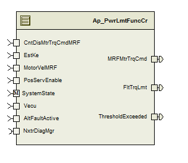
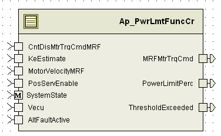

> **Converted document.** Source: `PwrLmtFuncCr/doc/Power_Limit_Function_CM_MDD.docx` (Word .docx, converted automatically; formatting, tables and figures preserved as Markdown — consult the original for normative layout).

## Module –

## High-Level Description

This module determines an appropriate limit for the system motor torque command based on reasonable output power and system temperature.  It also determines to what degree the system command is being limited.

## Figures

### Component Diagram

## Variable Data Dictionary

For details on module input / output variable, refer to the Data Dictionary for the application.  Input / output variable names are listed here for reference.

| Module Inputs | Module Outputs | Module Outputs |
| --- | --- | --- |
| _VpRadpS_f32 | _VpRadpS_f32 | MRFMtrTrqCmd_MtrNm_f32 |
| _MtrRadpS_f32 | _MtrRadpS_f32 | _Uls_f32 |
| PosServEnable_Cnt_lgc | PosServEnable_Cnt_lgc | ThresholdExceeded_Cnt_lgc |
| Vecu_Volt_f32 | Vecu_Volt_f32 |  |
| CntDisMtrTrqCmdMRF_MtrNm_f32 | CntDisMtrTrqCmdMRF_MtrNm_f32 |  |
| AltFaultActive_Cnt_lgc | AltFaultActive_Cnt_lgc |  |

### Module Internal Variables

This section identifies the name, range and resolutions for module specific data created by this module.  If there are no range restrictions on the variable, the term “FULL” is placed into the table for legal range.

| Variable Name | Resolution | Legal Range | Legal Range | Software Segment |
| --- | --- | --- | --- | --- |
| SpdAdj_MtrRadpS_M_f32 | Single Precision Float |  |  | PWRLMTFUNCCR_START_SEC_VAR_CLEARED_32 |
| VoltageRecoveryTimer_mS_M_u32 | 1 |  |  | PWRLMTFUNCCR_START_SEC_VAR_CLEARED_32 |
| ThresholdExceeded_Cnt_M_lgc | N/A |  |  | PWRLMTFUNCCR_START_SEC_VAR_CLEARED_BOOLEAN |
| KSV_M_str | LPF32KSV_Str |  |  | PWRLMTFUNCCR_START_SEC_VAR_CLEARED_UNSPECIFIED |
| KSV_M_str.SV_Uls_f32 | Single Precision Float |  |  |  |
| KSV_M_str.K_Uls_f32 | Single Precision Float |  |  |  |
| MtrVelKSV_M_str | LPF32KSV_Str |  |  | PWRLMTFUNCCR_START_SEC_VAR_CLEARED_UNSPECIFIED |
| MtrVelKSV_M_str.SV_Uls_f32 | Single Precision Float |  |  |  |
| MtrVelKSV_M_str.K_Uls_f32 | Single Precision Float |  |  |  |
| MtrEnvSpd_MtrRadpS_M_f32 | Single Precision Float |  |  | PWRLMTFUNCCR_START_SEC_VAR_CLEARED_32 |
| MinStdOpLmt_MtrNm_M_f32 | Single Precision Float |  |  | PWRLMTFUNCCR_START_SEC_VAR_CLEARED_32 |
| TrqEnvLmt1_MtrNm_M_f32 | Single Precision Float |  |  | PWRLMTFUNCCR_START_SEC_VAR_CLEARED_32 |
| TrqEnvLmt4_MtrNm_D_f32 | Single Precision Float |  |  | PWRLMTFUNCCR_START_SEC_VAR_CLEARED_32 |
| TrqLmt4_MtrNm_D_f32 | Single Precision Float |  |  | PWRLMTFUNCCR_START_SEC_VAR_CLEARED_32 |
| OPVelOffset_MtrRadpS_D_f32 | Single Precision Float |  |  | PWRLMTFUNCCR_START_SEC_VAR_CLEARED_32 |
| TrqLmt1_MtrNm_D_f32 | Single Precision Float |  |  | PWRLMTFUNCCR_START_SEC_VAR_CLEARED_32 |
| TLimitMaxCurr_MtrNm_D_f32 | Single Precision Float |  |  | PWRLMTFUNCCR_START_SEC_VAR_CLEARED_32 |
| MinStdOpLmt_MtrNm_D_f32 | Single Precision Float |  |  | PWRLMTFUNCCR_START_SEC_VAR_CLEARED_32 |
| LimitDifference_MtrNm_D_f32 | Single Precision Float |  |  | PWRLMTFUNCCR_START_SEC_VAR_CLEARED_32 |
| _Uls_D_f32 | Single Precision Float |  |  | PWRLMTFUNCCR_START_SEC_VAR_CLEARED_32 |
| MtrVelFilt_MtrRadpS_D_f32 | Single Precision Float |  |  | PWRLMTFUNCCR_START_SEC_VAR_CLEARED_32 |
| VecuSlewAdj_Volt_M_f32 | Single Precision Float |  |  | PWRLMTFUNCCR_START_SEC_VAR_CLEARED_32 |

#### User defined typedef definition/declaration

This section documents any user types uniquely used for the module.

| Typedef Name | Element Name | User Defined Type | Legal Range | Legal Range |
| --- | --- | --- | --- | --- |

## Constant Data Dictionary

### Calibration Constants

This section lists the calibrations used by the module.  For details on calibration constants, refer to the Data Dictionary for the application.

| Constant Name |
| --- |
| [] |
| [] |
| _MtrRadpS_11p[] |
| [] |
| [] |
| k_SpdAdjSlewInc_MtrRadpS_f32 |
| k_SpdAdjSlewDec_MtrRadpS_f32 |
| k_SpdAdjSlewEnable_Cnt_lgc |
| k_AsstReducLPFKn_Hz_f32 |
| k_PwrLmtMtrVelLPFKn_Hz_f32 |
| k_LowVltAstRecTime_mS_u16 |
| k_LowVltAstRecTh_Volt_f32 |
| k_PwrLmtVecuAltFltAdj_Volt_f32 |
| k_PwrLmtVecuAdjSlew_VoltspL_f32 |

### Program(fixed) Constants

#### Embedded Constants

All embedded constants whose values are provided in Eng units will be evaluated to the equivalent counts by using the FPM_InitFixedPoint_m() macro within the #define statement.

##### Local

| Constant Name | Resolution | Units | Value |
| --- | --- | --- | --- |
| D_10MS_SEC_F32 | Single Precision Floating Point | Sec | 0.010 |

##### Global

This section lists the global constants used by the module.  For details on global constants, refer to the Data Dictionary for the application.

| Constant Name |
| --- |
| D_2MS_SEC_F32 |
| D_ZERO_ULS_F32 |
| FLT_EPSILON |

#### Module specific Lookup Tables Constants

| Constant Name | Resolution | Value | Software Segment |
| --- | --- | --- | --- |
| None |  |  |  |

## Functions/Macros used by the Sub-Modules

### Library Functions / Macros

The library and functions / Macros that are called by the various sub modules are identified below,

1. LPF_KUpdate_f32_m
2. LPF_OpUpdate_f32_m
3. Abs_f32_m
4. FPM_FixedToFloat_m
5. FPM_FloatToFixed_m
6. IntplVarXY_u16_u16Xu16Y_Cnt
7. TableSize_m
8. Limit_m
9. Min_m
10. IntplVarXY_u16_s16Xu16Y_Cnt
11. Sign_f32_m
### Data Hiding Functions

1. None
### Global Functions/Macros Defined by this Module

None

### Local Functions/Macros Used by this MDD only

None

## Software Module Implementation

### Runtime Environment (RTE) Initial Values

This section lists the initial values of data written by this module but controlled by the RTE. After RTE initialization, the data in this table will contain these values.

| Data | Value |
| --- | --- |
|  | 0 |
| Rte_InitValue__VpRadpS_f32 | 0 |
| Rte_InitValue__MtrRadpS_f32 | 0 |
| Rte_InitValue_PosServEnable_Cnt_lgc | FALSE |
| Rte_InitValue__Uls_f32 | 0 |
|  | 0 |
| Rte_InitValue_ThresholdExceeded_Cnt_lgc | FALSE |
| Rte_InitValue_Vecu_Volt_f32 | 5 |

### Initialization Functions

#### Init: _Init1

##### Design Rationale

None

##### Module Outputs

None

##### Module Internal

### Periodic Functions

#### Per: _Per1

##### Design Rationale

None

##### Program Flow Start

Rte_Call_PwrLmtFuncCr_Per1_CP0_CheckpointReached

##### Store Module Inputs to Local copies

_VpRadpS_T_f32 = Rte_IRead_PwrLmtFuncCr_Per1__VpRadpS_f32()

_MtrRadpS_T_f32 = Rte_IRead_PwrLmtFuncCr_Per1__MtrRadpS_f32()Vecu_Volt_T_f32 = Rte_IRead_PwrLmtFuncCr_Per1_Vecu_Volt_f32()

CntDisMtrCmdMRF_MtrNm_T_f32 = Rte_IRead_PwrLmtFuncCr_Per1_CntDisMtrTrqCmdMRF_MtrNm_f32()

AltFaultActive_Cnt_T_lgc = Rte_IRead_PwrLmtFuncCr_Per1_AltFaultActive_Cnt_lgc()

##### Filter Motor Velocity

MtrVelFilt_MtrRadpS_T_f32 = LPF_OpUpdate_f32_m(_MtrRadpS_T_f32, &MtrVelKSV_M_str)

##### Nexteer Power Limit

##### Output Velocity

##### Store Local copy of outputs into Module Outputs

OPVelOffset_MtrRadpS_D_f32 = OPVelOffset_MtrRadpS_T_f32

TrqEnvLmt_MtrRadpS_D_f32 = TrqEnvLmt_MtrRadpS_T_f32

TLimitMaxCurr_MtrNm_D_f32 = TLimitMaxCurr_MtrNm_T_f32

MinStdOpLmt_MtrNm_D_f32 = MinStdOpLmt_MtrNm_M_f32

SpdAdj_MtrRadpS_M_f32 = SpdAdj_MtrRadpS_T_f32

TrqEnvLmt1_MtrNm_M_f32 =TrqEnvLmt1_MtrNm_T_f32;

TrqLmt1_MtrNm_D_f32 = TrqLmt1_MtrNm_T_f32;

TrqEnvLmt4_MtrNm_D_f32 = TrqEnvLmt4_MtrNm_T_f32;

TrqLmt4_MtrNm_D_f32 = TrqLmt4_MtrNm_T_f32;

MtrVelFilt_MtrRadpS_D_f32 = MtrVelFilt_MtrRadpS_T_f32;

VecuSlewAdj_Volt_M_f32 = PwrLmtVecu1SlewAdj_Volt_T_f32

()

##### Program Flow End

Rte_Call_PwrLmtFuncCr_Per1_CP1_CheckpointReached

#### Per: _Per2

##### Design Rationale

None

##### Program Flow Start

Rte_Call_PwrLmtFuncCr_Per2_CP0_CheckpointReached

##### Store Module Inputs to Local copies

CntDisMtrCmdMRF_MtrNm_T_f32 = Rte_IRead_PwrLmtFuncCr_Per2_CntDisMtrTrqCmdMRF_MtrNm_f32();

Vecu_Volt_T_f32 = Rte_IRead_PwrLmtFuncCr_Per2_Vecu_Volt_f32();

MinStdOpLmt_MtrNm_T_f32 = MinStdOpLmt_MtrNm_M_f32

TrqEnvLmt1_MtrNm_T_f32 = TrqEnvLmt1_MtrNm_M_f32

MtrEnvSpd_MtrRadpS_T_f32 = MtrEnvSpd_MtrRadpS_M_f32

##### Power Limit Status

##### Assist Limit Condition

##### Store Local copy of outputs into Module Outputs

LimitDifference_MtrNm_D_f32 = LimitDifference_MtrNm_T_f32

_Uls_D_f32 = _Uls_T_f32

Rte_IWrite_PwrLmtFuncCr_Per__Uls_f32(_Uls_T_f32)

Rte_IWrite_PwrLmtFuncCr_Per_ThresholdExceeded_Cnt_lgc(ThresholdExceeded_Cnt_M_lgc)

##### Program Flow End

Rte_Call_PwrLmtFuncCr_Per2_CP1_CheckpointReached

### Fault Recovery Functions

None

### Shutdown Functions

None

### Interrupt Functions

None

### Serial Communication Functions

None

## Execution Requirements

### Execution Rates for sub-modules called by the Scheduler

This table serves as reference for the Scheduler design

| Function Name | Calling Frequency | System State(s) in which the function is called |
| --- | --- | --- |
| PwrLmtFuncCr_Init1 | On Event | On Init |
| PwrLmtFuncCr_Per1 | 2 ms | OPERATE |
| PwrLmtFuncCr_Per2 | 2 ms | OPERATE |

### Execution Requirements for Serial Communication Functions

| Function Name | Sub-Module called by (Serial Comm Function Name) |
| --- | --- |
| None |  |

## Memory Map Definition Requirements

### Sub Modules (Functions)

This table identifies the software segments for functions identified in this module.

| Name of Sub Module | Software Segment |
| --- | --- |
| PwrLmtFuncCr_Init1 | RTE_START_SEC_AP_PWRLMTFUNCCR_APPL_CODE |
| PwrLmtFuncCr_Per1 | RTE_START_SEC_AP_PWRLMTFUNCCR_APPL_CODE |
| PwrLmtFuncCr_Per2 | RTE_START_SEC_AP_PWRLMTFUNCCR_APPL_CODE |

### Local Functions

This table identifies the software segments for local functions identified in this module.

| Name of Sub Module | Software Segment |
| --- | --- |
| None |  |

## Known Issues / Limitations With Design

1. INLINE functions defined in GlobalMacro.h are not unit tested.
## Revision Control Log

| **Item #** | **Rev #** | **Change Description** | **Date ** | **Author Initials** |
| --- | --- | --- | --- | --- |
| 1 | 1.0 | Initial Version (SF-19B v000B) | 7-Aug-12 | OT |
| 2 | 2.0 | Added checkpoints and memmap software segment is updated for static variables | 23-Sep-12 | Selva |
| 3 | 3.0 | Updated to version 2 to FDD 19 B | 23-Jan-13 | Selva |
| 4 | 4.0 | Apply limit else in Power Limit function corrected | 28-Jan-13 | Selva |
| 5 | 5.0 | Created local copies to module level variables in per2 | 29-Jan-13 | Selva |
| 6 | 6 | Added Low Pass Filter to Motor Velocity | 04-Feb-13 | LN |
| 7 | 7.0 | Updated to FDD ver 004 (Fixes the anomaly 4686) | 13-Apr-13 | SP |
| 8 | 8.0 | Updated to FDD ver 006 | 21-May-13 | SP |
| 9 | 9.0 | Anomaly 5271 Fix, removed division from Power Limit function slew rate min/max values | 23-Jul-13 | VT |
