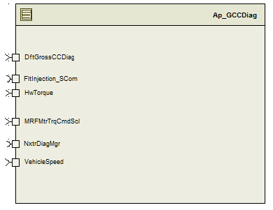

> **Converted document.** Source: `SF46_GCCDiag_Implementation/doc/GCCDiag_MDD.docx` (Word .docx, converted automatically; formatting, tables and figures preserved as Markdown — consult the original for normative layout).

## Module – Gross Cross Check Diagnostic

## High-Level Description

This module computes the Gross Cross Check Diagnostics.  It takes the handwheel torque,vehicle speed ,Motor Nm to diagnose .

## Figures

### Component Diagram

## Variable Data Dictionary

For details on module input / output variable, refer to the Data Dictionary for the application.  Input / output variable names are listed here for reference.

| Module Inputs | Module Outputs | Module Outputs |
| --- | --- | --- |
| HwTorque_HwNm_f32 | HwTorque_HwNm_f32 |  |
| DftGrossCCDiag_Cnt_lgc | DftGrossCCDiag_Cnt_lgc |  |
| MRFMtrTrqCmdScl_MtrNm_f32 | MRFMtrTrqCmdScl_MtrNm_f32 |  |
| VehicleSpeed_Kph_f32 | VehicleSpeed_Kph_f32 |  |

### Module Internal Variables

This section identifies the name, range and resolutions for module specific data created by this module.  If there are no range restrictions on the variable, the term “FULL” is placed into the table for legal range.

| Variable Name | Resolution | Legal Range | Legal Range | Software Segment |
| --- | --- | --- | --- | --- |
| GCCDiag_HwTrqLPF_M_str | See Data Dictionary | See Data Dictionary | See Data Dictionary | GCCDIAG_START_SEC_VAR_CLEARED_UNSPECIFIED |
| GCCDiag_MtrTrqLPF_M_str | See Data Dictionary | See Data Dictionary | See Data Dictionary | GCCDIAG_START_SEC_VAR_CLEARED_UNSPECIFIED |
| GCCDiag_PNAccumulator_Cnt_M_u16 | See Data Dictionary | See Data Dictionary | See Data Dictionary | GCCDIAG_START_SEC_VAR_CLEARED_16 |

#### User defined typedef definition/declaration

This section documents any user types uniquely used for the module.

| Typedef Name | Element Name | User Defined Type | Legal Range | Legal Range |
| --- | --- | --- | --- | --- |
| None |  |  |  |  |

### Module Display Variables

| Variable Name | Variable Name | Resolution | Legal Range | Legal Range | Software Segment |
| --- | --- | --- | --- | --- | --- |
| GCCDiag_PNAccumulator_Cnt_D_u16 | See Data Dictionary | See Data Dictionary | See Data Dictionary | GCCDIAG_START_SEC_VAR_CLEARED_16 |  |

## Constant Data Dictionary

### Calibration Constants

This section lists the calibrations used by the module.  For details on calibration constants, refer to the Data Dictionary for the application.

| Constant Name |
| --- |
| k_GCC_PNSettings_str |
| t_GCC_VehSpd_Kph_u9p7 |
| t2_GCC_UprBoundX_HwNm_s4p11 |
| t2_GCC_UprBoundY_MtrNm_u4p12 |

### Program(fixed) Constants

#### Embedded Constants

All embedded constants whose values are provided in Eng units will be evaluated to the equivalent counts by using the FPM_InitFixedPoint_m() macro within the #define statement.

##### Local

| Constant Name | Resolution | Units | Value |
| --- | --- | --- | --- |
| D_FILTERFRQ_HZ_F32 | Single precision floating point | Hetrz | 1 |

##### Global

This section lists the global constants used by the module.  For details on global constants, refer to the Data Dictionary for the application.

| Constant Name |
| --- |
| D_NEGONE_CNT_S16 |
| D_2MS_SEC_F32 |

#### Module specific Lookup Tables Constants

(This is for lookup tables (arrays) with fixed values, same name as other tables)

| Constant Name | Resolution | Value | Software Segment |
| --- | --- | --- | --- |
| None |  |  |  |

## Functions/Macros used by the Sub-Modules

### Library Functions / Macros

The library and functions / Macros that are called by the various sub modules are identified below,

1. FPM_FloatToFixed_m()
2. FPM_FixedToFloat_m
3. BilinearXMYM_u16_s16XMu16YM_Cnt ()
4. LPF_Init_f32_m()
5. LPF_OpUpdate_f32_m ()
6. LPF_KUpdate_f32_m()
7. Tablesize_m()
8. DiagPStep_m()
9. DiagNStep_m()
10. DiagFailed_m()
### Data Hiding Functions

1. Rte_Call_NxtrDiagMgr_SetNTCStatus()
### Global Functions/Macros Defined by this Module

None

### Local Functions/Macros Used by this MDD only

None

## Software Module Implementation

### Runtime Environment (RTE) Initial Values

This section lists the initial values of data written by this module but controlled by the RTE. After RTE initialization, the data in this table will contain these values.

| Data | Value |
| --- | --- |
| None |  |

### Initialization Functions

#### Init: GCCDiag_Init1

##### Design Rationale

The two filters need the initialization of filter constants only and the state variables are initialized to zero by MemMap section.

##### Module Outputs

None

##### Module Internal

LPF_KUpdate_f32_m(D_FILTERFRQ_HZ_F32, D_2MS_SEC_F32, &GCCDiag_HwTrqLPF_M_str);

LPF_KUpdate_f32_m(D_FILTERFRQ_HZ_F32, D_2MS_SEC_F32, &GCCDiag_MtrTrqLPF_M_str);

### Periodic Functions

#### Per: GCCDiag_Per1

##### Design Rationale

The Code has been optimized to remove the Inverter for the variable MtrCmdOk_T_lgc , the functionality is same as FDD.

##### Program Flow Start

N/A

##### Store Module Inputs to Local copies

/* Read the Inputs to the Temporary Variables */

HwTorque_HwNm_T_f32 = Rte_IRead_GCCDiag_Per1_HwTorque_HwNm_f32();

VehicleSpeed_Kph_T_f32 = Rte_IRead_GCCDiag_Per1_VehicleSpeed_Kph_f32();

MRFMtrTrqCmdScl_MtrNm_T_f32 = Rte_IRead_GCCDiag_Per1_MRFMtrTrqCmdScl_MtrNm_f32();

DftGrossCCDiag_Cnt_T_lgc = Rte_IRead_GCCDiag_Per1_DftGrossCCDiag_Cnt_lgc();

/* Fault Injection for the HwTrq,MtrTrq and VehSpd */

#if (STD_ON == BC_GCCDIAG_FAULTINJECTIONPOINT)

Rte_Call_FltInjection_SCom_FltInjection(&HwTorque_HwNm_T_f32, FLTINJ_GCCDIAG_HWTRQ);

Rte_Call_FltInjection_SCom_FltInjection(&VehicleSpeed_Kph_T_f32, FLTINJ_GCCDIAG_VEHSPD);

Rte_Call_FltInjection_SCom_FltInjection(&MRFMtrTrqCmdScl_MtrNm_T_f32, FLTINJ_GCCDIAG_MTRTRQ);

#endif

##### Gross Cross Check Diagnostics

##### Store Local copy of outputs into Module Outputs

##### Program Flow End

N/A

### Fault Recovery Functions

None

### Shutdown Functions

None

### Interrupt Functions

None

## Execution Requirements

### Execution Sequence of the Module

### Execution Rates for sub-modules called by the Scheduler

This table serves as reference for the Scheduler design

| Function Name | Calling Frequency | System State(s) in which the function is called |
| --- | --- | --- |
| GCCDiag_Init1() | Once (at initialization) | COLD INIT |
| GCCDiag_Per1() | 2 ms | ALL |

### Execution Requirements for Serial Communication Functions

| Function Name | Sub-Module called by (Serial Comm Function Name) |
| --- | --- |
| None |  |

## Memory Map Definition Requirements

### Sub Modules (Functions)

This table identifies the software segments for functions identified in this module.

| Name of Sub Module | Software Segment |
| --- | --- |
| GCCDiag_Init1() | RTE_AP_GCCDIAG_APPL_CODE |
| GCCDiag_Per1() | RTE_AP_GCCDIAG_APPL_CODE |

### Local Functions

This table identifies the software segments for local functions identified in this module.

| Name of Sub Module | Software Segment |
| --- | --- |
| None |  |

## Known Issues / Limitations With Design

1. INLINE functions defined in globalmacro.h are not unit tested
Revision Control Log

| **Rev #** | **Change Description** | **Date ** | **Author Initials** |
| --- | --- | --- | --- |
| 1.0 | Initial Version per SF46 Gross Cross Check Diagnostics | 26-Aug-14 | VS |
