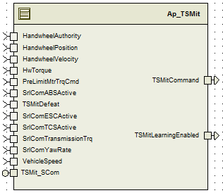
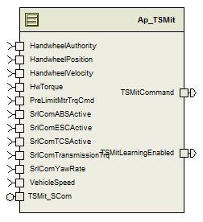

> **Converted document.** Source: `SF47_TSMit_Implementation/doc/Torque_Steer_Mitigation_MDD.docx` (Word .docx, converted automatically; formatting, tables and figures preserved as Markdown — consult the original for normative layout).

## Module  --

## High-Level Description

This function provides a motor torque command to mitigate linear rack force disturbances caused by unequal driveline torques.

## Figures

## Variable Data Dictionary

For details on module input / output variable, refer to the Data Dictionary for the application.  Input / output variable names are listed here for reference.

| Module Inputs | Module Outputs | Module Outputs |
| --- | --- | --- |
| HandwheelAuthority_Uls_f32 | HandwheelAuthority_Uls_f32 | TSMitCommand_MtrNm_f32 |
| HandwheelPosition_HwDeg_f32 | HandwheelPosition_HwDeg_f32 | TSMitLearningEnabled_Cnt_lgc |
| HandwheelVelocity_HwRadpS_f32 | HandwheelVelocity_HwRadpS_f32 |  |
| HwTorque_HwNm_f32 | HwTorque_HwNm_f32 |  |
| PreLimitMtrTrqCmd_MtrNm_f32 | PreLimitMtrTrqCmd_MtrNm_f32 |  |
| SrlComABSActive_Cnt_lgc | SrlComABSActive_Cnt_lgc |  |
| SrlComESCActive_Cnt_lgc | SrlComESCActive_Cnt_lgc |  |
| SrlComTCSActive_Cnt_lgc | SrlComTCSActive_Cnt_lgc |  |
| SrlComTransmissionTrq_TransNm_f32 | SrlComTransmissionTrq_TransNm_f32 |  |
| SrlComYawRate_DegpS_f32 | SrlComYawRate_DegpS_f32 |  |
| VehicleSpeed_Kph_f32 | VehicleSpeed_Kph_f32 |  |

### Module Internal Variables

This section identifies the name, range and resolutions for module specific data created by this module.  If there are no range restrictions on the variable, the term “FULL” is placed into the table for legal range.

| Variable Name | Resolution | Legal Range | Legal Range | Software Segment |
| --- | --- | --- | --- | --- |
| TSMit_PosTrsmTqGainLongTerm_Uls_M_f32 | Single Precision Float | See DD | See DD | TSMIT_START_SEC_VAR_CLEARED_32 |
| TSMit_NegTrsmTqGainLongTerm_Uls_M_f32 | Single Precision Float | See DD | See DD | TSMIT_START_SEC_VAR_CLEARED_32 |
| TSMit_GainLearningEnableTimer_mS_M_u32 | 1 | See DD | See DD | TSMIT_START_SEC_VAR_CLEARED_32 |
| TSMit_PrevTSMitCommand_HwNm_M_f32 | Single Precision Float | See DD | See DD | TSMIT_START_SEC_VAR_CLEARED_32 |
| TSMit_HwTrqFilterKSV_Cnt_M_str | Single Precision Float | See DD | See DD | TSMIT_START_SEC_VAR_CLEARED_UNSPECIFIED |
| TSMit_HwTrqFilterKSV_Cnt_M_str .SV_Uls_f32 | Single Precision Float | See DD | See DD | TSMIT_START_SEC_VAR_CLEARED_UNSPECIFIED |
| TSMit_HwTrqFilterKSV_Cnt_M_str .K_Uls_f32 | Single Precision Float | See DD | See DD | TSMIT_START_SEC_VAR_CLEARED_UNSPECIFIED |
| TSMit_YawRateFilterKSV_Cnt_M_str | Single Precision Float | See DD | See DD | TSMIT_START_SEC_VAR_CLEARED_UNSPECIFIED |
| TSMit_YawRateFilterKSV_Cnt_M_str .SV_Uls_f32 | Single Precision Float | See DD | See DD | TSMIT_START_SEC_VAR_CLEARED_UNSPECIFIED |
| TSMit_YawRateFilterKSV_Cnt_M_str .K_Uls_f32 | Single Precision Float | See DD | See DD | TSMIT_START_SEC_VAR_CLEARED_UNSPECIFIED |
| TSMit_STPosTransGainFilterKSV_Cnt_M_str | Single Precision Float | See DD | See DD | TSMIT_START_SEC_VAR_CLEARED_UNSPECIFIED |
| TSMit_STPosTransGainFilterKSV_Cnt_M_str .SV_Uls_f32 | Single Precision Float | See DD | See DD | TSMIT_START_SEC_VAR_CLEARED_UNSPECIFIED |
| TSMit_STPosTransGainFilterKSV_Cnt_M_str .K_Uls_f32 | Single Precision Float | See DD | See DD | TSMIT_START_SEC_VAR_CLEARED_UNSPECIFIED |
| TSMit_STNegTransGainFilterKSV_Cnt_M_str | Single Precision Float | See DD | See DD | TSMIT_START_SEC_VAR_CLEARED_UNSPECIFIED |
| TSMit_STNegTransGainFilterKSV_Cnt_M_str .SV_Uls_f32 |  | See DD | See DD | TSMIT_START_SEC_VAR_CLEARED_UNSPECIFIED |
| TSMit_STNegTransGainFilterKSV_Cnt_M_str .K_Uls_f32 |  | See DD | See DD | TSMIT_START_SEC_VAR_CLEARED_UNSPECIFIED |
| TSMit_HwTqFiltered_HwNm_D_f32 | Single Precision Float | See DD | See DD | TSMIT_START_SEC_VAR_CLEARED_32 |
| TSMit_YawRateFiltered_DegpS_D_f32 | Single Precision Float | See DD | See DD | TSMIT_START_SEC_VAR_CLEARED_32 |
| TSMit_PinionTrqEst_HwNm_D_f32 | Single Precision Float | See DD | See DD | TSMIT_START_SEC_VAR_CLEARED_32 |
| TSMit_PosTransTrqGainShortTerm_HwNmpTransNm_D_f32 | Single Precision Float | See DD | See DD | TSMIT_START_SEC_VAR_CLEARED_32 |
| TSMit_NegTransTrqGainShortTerm_HwNmpTransNm_D_f32 | Single Precision Float | See DD | See DD | TSMIT_START_SEC_VAR_CLEARED_32 |
| TSMit_PosTransTrqGainLongTerm_HwNmpTransNm_D_f32 | Single Precision Float | See DD | See DD | TSMIT_START_SEC_VAR_CLEARED_32 |
| TSMit_NegTransTrqGainLongTerm_HwNmpTransNm_D_f32 | Single Precision Float | See DD | See DD | TSMIT_START_SEC_VAR_CLEARED_32 |
| TSMit_CmdScaleFactor_Uls_D_f32 | Single Precision Float | See DD | See DD | TSMIT_START_SEC_VAR_CLEARED_32 |
| TSMit_CommandRaw_HwNm_D_f32 | Single Precision Float |  |  | TSMIT_START_SEC_VAR_CLEARED_32 |

#### User defined typedef definition/declaration

This section documents any user types uniquely used for the module.

| Typedef Name | Element Name | User Defined Type | Legal Range | Legal Range |
| --- | --- | --- | --- | --- |
| (Name given for the user defined typdef of type struct/union) | (Variable name qualified similar to all other variables) | as other variables |  |  |
|  | (Variable name qualified similar to all other variables) |  |  |  |

## Constant Data Dictionary

### Calibration Constants

This section lists the calibrations used by the module.  For details on calibration constants, refer to the Data Dictionary for the application.

| Constant Name |
| --- |
| k_TSMitHwTrqLPFiltFc_Hz_f32 |
| k_TSMitYawRateLPFiltFc_Hz_f32 |
| k_TSMitGainLearningFreqFc_Hz_f32 |
| k_TSMitUseABSActiveFlag_Cnt_lgc |
| k_TSMitUseTCSActiveFlag_Cnt_lgc |
| k_TSMitUseESCActiveFlag_Cnt_lgc |
| k_TSMitMinHwTrqEnable_HwNm_f32 |
| k_TSMitMaxHwPosEnable_HwDeg_f32 |
| k_TSMitMaxYawRateEnable_DegpS_f32 |
| k_TSMitMinHwAuthEnable_Uls_f32 |
| k_TSMitMinVehSpdEnable_Kph_f32 |
| k_TSMitMaxVehSpdEnable_Kph_f32 |
| k_TSMitMaxHwVelEnable_HwRadpS_f32 |
| k_TSMitMaxNegTransTrqEnable_TransNm_f32 |
| k_TSMitMinPosTransTrqEnable_TransNm_f32 |
| k_TSMitTimeOnEnable_Sec_f32 |
| k_TSMitPosTransGainLimit_HwNmpTransNm_f32 |
| k_TSMitDisableNegTransTrqSTGainLearning_Cnt_f32 |
| k_TSMitNegTransGainLimit_HwNmpTransNm_f32 |
| t_TSMitCmdSclVelocityTbl_Kph_u8p8[5] |
| t_TSMitCmdSclHwPosTbl_HwDeg_s10p5[11] |
| t2_TSMitCmdSclScaleFactor_Uls_u2p14[5][11] |
| k_TSMitPosTransTrqThresh_TransNm_f32 |
| k_TSMitNegTransTrqThresh_TransNm_f32 |
| k_TSMitCmdSlewRate_HwNmpS_f32 |
| k_CmnSysTrqRatio_HwNmpMtrNm_f32 |

### Program(fixed) Constants

#### Embedded Constants

All embedded constants whose values are provided in Eng units will be evaluated to the equivalent counts by using the FPM_InitFixedPoint_m() macro within the #define statement.

##### Local

| Constant Name | Resolution | Units | Value |
| --- | --- | --- | --- |
| D_10MS_SEC_F32 | Single Precision Float | Sec | 0.01 |
| D_ONESEC_MS_F32 | Single Precision Float | mS | 1000 |
| D_OUTPUTCMDLIMIT_HWNM_F32 | Single Precision Float | HwNm | 3 |

##### Global

This section lists the global constants used by the module.  For details on global constants, refer to the Data Dictionary for the application.

| Constant Name |
| --- |
| D_ZERO_ULS_F32 |

#### Module specific Lookup Tables Constants

(This is for lookup tables (arrays) with fixed values, same name as other tables)

| Constant Name | Resolution | Value | Software Segment |
| --- | --- | --- | --- |
| None |  |  |  |

## Functions/Macros used by the Sub-Modules

### Library Functions / Macros

The library and functions / Macros that are called by the various sub modules are identified below,

1. Abs_f32_m
2. FPM_FixedToFloat_m
3. FPM_FloatToFixed_m
4. BilinearXYM_u16_s16Xu16YM_Cnt
5. TableSize_m
### Data Hiding Functions

1. Rte_Pim_TSMitGainLrn()
2. Rte_Pim_TSMitDisableEOL()
### Global Functions/Macros Defined by this Module

None

### Local Functions/Macros Used by this MDD only

None

## Software Module Implementation

### Runtime Environment (RTE) Initial Values

This section lists the initial values of data written by this module but controlled by the RTE. After RTE initialization, the data in this table will contain these values.

| Data | Value |
| --- | --- |
| Rte_InitValue_HandwheelAuthority_Uls_f32 | 0 |
| Rte_InitValue_HandwheelPosition_HwDeg_f32 | 0 |
| Rte_InitValue_HandwheelVelocity_HwRadpS_f32 | 0 |
| Rte_InitValue_HwTorque_HwNm_f32 | 0 |
| Rte_InitValue_PreLimitMtrTrqCmd_MtrNm_f32 | 0 |
| Rte_InitValue_SrlComABSActive_Cnt_lgc | FALSE |
| Rte_InitValue_SrlComESCActive_Cnt_lgc | FALSE |
| Rte_InitValue_SrlComTCSActive_Cnt_lgc | FALSE |
| Rte_InitValue_SrlComTransmissionTrq_TransNm_f32 | 0 |
| Rte_InitValue_SrlComYawRate_DegpS_f32 | 0 |
| Rte_InitValue_TSMitCommand_MtrNm_f32 | 0 |
| Rte_InitValue_TSMitLearningEnabled_Cnt_lgc | FALSE |
| Rte_InitValue_VehicleSpeed_Kph_f32 | 0 |

### Initialization Functions

#### Init: _Init1

##### Design Rationale

None

##### Design

See unambiguous design at SF47_TqStrMtgtn/Ap_TorqueSteerMitigation/TSMit_Init.

### Periodic Functions

#### Per: _Per1

##### Design Rationale

None

##### Program Flow Start

Rte_Call_TSMit_Per1_CP0_CheckpointReached()

##### Store Module Inputs to Local copies

HandwheelAuthority_Uls_T_f32 = Rte_IRead_TSMit_Per1_HandwheelAuthority_Uls_f32()

HandwheelPosition_HwDeg_T_f32 = Rte_IRead_TSMit_Per1_HandwheelPosition_HwDeg_f32()

HandwheelVelocity_HwRadpS_T_f32 = Rte_IRead_TSMit_Per1_HandwheelVelocity_HwRadpS_f32()

HwTorque_HwNm_T_f32 = Rte_IRead_TSMit_Per1_HwTorque_HwNm_f32()

PreLimitMtrTrqCmd_MtrNm_T_f32 = Rte_IRead_TSMit_Per1_PreLimitMtrTrqCmd_MtrNm_f32()

SrlComABSActive_Cnt_T_lgc = Rte_IRead_TSMit_Per1_SrlComABSActive_Cnt_lgc()

SrlComTCSActive_Cnt_T_lgc = Rte_IRead_TSMit_Per1_SrlComTCSActive_Cnt_lgc()

SrlComESCActive_Cnt_T_lgc = Rte_IRead_TSMit_Per1_SrlComESCActive_Cnt_lgc()

SrlComTransmissionTrq_TransNm_T_f32 = Rte_IRead_TSMit_Per1_SrlComTransmissionTrq_TransNm_f32()

SrlComYawRate_DegpS_T_f32 = Rte_IRead_TSMit_Per1_SrlComYawRate_DegpS_f32()

VehicleSpeed_Kph_T_f32 = Rte_IRead_TSMit_Per1_VehicleSpeed_Kph_f32()

##### (Processing of function)………

See unambiguous design at SF47_TqStrMtgtn/Ap_TorqueSteerMitigation/TSMit_Per1.

##### Store Local copy of outputs into Module Outputs

Rte_IWrite_TSMit_Per1_TSMitLearningEnabled_Cnt_lgc(GainLearningEnableOutput_Cnt_T_lgc)

Rte_IWrite_TSMit_Per1_TSMitCommand_MtrNm_f32(TSMitCommand_MtrNm_T_f32)

##### Program Flow End

Rte_Call_TSMit_Per1_CP1_CheckpointReached()

### Fault Recovery Functions

None

### Shutdown Functions

None

### Interrupt Functions

None

### Serial Communication Functions

#### SComm: TSMit_SCom_GainReset

##### Design Rationale

None

##### Description

See unambiguous design at SF47_TqStrMtgtn/Ap_TorqueSteerMitigation/TSMit_ResetSvc_Manuf.

#### SComm: TSMit_SCom_SetFcnDefeat

##### Design Rationale

None

##### Description

See unambiguous design at SF47_TqStrMtgtn/Ap_TorqueSteerMitigation/Set_FunctionDefeat_Service.

#### SComm: TSMit_SCom_SetLrnDefeat

##### Design Rationale

None

##### Description

See unambiguous design at SF47_TqStrMtgtn/Ap_TorqueSteerMitigation/Set_LearningDefeat_Service.

#### SComm: TSMit_SCom_SetLongTermGains

##### Design Rationale

None

##### Description

See unambiguous design at SF47_TqStrMtgtn/Ap_TorqueSteerMitigation/TSMit Set Long Term Gains Service.

## Execution Requirements

### Execution Sequence of the Module

(Describe in words relevant details about the execution sequence of the different sub modules.)

### Execution Rates for sub-modules called by the Scheduler

This table serves as reference for the Scheduler design

| Function Name | Calling Frequency | System State(s) in which the function is called |
| --- | --- | --- |
| TSMit_Init1 | On Init | All |
| TSMit_Per1 | 10 ms | All |

### Execution Requirements for Serial Communication Functions

| Function Name | Sub-Module called by (Serial Comm Function Name) |
| --- | --- |
| TSMit_SCom_GainReset | Common manufacturing services |
| TSMit_SCom_GetFcnDefeat | Common manufacturing services |
| TSMit_SCom_GetLongTermGains | Common manufacturing services |
| TSMit_SCom_GetLrnDefeat | Common manufacturing services |
| TSMit_SCom_SetFcnDefeat | Common manufacturing services |
| TSMit_SCom_SetLongTermGains | Common manufacturing services |
| TSMit_SCom_SetLrnDefeat | Common manufacturing services |

## Memory Map Definition Requirements

### Sub Modules (Functions)

This table identifies the software segments for functions identified in this module.

| Name of Sub Module | Software Segment |
| --- | --- |
| TSMit_Init1 | RTE_START_SEC_AP_TSMIT_APPL_CODE |
| TSMit_Per1 | RTE_START_SEC_AP_TSMIT_APPL_CODE |

### Local Functions

This table identifies the software segments for local functions identified in this module.

| Name of Sub Module | Software Segment |
| --- | --- |
| None |  |

## Known Issues / Limitations With Design

1. None
## Revision Control Log

| **Item #** | **Rev #** | **Change Description** | **Date ** | **Author Initials** |
| --- | --- | --- | --- | --- |
| 1 | 1 | Initial creation | 25-Jul-14 | Jared |
