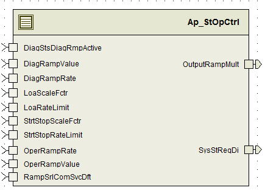

> **Converted document.** Source: `StOpCtrl/doc/State_Output_Control_MDD.docx` (Word .docx, converted automatically; formatting, tables and figures preserved as Markdown — consult the original for normative layout).

## Module – State Output Control

## High-Level Description

The State Output Control Function implements the system ramping functions based on inputs from other modules.  Ramping due to diagnostics and other functions are requested and this function does the actual implementation of the ramping.  The ramping rate can also be increased through the use of a serial comm service.

## Figures

### Diagram – Function Data Sharing

## Variable Data Dictionary

For details on module input / output variable, refer to the Data Dictionary for the application.  Input / output variable names are listed here for reference.

(Note: Full variable names required in table.)

(Note: All global variables including End Of Line data used should be shown here)

| Module Inputs (Global Variable Name) | Module Outputs (Global Variable Name) |
| --- | --- |
| DiagRampRate_XpmS_32 | SysStReqDi_Cnt_lgc |
| DiagRampValue_Uls_f32 | OutputRampMult_Uls_f32 |
| OperRampRate_XpmS_f32 |  |
| OperRampValue_Uls_f32 |  |
| RampSrlComSvcDft_Cnt_lgc |  |
| DiagStsDiagRmpActive_Cnt_lgc |  |
| LoaRateLimit_UlspS_f32 |  |
| LoaScaleFctr_Uls_ f32 |  |
| StrtStopRateLimit_UlspS_f32 |  |
| StrtStopScaleFctr_Uls_ f32 |  |

### Module Internal Variables

This section identifies the name, range and resolutions for module specific data created by this module.  If there are no range restrictions on the variable, the term “FULL” is placed into the table for legal range.

*Note :** Display variables and user defined constants are allowed to have units “**UlspS**” (wherever applicable as per FDD) to simplify EA4 implementation and also since there is no impact on functionality.*

| Variable Name | Resolution | Legal Range | Legal Range | Software Segment |
| --- | --- | --- | --- | --- |
| Please refer to the Data dictionary | NA | NA | NA | NA |

#### User defined typedef definition/declaration

This section documents any user types uniquely used for the module.

| Typedef Name | Element Name | User Defined Type | Legal Range | Legal Range |
| --- | --- | --- | --- | --- |
| NA |  |  |  |  |

## Constant Data Dictionary

### Calibration Constants

This section lists the calibrations used by the module.  For details on calibration constants, refer to the Data Dictionary for the application.

| Constant Name |
| --- |
| NA |

### Program(fixed) Constants

#### Embedded Constants

All embedded constants whose values are provided in Eng units will be evaluated to the equivalent counts by using the FPM_InitFixedPoint_m() macro within the #define statement.

##### Local

| Constant Name | Resolution | Value |
| --- | --- | --- |
| D_BIGSLEW_ULSPS_F32 | Single precision floating point | 500 |
| D_OPER_CNT_U08 | 1 | 1 |
| D_LOA_CNT_U08 | 1 | 2 |
| D_STRTSTOP_CNT_U08 | 1 | 3 |
| D_DIAG_CNT_U08 | 1 | 4 |
| D_RATELIMITLO_ULSPS_F32 | Single precision floating point | 0.01 |
| D_RATELIMITHI_ULSPS_F32 | Single precision floating point | 500.0 |
| D_TARGETSCALELO_ULS_F32 | Single precision floating point | 0.0 |
| D_TARGETSCALEHI_ULS_F32 | Single precision floating point | 1.0 |
| D_EPSILON_ULS_F32 | Single precision floating point | FLT_EPSILON |

##### Global

This section lists the global constants used by the module.  For details on global constants, refer to the Data Dictionary for the application.

| Constant Name |
| --- |
| D_2MS_SEC_F32 |

#### Module specific Lookup Tables Constants

(This is for lookup tables (arrays) with fixed values, same name as other tables)

| Constant Name | Resolution | Value | Software Segment |
| --- | --- | --- | --- |
| None |  |  |  |

### Lookup Table Definitions

## Software Module Implementation

### Initialization Functions

### Periodic Functions

#### Per: StOpCtrl_Per1

##### Design Rationale

##### Program Flow Start

##### Store Module Inputs to Local copies

See FDD

##### Function Internal

See FDD

##### Store Local copy of outputs into Module Outputs

See FDD

### Fault Recovery Functions

None

### Shutdown Functions

None

### Interrupt Functions

None

### Serial Communication Functions

None

### Local Function/Macro Definitions

#### TargetSelection

| **Function Name** | TargetSelection | Type | Min | Max |
| --- | --- | --- | --- | --- |
| **Arguments Passed ** | OperScaleFctr_Uls_T_f32 | float32 | 0.0 | 1.0 |
|  | LoaScaleFctr_Uls_T_f32 | float32 | 0.0 | 1.0 |
|  | StrtStopScaleFctr_Uls_T_f32 | float32 | 0.0 | 1.0 |
|  | OperRateLimit_UlspS_T_f32 | float32 | 0.1 | 5 |
|  | LoaRateLimit_UlspS_T_f32 | float32 | 0.01 | 500 |
|  | StrtStopRateLimit_UlspS_T_f32 | float32 | 0.01 | 500 |
| **Output ****params** | SelRampValue_Uls_T_f32 | float32 | 0.0 | 1.0 |
|  | SelRampRate_UlspS_T_f32 | float32 | 0.01 | 500 |
| **Return Value** |  |  |  |  |

##### Description

Implements “Target Selection” model block in FDD.

## Execution Requirements

### Execution Sequence of the Module

### Execution Rates for sub-modules called by the Scheduler

This table serves as reference for the Scheduler design

| Function Name | Calling Frequency | System State(s) in which the function is called |
| --- | --- | --- |
| StOpCtrl_Per1() | 2 ms | ALL States |

### Execution Requirements for Serial Communication Functions

| Function Name | Sub-Module called by (Serial Comm Function Name) |
| --- | --- |
| None |  |

## Memory Map Definition Requirements

### Sub Modules (Functions)

This table identifies the software segments for functions identified in this module.

| Name of Sub Module | Software Segment |
| --- | --- |
| StOpCtrl_Per1() | RTE_START_SEC_AP_STOPCTRL_APPL_CODE RTE_STOP_SEC_AP_STOPCTRL_APPL_CODE |

### Local Functions

This table identifies the software segments for local functions identified in this module.

| Name of Sub Module | Software Segment |
| --- | --- |

## Known Issues / Limitations With Design

## Revision Control Log

| **Item #** | **Rev #** | **Change Description** | **Date ** | **Author Initials** |
| --- | --- | --- | --- | --- |
| 1 | 1.0 | Initial release | 07-Jun-11 | SAH |
| 2 | 2.0 | FDD SF05 | 5-Jan-12 | NRAR |
| 3 | 3.0 | Value for D_MAXRAMP_XPMS_F32  is fixed | 6-Jan-12 | NRAR |
| 4 | 4.0 | DiagStsF1Active_Cnt_lgc is renamed to DiagStsDiagRmpActive_Cnt_lgc | 12-Jan-12 | NRAR |
| 5 | 4.0 | PrevRate_XpmS_M_f32 range correction | 23-Jan-12 | NRAR |
| 6 | 5.0 | Anom #3272 Ramp output vs. target fix | 13-Aug-12 | BWL |
| 7 | 6.0 | Added checkpoints and memmap software segment is updated for static variables | 23-Sep-12 | Selva |
| 8 | 7.0 | Updated to SF-05 v004 based on FDD v4.0.0 | 10-Apr-15 | KK |
