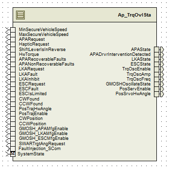
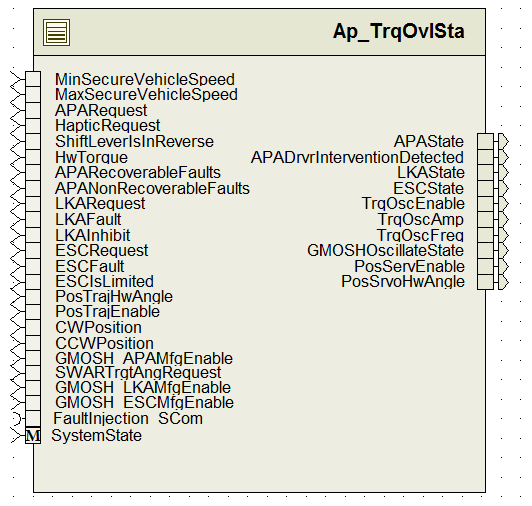

> **Converted document.** Source: `TrqOvlSta/doc/TrqOvlSta_MDD.docx` (Word .docx, converted automatically; formatting, tables and figures preserved as Markdown — consult the original for normative layout).

## Module  -- TrqOvlSta

## High-Level Description

This function is owned by Nexteer but designed and implemented to satisfy the requirements of a particular customer.  It is not intended for use on other customer programs.

## Figures

### Diagram – Function Data Sharing

#### Diagram – Function

## Variable Data Dictionary

For details on module input / output variable, refer to the Data Dictionary for the application.  Input / output variable names are listed here for reference.

| Module Inputs | Module Outputs | Module Outputs |
| --- | --- | --- |
| APANonRecoverableFaults_Cnt_lgc | APANonRecoverableFaults_Cnt_lgc | APADrvrInterventionDetected_Cnt_lgc |
| APARecoverableFaults_Cnt_lgc | APARecoverableFaults_Cnt_lgc | APAState_State_enum |
| APARequest_Cnt_lgc | APARequest_Cnt_lgc | GMOSHOscillateState_State_enum |
| HapticRequest_Cnt_lgc | HapticRequest_Cnt_lgc | LKAState_State_enum |
| HwTorque_HwNm_f32 | HwTorque_HwNm_f32 | PosServEnable_Cnt_lgc |
| LKAFault_Cnt_lgc | LKAFault_Cnt_lgc | TrqOscAmp_MtrNm_f32 |
| LKAInhibit_Cnt_lgc | LKAInhibit_Cnt_lgc | TrqOscEnable_Cnt_lgc |
| LKARequest_Cnt_lgc | LKARequest_Cnt_lgc | TrqOscFreq_Hz_f32 |
|  |  | ESCState_State_enum |
| ShiftLeverIsInReverse_Cnt_lgc | ShiftLeverIsInReverse_Cnt_lgc | PosSrvoHwAngle_HwDeg_f32 |
| CCWPosition_HwDeg_f32 | CCWPosition_HwDeg_f32 |  |
| CWPosition_HwDeg_f32 | CWPosition_HwDeg_f32 |  |
| ESCFault_Cnt_lgc | ESCFault_Cnt_lgc |  |
| ESCIsLimited_Cnt_lgc | ESCIsLimited_Cnt_lgc |  |
| ESCRequest_Cnt_lgc | ESCRequest_Cnt_lgc |  |
| GMOSH_APAMfgEnable_Cnt_lgc | GMOSH_APAMfgEnable_Cnt_lgc |  |
| GMOSH_ESCMfgEnable_Cnt_lgc | GMOSH_ESCMfgEnable_Cnt_lgc |  |
| GMOSH_LKAMfgEnable_Cnt_lgc | GMOSH_LKAMfgEnable_Cnt_lgc |  |
| MaxSecureVehicleSpeed_Kph_f32 | MaxSecureVehicleSpeed_Kph_f32 |  |
| MinSecureVehicleSpeed_Kph_f32 | MinSecureVehicleSpeed_Kph_f32 |  |
| PosTrajEnable_Cnt_lgc | PosTrajEnable_Cnt_lgc |  |
| PosTrajHwAngle_HwDeg_f32 | PosTrajHwAngle_HwDeg_f32 |  |
| SWARTrgtAngRequest_HwDeg_f32 | SWARTrgtAngRequest_HwDeg_f32 |  |

### Module Internal Variables

This section identifies the name, range and resolutions for module specific data created by this module.  If there are no range restrictions on the variable, the term “FULL” is placed into the table for legal range.

| Variable Name | Resolution | Legal Range | Legal Range | Software Segment |
| --- | --- | --- | --- | --- |
| TrqOvlSta_LKAPermFault_Cnt_M_u08 | See Data Dictionary | See Data Dictionary | See Data Dictionary | TRQOVLSTA_START_SEC_VAR_CLEARED_8 |
| TrqOvlSta_LKAPermFault_Cnt_M_lgc | See Data Dictionary | See Data Dictionary | See Data Dictionary | TRQOVLSTA_STOP_SEC_VAR_CLEARED_BOOLEAN |
| TrqOvlSta_LKAFault_Cnt_M_lgc | See Data Dictionary | See Data Dictionary | See Data Dictionary | TRQOVLSTA_STOP_SEC_VAR_CLEARED_BOOLEAN |
| TrqOvlSta_Haptictime_mS_M_u32 | See Data Dictionary | See Data Dictionary | See Data Dictionary | TRQOVLSTA_START_SEC_VAR_CLEARED_32 |
| TrqOvlSta_ShiftLevRevTime_mS_M_u32 | See Data Dictionary | See Data Dictionary | See Data Dictionary | TRQOVLSTA_START_SEC_VAR_CLEARED_32 |
| TrqOvlSta_APAMaxHwTrqTime_mS_M_u32 | See Data Dictionary | See Data Dictionary | See Data Dictionary | TRQOVLSTA_START_SEC_VAR_CLEARED_32 |
| TrqOvlSta_StandstillTime_mS_M_u32 | See Data Dictionary | See Data Dictionary | See Data Dictionary | TRQOVLSTA_START_SEC_VAR_CLEARED_32 |
| TrqOvlSta_Hapticdur_Cnt_M_u16 | See Data Dictionary | See Data Dictionary | See Data Dictionary | TRQOVLSTA_START_SEC_VAR_CLEARED_16 |
| TrqOvlSta_HwTorqueSV_HwNm_M_Str | See Data Dictionary | See Data Dictionary | See Data Dictionary | TRQOVLSTA_START_SEC_VAR_CLEARED_UNSPECIFIED |
| TrqOvlSta_APAState_State_M_enum | See Data Dictionary | See Data Dictionary | See Data Dictionary | TRQOVLSTA_START_SEC_VAR_CLEARED_UNSPECIFIED |
| TrqOvlSta_HapticState_State_M_enum | See Data Dictionary | See Data Dictionary | See Data Dictionary | TRQOVLSTA_START_SEC_VAR_CLEARED_UNSPECIFIED |
| TrqOvlSta_LKAState_State_M_enum | See Data Dictionary | See Data Dictionary | See Data Dictionary | TRQOVLSTA_START_SEC_VAR_CLEARED_UNSPECIFIED |
| TrqOvlSta_StandstillTime_Cnt_D_lgc | See Data Dictionary | See Data Dictionary | See Data Dictionary | TRQOVLSTA_STOP_SEC_VAR_CLEARED_BOOLEAN |
| TrqOvlSta_ShiftLevRevTime_Cnt_D_lgc | See Data Dictionary | See Data Dictionary | See Data Dictionary | TRQOVLSTA_STOP_SEC_VAR_CLEARED_BOOLEAN |
| TrqOvlSta_ReadytoPulse_Cnt_M_lgc | See Data Dictionary | See Data Dictionary | See Data Dictionary | TRQOVLSTA_STOP_SEC_VAR_CLEARED_BOOLEAN |
| TrqOvlSta_ESCState_State_M_enum; | See Data Dictionary | See Data Dictionary | See Data Dictionary | TRQOVLSTA_START_SEC_VAR_CLEARED_UNSPECIFIED |
| TrqOvlSta_PosSrvoHwAngle_HwDeg_M_f32 | See Data Dictionary | See Data Dictionary | See Data Dictionary | TRQOVLSTA_START_SEC_VAR_CLEARED_32 |

#### User defined typedef definition/declaration

This section documents any user types uniquely used for the module.

| Typedef Name | Element Name | User Defined Type | Legal Range | Legal Range |
| --- | --- | --- | --- | --- |

## Constant Data Dictionary

### Calibration Constants

This section lists the calibrations used by the module.  For details on calibration constants, refer to the Data Dictionary for the application.

| Constant Name |
| --- |
| k_StandstillTime_Sec_f32 |
| k_APAMaxHwTrqTime_Sec_f32 |
| k_APAMaxHwTrq_HwNm_f32 |
| k_APAMaxVehSpd_Kph_f32 |
| k_APAIncludeHaptic_Cnt_lgc |
| k_HapticDuration_Sec_f32 |
| k_HapticReacttime_Sec_f32 |
| k_LKAMinVehSpd_Kph_f32 |
| k_LKAMaxVehSpd_Kph_f32 |
| k_APAHwTrqLPFKn_Hz_f32 |
| k_StandstillThresh_Kph_f32 |
| k_HapticAmplitude_MtrNm_f32 |
| k_HapticFreq_Hz_f32 |
| k_ESCMaxVehSpd_Kph_f32 |
| k_SWARLimiter_HwDeg_f32 |

### Program(fixed) Constants

#### Embedded Constants

All embedded constants whose values are provided in Eng units will be evaluated to the equivalent counts by using the FPM_InitFixedPoint_m() macro within the #define statement.

##### Local

| Constant Name | Resolution | Units | Value |
| --- | --- | --- | --- |

##### Global

This section lists the global constants used by the module.  For details on global constants, refer to the Data Dictionary for the application.

| Constant Name |
| --- |
| D_FALSE_CNT_LGC |
| D_2MS_SEC_F32 |
| D_ZERO_ULS_F32 |

#### Module specific Lookup Tables Constants

(This is for lookup tables (arrays) with fixed values, same name as other tables)

| Constant Name | Resolution | Value | Software Segment |
| --- | --- | --- | --- |
| None |  |  |  |

## Functions/Macros used by the Sub-Modules

### Library Functions / Macros

The library and functions / Macros that are called by the various sub modules are identified below,

1. Limit_m
2. Abs_f32_m
3. LPF_Init_f32_m
### Data Hiding Functions

1. <None>
### Global Functions/Macros Defined by this Module

#### Global Function #1

| **Function Name** | None | Type | Dir. | Min | Max | UTP Tol. |
| --- | --- | --- | --- | --- | --- | --- |
| **Arguments Passed ** |  |  |  |  |  |  |
| **Return Value** |  |  |  |  |  |  |

##### Description

None

### Local Functions/Macros Used by this MDD only

#### Local Function #1

| **Function Name** | None | Type | Dir. | Min | Max | UTP Tol. |
| --- | --- | --- | --- | --- | --- | --- |
| **Arguments Passed ** | None |  |  |  |  |  |
|  | None |  |  |  |  |  |
| **Return Value** | None |  |  |  |  |  |

##### Description

None

## Software Module Implementation

### Runtime Environment (RTE) Initial Values

This section lists the initial values of data written by this module but controlled by the RTE. After RTE initialization, the data in this table will contain these values.

| Data | Value |
| --- | --- |

### Initialization Functions

#### Init: TrqOvlSta_Init

##### Design Rationale

Initialize the state to Inactive at the start.

##### Module Outputs

##### Module Internal

### Periodic Functions

#### Per: TrqOvlSta_Per1

##### Design Rationale

None

##### Program Flow Start

Rte_Call_TrqOvlSta_Per1_CP0_CheckpointReached()

##### Store Module Inputs to Local copies

MaxSecureVehicleSpeed_Kph_T_f32	=	Rte_IRead_TrqOvlSta_Per1_MaxSecureVehicleSpeed_Kph_f32()

MinSecureVehicleSpeed_Kph_T_f32	=	Rte_IRead_TrqOvlSta_Per1_MinSecureVehicleSpeed_Kph_f32()

APARequest_Cnt_T_lgc		=	Rte_IRead_TrqOvlSta_Per1_APARequest_Cnt_lgc()

APANonRecoverableFaults_Cnt_T_lgc	= 	Rte_IRead_TrqOvlSta_Per1_APANonRecoverableFaults_Cnt_lgc()

APARecoverableFaults_Cnt_T_lgc	= 	Rte_IRead_TrqOvlSta_Per1_APARecoverableFaults_Cnt_lgc()

HapticRequest_Cnt_T_lgc		= 	Rte_IRead_TrqOvlSta_Per1_HapticRequest_Cnt_lgc()

ShiftLeverIsInReverse_Cnt_T_lgc = 	Rte_IRead_TrqOvlSta_Per1_ShiftLeverIsInReverse_Cnt_lgc()

HwTorque_HwNm_T_f32             = 	Rte_IRead_TrqOvlSta_Per1_HwTorque_HwNm_f32()

LKAFault_Cnt_T_lgc              = 	Rte_IRead_TrqOvlSta_Per1_LKAFault_Cnt_lgc()

LKAInhibit_Cnt_T_lgc            = 	Rte_IRead_TrqOvlSta_Per1_LKAInhibit_Cnt_lgc()

ESCRequest_Cnt_T_lgc            = 	Rte_IRead_TrqOvlSta_Per1_ESCRequest_Cnt_lgc()

ESCFault_Cnt_T_lgc              = 	Rte_IRead_TrqOvlSta_Per1_ESCFault_Cnt_lgc()

ESCIsLimited_Cnt_T_lgc		=	Rte_IRead_TrqOvlSta_Per1_ESCIsLimited_Cnt_lgc()

PosTrajHwAngle_HwDeg_T_f32	=	Rte_IRead_TrqOvlSta_Per1_PosTrajHwAngle_HwDeg_f32()

SWARTrgtAngRequest_HwDeg_T_f32	=	Rte_IRead_TrqOvlSta_Per1_SWARTrgtAngRequest_HwDeg_f32()

PosTrajEnable_Cnt_T_lgc		=	Rte_IRead_TrqOvlSta_Per1_PosTrajEnable_Cnt_lgc()

CWPosition_HwDeg_T_f32		=	Rte_IRead_TrqOvlSta_Per1_CWPosition_HwDeg_f32()

CCWPosition_HwDeg_T_f32		=	Rte_IRead_TrqOvlSta_Per1_CCWPosition_HwDeg_f32()

GMOSH_APAMfgEnable_Cnt_T_lgc	=	Rte_IRead_TrqOvlSta_Per1_GMOSH_APAMfgEnable_Cnt_lgc()

GMOSH_LKAMfgEnable_Cnt_T_lgc	=	Rte_IRead_TrqOvlSta_Per1_GMOSH_LKAMfgEnable_Cnt_lgc()

GMOSH_ESCMfgEnable_Cnt_T_lgc	=	Rte_IRead_TrqOvlSta_Per1_GMOSH_ESCMfgEnable_Cnt_lgc()

##### FLOW

##### Store Local copy of outputs into Module Outputs

Rte_IWrite_TrqOvlSta_Per1_APADrvrInterventionDetected_Cnt_lgc(APAIntervention_Cnt_T_lgc );

Rte_IWrite_TrqOvlSta_Per1_APAState_State_enum(TrqOvlSta_APAState_State_M_enum );

Rte_IWrite_TrqOvlSta_Per1_GMOSHOscillateState_State_enum(TrqOvlSta_HapticState_State_M_enum );

Rte_IWrite_TrqOvlSta_Per1_LKAState_State_enum(TrqOvlSta_LKAState_State_M_enum);

Rte_IWrite_TrqOvlSta_Per1_ESCState_State_enum(TrqOvlSta_ESCState_State_M_enum);

Rte_IWrite_TrqOvlSta_Per1_PosServEnable_Cnt_lgc(PosEnable_Cnt_T_lgc );

Rte_IWrite_TrqOvlSta_Per1_TrqOscAmp_MtrNm_f32(k_HapticAmplitude_MtrNm_f32 );

Rte_IWrite_TrqOvlSta_Per1_TrqOscEnable_Cnt_lgc(TrqOscEnable_Cnt_T_lgc);

Rte_IWrite_TrqOvlSta_Per1_TrqOscFreq_Hz_f32(k_HapticFreq_Hz_f32);Rte_IWrite_TrqOvlSta_Per1_PosSrvoHwAngle_HwDeg_f32(TrqOvlSta_PosSrvoHwAngle_HwDeg_M_f32);

##### Program Flow End

#### Rte_Call_TrqOvlSta_Per1_CP1_CheckpointReached()

### Fault Recovery Functions

None

### Shutdown Functions

None

### Interrupt Functions

None

### Serial Communication Functions

None

## Execution Requirements

### Execution Sequence of the Module

(Describe in words relevant details about the execution sequence of the different sub modules.)

### Execution Rates for sub-modules called by the Scheduler

This table serves as reference for the Scheduler design

| Function Name | Calling Frequency | System State(s) in which the function is called |
| --- | --- | --- |
| TrqOvlSta_Per1 | 2ms | ALL |
| TrqOvlSta_Init | ECU startup | ALL |

### Execution Requirements for Serial Communication Functions

| Function Name | Sub-Module called by (Serial Comm Function Name) |
| --- | --- |
| <None> |  |

## Memory Map Definition Requirements

### Sub Modules (Functions)

This table identifies the software segments for functions identified in this module.

| Name of Sub Module | Software Segment |
| --- | --- |
| TrqOvlSta_Per1 | RTE_START_SEC_AP_TRQOVLSTA_APPL_CODE |
| TrqOvlSta_Init | RTE_START_SEC_AP_TRQOVLSTA_APPL_CODE |

### Local Functions

This table identifies the software segments for local functions identified in this module.

| Name of Sub Module | Software Segment |
| --- | --- |

## Known Issues / Limitations With Design

1. Local Macros are not unit tested.
2. Cyclomatic complexity (73) is more than the suggested value of coding guidelines (15)
3. Static path count (5000000) is more than the suggested value of coding guidelines (300)
## Revision Control Log

| **Item #** | **Rev #** | **Change Description** | **Date ** | **Author Initials** |
| --- | --- | --- | --- | --- |
| 1 | 1 | Initial revision | 23-Jan-14 | Selva |
| 2 | 2 | Move Type H memory to dedicated block per A6405 | 26-Feb-14 | BWL |
| 3 | 3 | A6475 fixed. Added absolute value in HwTrqFilt_HwNm_T_f32 | 16-Apr-14 | Selva |
| 4 | 4 | Implemented CF-09 GM Torque Overlay State Handler  v002 – 12181 | 24-Jul-14 | SB |
| 5 | 5 | UTP Fixes | 22-Sep-14 | KPIT, SB |
| 6 | 6 | Implemented CF-09 GM Torque Overlay State Handler  v003 – 12540 | 15-Oct-14 | SB |
| 7 | 7 | Fixed anomaly A7535  Incorrect APA State Machine transition between states 'Available for Control' and 'Active' | 20-Jan-15 | KK |
