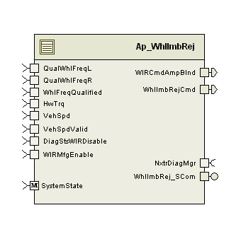

> **Converted document.** Source: `WhlImbRej/doc/Wheel_Imbalance_Rejection_MDD.docx` (Word .docx, converted automatically; formatting, tables and figures preserved as Markdown — consult the original for normative layout).

## Module  --

## High-Level Description

The Wheel Imbalance Rejection Function corrects Handwheel vibration or oscillation issues by canceling out the appropriate HW torque disturbances detected by the steering system.  This module is responsible for calculating the cancellation torque command to apply to the motor.

## Figures

### Diagram – Function Data Sharing

This diagram shows all data that is shared between functions within the module.

#### Diagram – Function (Name)

This diagram describes the functional characteristics and data flow of a given function.

## Variable Data Dictionary

For details on module input / output variable, refer to the Data Dictionary for the application.  Input / output variable names are listed here for reference.

(Note: Full variable names required in table.)

(Note: All global variables including End Of Line data used should be shown here)

| Module Inputs | Module Outputs | Module Outputs |
| --- | --- | --- |
| HwTrq_HwNm_f32 | HwTrq_HwNm_f32 | WhlImbRejCmd_MtrNm_f32 |
| QualWhlFreqL_Hz_f32 | QualWhlFreqL_Hz_f32 | WIRCmdAmpBlnd_MtrNm_f32 |
| WhlFreqQualified_Cnt_lgc | WhlFreqQualified_Cnt_lgc |  |
| QualWhlFreqR_Hz_f32 | QualWhlFreqR_Hz_f32 |  |
| VehSpd_Kph_f32 | VehSpd_Kph_f32 |  |
| WIRMfgEnable_Cnt_lgc | WIRMfgEnable_Cnt_lgc |  |
| DiagStsWIRDisable_Cnt_lgc | DiagStsWIRDisable_Cnt_lgc |  |
| VehSpdValid_Cnt_lgc | VehSpdValid_Cnt_lgc |  |

### Module Internal Variables

This section identifies the name, range and resolutions for module specific data created by this module.  If there are no range restrictions on the variable, the term “FULL” is placed into the table for legal range.

| Variable Name | Resolution | Legal Range | Legal Range | Software Segment |
| --- | --- | --- | --- | --- |
| MaxMagFlt_Cnt_M_Str | WIRDiagInfo_Str | See DataType Def | See DataType Def | WHLIMBREJ_START_SEC_VAR_CLEARED_UNSPECIFIED |
| DCTrendFlt_Cnt_M_Str | WIRDiagInfo_Str | See DataType Def | See DataType Def | WHLIMBREJ_START_SEC_VAR_CLEARED_UNSPECIFIED |
| FreqDiagFlt_Cnt_M_Str | WIRDiagInfo_Str | See DataType Def | See DataType Def | WHLIMBREJ_START_SEC_VAR_CLEARED_UNSPECIFIED |
| CorrFlt_Cnt_M_Str | WIRDiagInfo_Str | See DataType Def | See DataType Def | WHLIMBREJ_START_SEC_VAR_CLEARED_UNSPECIFIED |
| QualFlt_Cnt_M_Str | WIRDiagInfo_Str | See DataType Def | See DataType Def | WHLIMBREJ_START_SEC_VAR_CLEARED_UNSPECIFIED |
| MaxPersFlt_Cnt_M_Str | WIRDiagInfo_Str | See DataType Def | See DataType Def | WHLIMBREJ_START_SEC_VAR_CLEARED_UNSPECIFIED |
| WIRCmdMag_MtrNm_M_f32 | Single Precision Float | 0 | 127 * π/2 | WHLIMBREJ_START_SEC_VAR_CLEARED_32 |
| xRefDelayR_RadpSec_M_f32[41] | Single Precision Float | -4 | 4 | WHLIMBREJ_START_SEC_VAR_CLEARED_32 |
| xRefDelayL_RadpSec_M_f32[41] | Single Precision Float | -4 | 4 | WHLIMBREJ_START_SEC_VAR_CLEARED_32 |
| xRefSVR_Uls_M_f32[41] | Single Precision Float | -2048 | 2048 | WHLIMBREJ_START_SEC_VAR_CLEARED_32 |
| xRefSVL_Uls_M_f32[41] | Single Precision Float | -2048 | 2048 | WHLIMBREJ_START_SEC_VAR_CLEARED_32 |
| WhlSpdRFiltSV_RadpSec_M_Str | LPF32KSV_Str | N/A | N/A | WHLIMBREJ_START_SEC_VAR_CLEARED_UNSPECIFIED |
| WhlSpdRFiltSV_RadpSec_M_Str.K_Uls_f32 | Float32 | 0 | 0.715390457 |  |
| WhlSpdRFiltSV_RadpSec_M_Str.SV_Uls_f32 | Float32 | 0 | 4 |  |
| WhlSpdLFiltSV_RadpSec_M_Str | LPF32KSV_Str | N/A | N/A | WHLIMBREJ_START_SEC_VAR_CLEARED_UNSPECIFIED |
| WhlSpdLFiltSV_RadpSec_M_Str.K_Uls_f32 | Float32 | 0 | 0.715390457 |  |
| WhlSpdLFiltSV_RadpSec_M_Str.SV_Uls_f32 | Float32 | 0 | 4 |  |
| WhlFreqRFiltSV_Hz_M_Str | LPF32KSV_Str | N/A | N/A | WHLIMBREJ_START_SEC_VAR_CLEARED_UNSPECIFIED |
| WhlFreqRFiltSV_Hz_M_Str.K_Uls_f32 | Float32 | 0 | 0.715390457 |  |
| WhlFreqRFiltSV_Hz_M_Str.SV_Uls_f32 | Float32 | 0 | 40 |  |
| WhlFreqLFiltSV_Hz_M_Str | LPF32KSV_Str | N/A | N/A | WHLIMBREJ_START_SEC_VAR_CLEARED_UNSPECIFIED |
| WhlFreqLFiltSV_Hz_M_Str.K_Uls_f32 | Float32 | 0 | 0.715390457 |  |
| WhlFreqLFiltSV_Hz_M_Str.SV_Uls_f32 | Float32 | 0 | 40 |  |
| WIREnTime_mS_M_u32p0 | 1 | FULL | FULL | WHLIMBREJ_START_SEC_VAR_CLEARED_32 |
| DistMagEnabled_Cnt_M_lgc | boolean | FALSE | TRUE | WHLIMBREJ_START_SEC_VAR_CLEARED_BOOLEAN |
| PrevCalcEnable_Uls_M_f32 | Single Precision Float | 0.0 | 1.0 | WHLIMBREJ_START_SEC_VAR_CLEARED_32 |
| PrevEnable_Uls_M_f32 | Single Precision Float | 0.0 | 1.0 | WHLIMBREJ_START_SEC_VAR_CLEARED_32 |
| PrevHwTrq_HwNm_M_f32 | Single Precision Float | -10.0 | 10.0 | WHLIMBREJ_START_SEC_VAR_CLEARED_32 |
| WhlImbFltStatus_Cnt_M_b16 | 1 | FULL | FULL | WHLIMBREJ_START_SEC_VAR_CLEARED_16 |
| UGRRDelay1_Uls_M_f32 | Single Precision Float | -256 | 256 | WHLIMBREJ_START_SEC_VAR_CLEARED_32 |
| UGRLDelay1_Uls_M_f32 | Single Precision Float | -256 | 256 | WHLIMBREJ_START_SEC_VAR_CLEARED_32 |
| UGRRDelay2_Uls_M_f32 | Single Precision Float | -256 | 256 | WHLIMBREJ_START_SEC_VAR_CLEARED_32 |
| UGRLDelay2_Uls_M_f32 | Single Precision Float | -256 | 256 | WHLIMBREJ_START_SEC_VAR_CLEARED_32 |
| Stage1SV1_Uls_M_f32 | Single Precision Float | -65536 | 65536 | WHLIMBREJ_START_SEC_VAR_CLEARED_32 |
| Stage1SV2_Uls_M_f32 | Single Precision Float | -65536 | 65536 | WHLIMBREJ_START_SEC_VAR_CLEARED_32 |
| Stage2SV1_Uls_M_f32 | Single Precision Float | -65536 | 65536 | WHLIMBREJ_START_SEC_VAR_CLEARED_32 |
| Stage2SV2_Uls_M_f32 | Single Precision Float | -65536 | 65536 | WHLIMBREJ_START_SEC_VAR_CLEARED_32 |
| MaxMagErrorAcc_Cnt_M_u16 | 1 | FULL | FULL | WHLIMBREJ_START_SEC_VAR_CLEARED_16 |
| CmdMagFiltSV1_MtrNm_M_Str | LPF32KSV_Str | N/A | N/A | WHLIMBREJ_START_SEC_VAR_CLEARED_UNSPECIFIED |
| CmdMagFiltSV1_MtrNm_M_Str.K_Uls_f32 | Float32 | 0 | 0.715390457 |  |
| CmdMagFiltSV1_MtrNm_M_Str.SV_Uls_f32 | Float32 | 0 | 127 |  |
| CmdMagFiltSV2_MtrNm_M_Str | LPF32KSV_Str | N/A | N/A | WHLIMBREJ_START_SEC_VAR_CLEARED_UNSPECIFIED |
| CmdMagFiltSV2_MtrNm_M_Str.K_Uls_f32 | Float32 | 0 | 0.715390457 |  |
| CmdMagFiltSV2_MtrNm_M_Str.SV_Uls_f32 | Float32 | 0 | 127 |  |
| TrendSV_MtrNm_M_Str | LPF32KSV_Str | N/A | N/A | WHLIMBREJ_START_SEC_VAR_CLEARED_UNSPECIFIED |
| TrendSV_MtrNm_M_Str.K_Uls_f32 | Float32 | 0 | 0.715390457 |  |
| TrendSV_MtrNm_M_Str.SV_Uls_f32 | Float32 | -127 | 127 |  |
| TrndThrStartTime_mS_M_u32p0 | 1 | FULL | FULL | WHLIMBREJ_START_SEC_VAR_CLEARED_32 |
| WhlSpdCorrFltTime_mS_M_u32p0 | 1 | FULL | FULL | WHLIMBREJ_START_SEC_VAR_CLEARED_32 |
| RtLmtCurrMagR_Uls_M_f32 | Single Precision Float | 0 | 4 * π/2 | WHLIMBREJ_START_SEC_VAR_CLEARED_32 |
| RtLmtCurrMagL_Uls_M_f32 | Single Precision Float | 0 | 4 * π/2 | WHLIMBREJ_START_SEC_VAR_CLEARED_32 |
| EnabledComp_Uls_M_f32 | Single Precision Float | 0.0 | 1.0 | WHLIMBREJ_START_SEC_VAR_CLEARED_32 |
| FreqEstAvg_Hz_M_f32 | Single Precision Float | 0 | 40 | WHLIMBREJ_START_SEC_VAR_CLEARED_32 |
| FiltFreqDiffSV_MtrNm_M_Str | LPF32KSV_Str | N/A | N/A | WHLIMBREJ_START_SEC_VAR_CLEARED_UNSPECIFIED |
| FiltFreqDiffSV_MtrNm_M_Str.K_Uls_f32 | Float32 | 0 | 0.715390457 |  |
| FiltFreqDiffSV_MtrNm_M_Str.SV_Uls_f32 | Float32 | 0 | 254 |  |
| FreqDiagUGRDelay1_Uls_M_f32 | Single Precision Float | -256 | 256 | WHLIMBREJ_START_SEC_VAR_CLEARED_32 |
| FreqDiagUGRDelay2_Uls_M_f32 | Single Precision Float | -256 | 256 | WHLIMBREJ_START_SEC_VAR_CLEARED_32 |
| FrqDiagStartTime_mS_M_u32p0 | 1 | FULL | FULL | WHLIMBREJ_START_SEC_VAR_CLEARED_32 |
| BlndCmdMagFiltSV1_MtrNm_M_Str | LPF32KSV_Str | N/A | N/A | WHLIMBREJ_START_SEC_VAR_CLEARED_UNSPECIFIED |
| BlndCmdMagFiltSV1_MtrNm_M_Str.K_uls_f32 | Float32 | 0 | 0.715390457 |  |
| BlndCmdMagFiltSV1_MtrNm_M_Str.SV_Uls_f32 | Float32 | 0 | 8 |  |
| BlndCmdMagFiltSV2_MtrNm_M_Str | LPF32KSV_Str | N/A | N/A | WHLIMBREJ_START_SEC_VAR_CLEARED_UNSPECIFIED |
| BlndCmdMagFiltSV2_MtrNm_M_Str.K_Uls_f32 | Float32 | 0 | 0.715390457 |  |
| BlndCmdMagFiltSV2_MtrNm_M_Str.SV_Uls_f32 | Float32 | 0 | 8 |  |
| LMSOutR_Uls_D_f32 | Single Precision Float | -245760 | 245760 | WHLIMBREJ_START_SEC_VAR_CLEARED_32 |
| LMSOutL_Uls_D_f32 | Single Precision Float | -245760 | 245760 | WHLIMBREJ_START_SEC_VAR_CLEARED_32 |
| FiltWhlSpdR_RadpSec_D_f32 | Single Precision Float | -4 | 4 | WHLIMBREJ_START_SEC_VAR_CLEARED_32 |
| FiltWhlSpdL_RadpSec_D_f32 | Single Precision Float | -4 | 4 | WHLIMBREJ_START_SEC_VAR_CLEARED_32 |
| FiltWhlSpdRScld_RadpSec_D_f32 | Single Precision Float | -4 | 4 | WHLIMBREJ_START_SEC_VAR_CLEARED_32 |
| FiltWhlSpdLScld_RadpSec_D_f32 | Single Precision Float | -4 | 4 | WHLIMBREJ_START_SEC_VAR_CLEARED_32 |
| CurrMagR_Uls_D_f32 | Single Precision Float | 0 | 4 * π/2 | WHLIMBREJ_START_SEC_VAR_CLEARED_32 |
| CurrMagL_Uls_D_f32 | Single Precision Float | 0 | 4 * π/2 | WHLIMBREJ_START_SEC_VAR_CLEARED_32 |
| CancelTrqOutput_MtrNm_D_f32 | Single Precision Float | -127 | 127 | WHLIMBREJ_START_SEC_VAR_CLEARED_32 |
| WhlSpdCorrPct_Pct_D_f32 | Single Precision Float | 0 | 100 | WHLIMBREJ_START_SEC_VAR_CLEARED_32 |
| ScaleL_Uls_D_f32 | Single Precision Float | 0 | 1 | WHLIMBREJ_START_SEC_VAR_CLEARED_32 |
| ScaleR_Uls_D_f32 | Single Precision Float | 0 | 1 | WHLIMBREJ_START_SEC_VAR_CLEARED_32 |
| PeakRightTyH_Uls_M_f32 | Single Precision Float | 0 | 4 * π/2 | WHLIMBREJ_START_SEC_VAR_SAVED_ZONEH_32 |
| PeakLeftTyH_Uls_M_f32 | Single Precision Float | 0 | 4 * π/2 | WHLIMBREJ_START_SEC_VAR_SAVED_ZONEH_32 |
| WIRCmpActTyH_Cnt_M_u32[3] | 1 | FULL | FULL | WHLIMBREJ_START_SEC_VAR_SAVED_ZONEH_32 |
| WIRMaxCompTyH_Pct_M_f32 | Single Precision Float | 0 | 100 | WHLIMBREJ_START_SEC_VAR_SAVED_ZONEH_32 |
| TrndThr2StartTime_mS_M_u32p0 | UINT32 | FULL | FULL | WHLIMBREJ_START_SEC_VAR_CLEARED_32 |

#### User defined typedef definition/declaration

This section documents any user types uniquely used for the module.

| Typedef Name | Element Name | User Defined Type | Legal Range | Legal Range |
| --- | --- | --- | --- | --- |
| WIRDiagInfo_Str | StartTime_mS_u32p0 | uint32 | FULL | FULL |
|  | Failed_Cnt_lgc | boolean | FALSE | TRUE |
|  | ResetFlt_Cnt_lgc | boolean | FALSE | TRUE |
|  | MaxRecFailed_Cnt_lgc | boolean | FALSE | TRUE |
|  | RecoveryCntr_Cnt_u8 | uint8 | FULL | FULL |

## Constant Data Dictionary

### Calibration Constants

This section lists the calibrations used by the module.  For details on calibration constants, refer to the Data Dictionary for the application.

| Constant Name |
| --- |
| k_AdaptiveMu_Uls_f32 |
| k_DistMagLPFKn_Hz_f32 |
| k_EnSlewPerLoop_Uls_f32 |
| k_MagEstDeltaScale_Uls_f32 |
| k_MagEstDisable_Uls_f32 |
| k_MagEstEnable_Uls_f32 |
| k_MagEstFreq_Hz_f32 |
| k_MagEstFreqDelta_Hz_f32 |
| k_MagEstLeak_Uls_f32 |
| k_NumberOfTaps_Cnt_u16 |
| k_FreqDiagEnable_Cnt_lgc |
| k_ScaleCancel_Uls_f32 |
| k_UGRPoleMag_Uls_f32 |
| k_WhlImbCmdMax_MtrNm_f32 |
| k_WhlSpdCorrThresh_Pct_f32 |
| k_WhlSpdCorrTime_mS_u16p0 |
| k_WhlSpdLPFKn_Hz_f32 |
| k_WIRRampDownTime_mS_u16p0 |
| t_FreqScaleTblX_Hz_u7p9[] |
| t_FreqScaleTblY_Uls_u2p14[] |
| t_PhaseAdjustX_Hz_u7p9[] |
| t_PhaseAdjustY_Deg_s8p7[] |
| k_CmdMagLPFKn1_Hz_f32 |
| k_CmdMagLPFKn2_Hz_f32 |
| k_MaxMagFltRecDly_Min_f32 |
| k_MaxMagFltRecLim_Cnt_u8 |
| k_CorrFltRecDly_Min_f32 |
| k_CorrFltRecLim_Cnt_u8 |
| k_DCTrendFltRecDly_Min_f32 |
| k_DCTrendFltRecLim_Cnt_u8 |
| k_FreqDiagFltRecDly_Min_f32 |
| k_FreqDiagFltRecLim_Cnt_u8 |
| k_WIRMaxDur_Cnt_u16 |
| k_WIRDCTrendLPFKn_Hz_f32 |
| k_WIRDCTrendTh_MtrNm_f32 |
| k_WIRDCTrendTime_Sec_f32 |
| k_WIRMaxMag_MtrNm_f32 |
| k_WIRMaxMagDiag_Cnt_Str |
| k_AutoScaleEnable_Cnt_lgc |
| k_AutoScaleTarget_RadpSec_f32 |
| k_CurrMagSlewPerLoop_Uls_f32 |
| k_FreqDiagLPFKn_Hz_f32 |
| k_FreqDiagThresh_MtrNm_f32 |
| k_FreqDiagTimeout_mS_u16p0 |
| k_FreqDiagUGRPoleMag_Uls_f32 |
| k_FreqDiagWIRAmpThresh_MtrNm_f32 |
| k_BlndCmdMagLPFKn1_Hz_f32 |
| k_BlndCmdMagLPFKn2_Hz_f32 |
| k_WIRVehSpdEnable_Kph_f32 |
| k_WIRDCTrendTime2_Sec_f32 |
| k_WIRDCTrendTh2_MtrNm_f32 |

### Program(fixed) Constants

#### Embedded Constants

All embedded constants whose values are provided in Eng units will be evaluated to the equivalent counts by using the FPM_InitFixedPoint_m() macro within the #define statement.

##### Local

| Constant Name | Resolution | Units | Value |
| --- | --- | --- | --- |
| D_WIRQUALFLT_CNT_B16 | 1 | Counts | 0x0001 |
| D_WIRCORRFLT_CNT_B16 | 1 | Counts | 0x0002 |
| D_WIRCORRFLTREC_CNT_B16 | 1 | Counts | 0x0004 |
| D_WIRDCTRENDFLT_CNT_B16 | 1 | Counts | 0x0040 |
| D_WIRDCTRENDFLTREC_CNT_B16 | 1 | Counts | 0x0080 |
| D_WIRFREQDIAGFLT_CNT_B16 | 1 | Counts | 0x0100 |
| D_WIRFREQDIAGFLTREC_CNT_B16 | 1 | Counts | 0x0200 |
| D_WIRMAXMAGFLT_CNT_B16 | 1 | Counts | 0x0008 |
| D_WIRMAXPERSFLT_CNT_B16 | 1 | Counts | 0x0020 |
| D_WIRMAXMAGFLTREC_CNT_B16 | 1 | Counts | 0x0010 |
| D_PIDIVTWO_ULS_F32 | Single precision float | Unitless | 1.57079632679 |
| D_PITIMESSAMPLETIME_ULS_F32 | Single precision float | Unitless | 0.006283185307 |
| D_SECPERLOOP_SEC_F32 | Single precision float | Seconds | 0.002 |
| D_MSPERMIN_ULS_F32 | Single precision float | Unitless | 60000.0 |
| D_STOREDMINSPERCOUNT_ULS_F32 | Single precision float | Unitless | 0.000133333333333 |
| D_RADPERDEGDIVTWO_ULS_F32 | Single precision float | Unitless | 0.00872664626 |
| D_CALMINSPERCOUNT_ULS_F32 | Single precision float | Unitless | 10.0 |
| D_DURATIONDISABLE_CNT_U16 | 1 | Counts | 18500 |
| D_FILTWHLSPDMAX_RADPSEC_F32 | Single precision float | Rad/Sec | 4.0 |
| D_PHASEADJMAX_ULS_F32 | Single precision float | Unitless | 127.0 |
| D_CNCLTRQMAX_MTRNM_F32 | Single precision float | MtrNm | 127.0 |
| D_UGRSVMAX_ULS_F32 | Single precision float | Unitless | 256.0 |
| D_LMSFILTSVMAX_ULS_F32 | Single precision float | Unitless | 2048.0 |
| D_LEADLAGFILTSVMAX_ULS_F32 | Single precision float | Unitless | 65536.0 |
| D_WIRCMDMAX_MTRNM_F32 | Single precision float | MtrNm | 8.0 |
| D_ONEHUNDRED_PCT_F32 | Single precision float | Percent | 100.0 |
| D_ONEHALF_ULS_F32 | Single precision float | Unitless | 0.5 |

##### Global

This section lists the global constants used by the module.  For details on global constants, refer to the Data Dictionary for the application.

| Constant Name |
| --- |
| D_ZERO_ULS_F32 |
| D_2PI_ULS_F32 |
| D_2MS_SEC_F32 |
| FLT_EPSILON |

#### Module specific Lookup Tables Constants

(This is for lookup tables (arrays) with fixed values, same name as other tables)

| Constant Name | Resolution | Value | Software Segment |
| --- | --- | --- | --- |
| None |  |  |  |

## Functions/Macros used by the Sub-Modules

### Library Functions / Macros

The library and functions / Macros that are called by the various sub modules are identified below,

1. TableSize_m
2. FPM_FloatToFixed
3. FPM_FixedToFloat
4. LPF_OpUpdate_u16InFixKTrunc_m
5. LPF_SvUpdate_u16InFixKTrunc_m
6. LPF_SvUpdate_s16InFixKTrunc_m
7. Abs_s16_m
8. Abs_f32_m
9. GetSystemTime_mS_u32
10. DtrmnElapsedTime_mS_u32
### Data Hiding Functions

1. Rte_Call_NxtrDiagMgr_SetNTCStatus
### Global Functions/Macros Defined by this Module

#### Global Function #1

| **Function Name** |  | Type | Min | Max | UTP Tol. |
| --- | --- | --- | --- | --- | --- |
| **Arguments Passed ** |  |  |  |  |  |
| **Return Value** |  |  |  |  |  |

##### Description

(Place flowchart/design for local function)

### Local Functions/Macros Used by this MDD only

#### Wheel Speed In Range Check

| **Function Name** | WhlSpdInRange | Type | Min | Max | UTP Tol. |
| --- | --- | --- | --- | --- | --- |
| **Arguments Passed ** | WhlSpd_Hz_T_f32 | float32 | 0 | 40 |  |
| **Return Value** | InRange_Cnt_T_lgc | boolean | FALSE | TRUE | 0 |

##### Description

#### Wheel Speed Correlation Check

| **Function Name** | WhlSpdCorrelationCheck | Type | Min | Max | UTP Tol. |
| --- | --- | --- | --- | --- | --- |
| **Arguments Passed ** | WhlSpdLeft_Hz_T_f32 | float32 | 0 | 40 |  |
|  | WhlSpdRight_Hz_T_f32 | float32 | 0 | 40 |  |
| **Return Value** | None |  |  |  |  |

##### Description

#### Wheel Imbalance Rejection Command

| **Function Name** | WIRActRejCmd | Type | Min | Max | UTP Tol. |
| --- | --- | --- | --- | --- | --- |
| **Arguments Passed ** | HwTrq_HwNm_T_f32 | float32 | -10 | 10 |  |
|  | WhlSpdLeft_Hz_T_f32 | float32 | 0 | 40 |  |
|  | WhlSpdRight_Hz_T_f32 | float32 | 0 | 40 |  |
|  | VehSpd_Kph_T_f32 | float32 | 0 | 512 |  |
|  | VehSpdValid_Cnt_T_lgc | boolean | FALSE | TRUE |  |
|  | WIRDisable_Cnt_T_lgc | boolean | FALSE | TRUE |  |
|  | WIRMfgEnable_Cnt_T_lgc | boolean | FALSE | TRUE |  |
| **Return Value** | CancelTrqOutput_MtrNm_T_f32 | float32 | -127 | 127 | 0.0084 |

##### Description

#### Unity Gain Resonator Filter

| **Function Name** | UGRFilter_f32 | Type | Min | Max | UTP Tol. |
| --- | --- | --- | --- | --- | --- |
| **Arguments Passed ** | UGRInput_Uls_T_f32 | float32 | 0 | 40 * 2π |  |
|  | WhlFreqEst_Hz_T_f32 | float32 | 0 | 40 |  |
|  | UGRPoleMag_Uls_T_f32 | float32 | 0 | 0.999984741210937 |  |
|  | UGRDelay1_Ptr_T_f32 | pointer to float32 | -256 | 256 | 0.0084 |
|  | UGRDelay2_Ptr_T_f32 | pointer to float32 | -256 | 256 | 0.0084 |
| **Return Value** | FilterOut_Uls_T_f32 | float32 | -512 | 512 | 0.0084 |

##### Description

#### Calculate Minus A1 Term

| **Function Name** | CalcMinusA1Term | Type | Min | Max | UTP Tol. |
| --- | --- | --- | --- | --- | --- |
| **Arguments Passed ** | PoleMag_Uls_T_f32 | float32 | 0 | 0.9999847412109375 |  |
|  | WhlFreqEst_Hz_T_f32 | float32 | 0 | 40 |  |
| **Return Value** | MinusA1Term_Uls_T_f32 | float32 | 0 | 1.999969482421875 | 0.0000610 |

##### Description

#### Resonator Filter

| **Function Name** | ResFilter | Type | Min | Max | UTP Tol. |
| --- | --- | --- | --- | --- | --- |
| **Arguments Passed ** | ResFilterIn_Uls_T_f32 | float32 | 0 | 40 * 2π |  |
|  | ResFiltTermMinA1_Uls_T_f32 | float32 | 0 | 1.999969482421875 |  |
|  | ResFiltTermA2_Uls_T_f32 | float32 | 0 | 0.999969482421875 |  |
|  | UGRDelay1_Ptr_T_f32 | pointer to float32 | -256 | 256 | 0.0000153 |
|  | UGRDelay2_Ptr_T_f32 | pointer to float32 | -256 | 256 | 0.0000153 |
| **Return Value** | FiltOut_Uls_T_f32 | float32 | -512 | 512 | 0.0084 |

##### Description

#### Determine Enabled Amount

| **Function Name** | DetermineEnabledAmount | Type | Min | Max | UTP Tol. |
| --- | --- | --- | --- | --- | --- |
| **Arguments Passed ** | FreqEstAvg_Hz_T_f32 | float32 | 0 | 40 |  |
|  | FiltWhlSpdR_RadpSec_T_f32 | float32 | -4 | 4 |  |
|  | FiltWhlSpdL_RadpSec_T_f32 | float32 | -4 | 4 |  |
|  | VehSpd_Kph_T_f32 | float32 | 0 | 512 |  |
|  | VehSpdValid_Cnt_T_lgc | boolean | FALSE | TRUE |  |
|  | WIRDisable_Cnt_T_lgc | boolean | FALSE | TRUE |  |
|  | WIRMfgEnable_Cnt_T_lgc | boolean | FALSE | TRUE |  |
| **Return Value** | Enable_Uls_T_f32 | float32 | 0.0 | 1.0 | 0.0000610 |

##### Design Rationale

DCTrendRecFlt, FreqRecFlt,CorRecFlt of FDD sec 5.6.2 are not checked as these faults will not set with out Setting Non recovery flt and these non recovery flt are already checked.Samething Implies for MaxCompRecFlt.

##### Description

#### Algorithm Enable Calculation

| **Function Name** | EnableCalc | Type | Min | Max | UTP Tol. |
| --- | --- | --- | --- | --- | --- |
| **Arguments Passed ** | FreqEstAvg_Hz_T_f32 | float32 | 0 | 40 |  |
|  | FiltWhlSpdR_RadpSec_T_f32 | float32 | -4 | 4 |  |
|  | FiltWhlSpdL_RadpSec_T_f32 | float32 | -4 | 4 |  |
|  | VehSpd_Kph_T_f32 | float32 | 0 | 512 |  |
|  | VehSpdValid_Cnt_T_lgc | boolean | FALSE | TRUE |  |
|  | WIRDisable_Cnt_T_lgc | boolean | FALSE | TRUE |  |
|  | WIRMfgEnable_Cnt_T_lgc | boolean | FALSE | TRUE |  |
| **Return Value** | Enable_Uls_T_f32 | float32 | 0.0 | 1.0 | 0.0000610 |

##### Description

#### Calculated Disturbance Magnitude

| **Function Name** | CalcDistMag | Type | Min | Max | UTP Tol. |
| --- | --- | --- | --- | --- | --- |
| **Arguments Passed ** | CurrMag_Uls_T_f32 | float32 | 0 | 4*π/2 |  |
|  | Peak_Uls_T_f32 | float32 | 0 | 4*π/2 |  |
|  | FreqEstAvg_Hz_T_f32 | float32 | 0 | 40 |  |
| **Return Value** | Peak_Uls_T_f32 | float32 | 0 | 4*π/2 | 0.0084 |

##### Description

#### Apply AutoScale

| **Function Name** | ApplyAutoScale | Type | Min | Max | UTP Tol. |
| --- | --- | --- | --- | --- | --- |
| **Arguments Passed ** | FiltWhlSpdR_Ptr_T_f32 | pointer to float32 | -4 | 4 | 0.00196 |
|  | FiltWhlSpdL_Ptr_T_f32 | pointer to float32 | -4 | 4 | 0.00196 |
|  | EnabledComp_Uls_T_f32 | float32 | 0 | 1.0 |  |
| **Return Value** | N/A |  |  |  |  |

##### Description

#### Least Mean Squared Filter

| **Function Name** | LMSFilt_f32 | Type | Min | Max | UTP Tol. |
| --- | --- | --- | --- | --- | --- |
| **Arguments Passed ** | Enable_Uls_T_f32 | float32 | 0.0 | 1.0 |  |
|  | PrevEpsilon_Uls_T_f32 | float32 | -10 | 10 |  |
|  | xRef_Uls_T_f32 | float32 | -4 | 4 |  |
|  | AdaptiveMu_Uls_T_f32 | float32 | 0.0 | 0.1 |  |
|  | xRefDelay_Uls_T_f32[] | float32 | -4 | 4 | 0.00196 |
|  | xRefStateVar_Uls_T_f32[] | float32 | -2048 | 2048 | 0.000123 |
|  | NTaps_Cnt_T_u16 | uint16 | 1 | 30 |  |
| **Return Value** | Output_Uls_T_f32 | float32 | -245760 | 245760 | 0.00391 |

##### Description

#### Phase Adjust

| **Function Name** | PhaseAdjust_f32 | Type | Min | Max | UTP Tol. |
| --- | --- | --- | --- | --- | --- |
| **Arguments Passed ** | PhaseAdjInput_Uls_T_f32 | float32 | -127 | 127 |  |
|  | FreqEstAvg_Hz_T_f32 | float32 | 0 | 40 |  |
| **Return Value** | PhaseAdjOutput_Uls_T_f32 | float32 | -127 | 127 | 0.0084 |

##### Description

#### Calculate Filter Coefficient

| **Function Name** | CalcFilterCoeff | Type | Min | Max | UTP Tol. |
| --- | --- | --- | --- | --- | --- |
| **Arguments Passed ** | Phase_Rad_T_f32 | float32 | -π/4 | π/4 |  |
|  | FreqEstAvg_Hz_T_f32 | float32 | 0 | 40 |  |
|  | ZeroCoeff_Ptr_T_f32 | pointer to float32 | 0.244742 | 1.0 | 0.000123 |
|  | PoleCoeff_Ptr_T_f32 | pointer to float32 | 0.244742 | 1.0 | 0.000123 |
|  | GainCoeff_Ptr_T_f32 | pointer to float32 | 0.249683 | 4.005074 | 0.000123 |
|  | InvMag_Ptr_T_f32 | pointer to float32 | 0.414213562 | 2.414213562 | 0.000123 |
| **Return Value** | N/A |  |  |  |  |

##### Description

#### Lead Lag Filter

| **Function Name** | LeadLagFilter | Type | Min | Max | UTP Tol. |
| --- | --- | --- | --- | --- | --- |
| **Arguments Passed ** | FilterInput_Uls_T_f32 | float32 | -127 | 127 |  |
|  | ZeroCoeff_Uls_T_f32 | float32 | 0.244742 | 1.0 |  |
|  | PoleCoeff_Uls_T_f32 | float32 | 0.244742 | 1.0 |  |
|  | GainCoeff_Uls_T_f32 | float32 | 0.249683 | 4.005074 |  |
|  | InvMag_Uls_T_f32 | float32 | 0.414213562 | 2.414213562 |  |
|  | LeadLagSV1_Ptr_T_f32 | pointer to float32 | -65536 | 65536 |  |
|  | LeadLagSV2_Ptr_T_f32 | pointer to float32 | -65536 | 65536 |  |
| **Return Value** | Output_Uls_T_f32 | float32 | -127 | 127 | 0.0084 |

##### Description

#### WIR Diagnostics

| **Function Name** | WIRDiagnostics | Type | Min | Max | UTP Tol. |
| --- | --- | --- | --- | --- | --- |
| **Arguments Passed ** | WhlImbRejCmd_MtrNm_T_f32 | float32 | -127 | 127 |  |
| **Return Value** | N/A |  |  |  |  |

##### Description

#### Diagnose Command Magnitude

| **Function Name** | DiagnoseCmdMag | Type | Min | Max | UTP Tol. |
| --- | --- | --- | --- | --- | --- |
| **Arguments Passed ** | InputCommand_MtrNm_T_f32 | float32 | -127 | 127 |  |
| **Return Value** | N/A |  |  |  |  |

##### Description

#### Calculate Command Amplitude

| **Function Name** | CalcCmdAmplitude | Type | Min | Max | UTP Tol. |
| --- | --- | --- | --- | --- | --- |
| **Arguments Passed ** | InputCommand_MtrNm_T_f32 | float32 | -127 | 127 |  |
|  | CmdMagFiltSV1_Ptr_T_Str | Ptr to LPF32KSV_Str | N/A | N/A |  |
|  | CmdMagFiltSV2_Ptr_T_Str | Ptr to LPF32KSV_Str | N/A | N/A |  |
| **Return Value** | CmdAmp_MtrNm_T_f32 | float32 | 0 | 127*π/2 (*See Note) | 0.0084 |

*Note: Range of return value is dependent on range of InputCommand input signal multiplied by π/2, therefore return value range may be less than range defined in this table if InputCommand range is lower than the range defined in this table.

##### Description

#### Diagnose Frequency

| **Function Name** | DiagnoseFreq | Type | Min | Max | UTP Tol. |
| --- | --- | --- | --- | --- | --- |
| **Arguments Passed ** | WhlImbRejCmd_MtrNm_T_f32 | float32 | -127 | 127 |  |
| **Return Value** | N/A |  |  |  |  |

##### Description

#### Diagnose DC Trend

| **Function Name** | DiagnoseDCTrend | Type | Min | Max | UTP Tol. |
| --- | --- | --- | --- | --- | --- |
| **Arguments Passed ** | InputCommand_MtrNm_T_f32 | float32 | -127 | 127 |  |
| **Return Value** | N/A |  |  |  |  |

##### Description

#### Process Status Bits

| **Function Name** | ProcessStatusBits | Type | Min | Max | UTP Tol. |
| --- | --- | --- | --- | --- | --- |
| **Arguments Passed ** | None |  |  |  |  |
| **Return Value** | N/A |  |  |  |  |

##### Description

#### Update Fault Bits

| **Function Name** | UpdateFaultBits | Type | Min | Max | UTP Tol. |
| --- | --- | --- | --- | --- | --- |
| **Arguments Passed ** | DiagInfo_Ptr_T_Str | pointer to WIRDiagInfo_Str | See DataType Def | See DataType Def | 0 |
|  | FaultMask_Cnt_T_b16 | uint16 | FULL | FULL |  |
|  | RecoveryFaultMask_Cnt_b16 | uint16 | FULL | FULL |  |
|  | WhlImbFltStatus_Ptr_T_b16 | pointer to uint16 | FULL | FULL | 0 |
| **Return Value** | N/A |  |  |  |  |

##### Description

#### Log Compensation Activity

| **Function Name** | LogCompActivity | Type | Min | Max | UTP Tol. |
| --- | --- | --- | --- | --- | --- |
| **Arguments Passed ** | WIRCmdMag_MtrNm_T_f32 | float32 | 0 | 127*π/2 |  |
| **Return Value** | N/A |  |  |  |  |

##### Description

#### Check Compensation Persistence

| **Function Name** | CheckCompPers | Type | Min | Max | UTP Tol. |
| --- | --- | --- | --- | --- | --- |
| **Arguments Passed ** | None |  |  |  |  |
| **Return Value** | N/A |  |  |  |  |

##### Description

#### WIR Fault Recovery

| **Function Name** | WIRFltRecovery | Type | Min | Max | UTP Tol. |
| --- | --- | --- | --- | --- | --- |
| **Arguments Passed ** | DiagInfo_Ptr_T_Str | pointer to WIRDiagInfo_Str | See DataType Def | See DataType Def | 0 |
|  | MaxFltRecLmt_Cnt_T_u8 | uint8 | FULL | FULL |  |
|  | FltRecDly_Min_T_f32 | float32 | 0 | 255 |  |
| **Return Value** | N/A |  |  |  |  |

##### Description

#### Reset WIR Algorithm

| **Function Name** | ResetWIRAlgorithm | Type | Min | Max | UTP Tol. |
| --- | --- | --- | --- | --- | --- |
| **Arguments Passed ** | N/A |  |  |  |  |
| **Return Value** | N/A |  |  |  |  |

##### Description

## Software Module Implementation

### Runtime Environment (RTE) Initial Values

This section lists the initial values of data written by this module but controlled by the RTE. After RTE initialization, the data in this table will contain these values.

| Data | Value |
| --- | --- |
| HwTrq_HwNm_f32 | 0.0 |
| QualWhlFreqL_Hz_f32 | 0.0 |
| QualWhlFreqR_Hz_f32 | 0.0 |
| WhlFreqQualified_Cnt_lgc | TRUE |
| WhlImbRejCmd_MtrNm_f32 | 0.0 |
| WIRCmdAmpBlnd_MtrNm_f32 | 0.0 |
| DiagStsDefVehSpd_Cnt_lgc | FALSE |
| VehSpd_Kph_f32 | 0 |
| WIRFnEnable_Cnt_lgc | TRUE |
| WIRMfgEnable_Cnt_lgc | FALSE |

### Initialization Functions

#### Init: _Init1

##### Design Rationale

None

##### Processing

### Periodic Functions

#### Per: _Per1

##### Design Rationale

None

##### Program Flow Start

##### Rte_Call_WhlImbRej_Per1_CP0_CheckpointReached()Store Module Inputs to Local copies

##### Processing

##### Store Local copy of outputs into Module Outputs

##### Program Flow End

Rte_Call_WhlImbRej_Per1_CP1_CheckpointReached()

#### Per: _Per2

##### Design Rationale

None

##### Program Flow Start

##### Rte_Call_WhlImbRej_Per2_CP0_CheckpointReached()Store Module Inputs to Local copies

None

##### Processing

##### Store Local copy of outputs into Module Outputs

##### Program Flow End

Rte_Call_WhlImbRej_Per2_CP1_CheckpointReached()

#### Per: _Per3

##### Design Rationale

None

##### Program Flow Start

Rte_Call_WhlImbRej_Per3_CP0_CheckpointReached()Store Module Inputs to Local copies

N/A

##### Processing

##### Store Local copy of outputs into Module Outputs

N/A

##### Program Flow End

Rte_Call_WhlImbRej_Per3_CP1_CheckpointReached()

### Fault Recovery Functions

None

### Shutdown Functions

None

### Interrupt Functions

None

### Serial Communication Functions

#### SComm: WhlImbRej_Scom_GetWIRInfo

| **Function Name** | WhlImbRej_Scom_GetWIRInfo | Type | Min | Max |
| --- | --- | --- | --- | --- |
| **Arguments Passed ** | WIRCmpActRng1Ptr_Cnt_u32 | pointer to uint32 | FULL | FULL |
|  | WIRCmpActRng2Ptr_Cnt_u32 | pointer to uint32 | FULL | FULL |
|  | WIRCmpActRng3Ptr_Cnt_u32 | pointer to uint32 | FULL | FULL |
|  | AlgFltStatusPtr_Cnt_b16 | pointer to uint16 | FULL | FULL |
|  | WIRMaxCompPtr_Pct_f32 | pointer to float32 | 0 | 100 |
| **Return Value** | N/A |  |  |  |

##### Design Rationale

None

##### Program Flow Start

N/A

##### Store Module Inputs to Local copies

N/A

##### Processing

##### Store Local copy of outputs into Module Outputs

N/A

##### Program Flow End

N/A

## Execution Requirements

### Execution Sequence of the Module

The WhlImbRej_Per1() function must be called prior to the module which sums in the WIR output.

### Execution Rates for sub-modules called by the Scheduler

This table serves as reference for the Scheduler design

| Function Name | Calling Frequency | System State(s) in which the function is called |
| --- | --- | --- |
| _Init1 | Once at Init | Cold Init |
| _Per1 | 2 ms | OPERATE |
| _Per2 | 4 ms | OPERATE |
| _Per3 | 2 ms | OFF, WARMINIT, DISABLE |

### Execution Requirements for Serial Communication Functions

| Function Name | Sub-Module called by (Serial Comm Function Name) |
| --- | --- |
| WhlImbRej_Scom_GetWIRInfo | Diagnostic Services |

## Memory Map Definition Requirements

### Sub Modules (Functions)

This table identifies the software segments for functions identified in this module.

| Name of Sub Module | Software Segment |
| --- | --- |
| _Init1 | RTE_START_SEC_AP_WHLIMBREJ_APPL_CODE |
| _Per1 | RTE_START_SEC_AP_WHLIMBREJ_APPL_CODE |
| _Per2 | RTE_START_SEC_AP_WHLIMBREJ_APPL_CODE |
| _Per3 | RTE_START_SEC_AP_WHLIMBREJ_APPL_CODE |
| WhlImbRej_Scom_GetWIRInfo | RTE_START_SEC_AP_WHLIMBREJ_APPL_CODE |

### Local Functions

This table identifies the software segments for local functions identified in this module.

| Name of Sub Module | Software Segment |
| --- | --- |
| WhlSpdCorrelationCheck | N/A (Inline with calling function) |
| WhlSpdInRange | N/A (Inline with calling function) |
| DetermineEnabledAmount | N/A (Inline with calling function) |
| EnableCalc | N/A (Inline with calling function) |
| WIRActRejCmd | N/A (Inline with calling function) |
| CalcDistMag | N/A (Inline with calling function) |
| UGRFilter_f32 | N/A (Inline with calling function) |
| CalcMinusA1Term | N/A (Inline with calling function) |
| ResFilter | N/A (Inline with calling function) |
| LMSFilt_f32 | N/A (Inline with calling function) |
| PhaseAdjust_f32 | N/A (Inline with calling function) |
| CalcFilterCoeff | N/A (Inline with calling function) |
| LeadLagFilter | N/A (Inline with calling function) |
| WIRDiagnostics | N/A (Inline with calling function) |
| DiagnoseCmdMag | N/A (Inline with calling function) |
| CalcCmdAmplitude | N/A (Inline with calling function) |
| DiagnoseFreq | N/A (Inline with calling function) |
| DiagnoseDCTrend | N/A (Inline with calling function) |
| LogCompActivity | N/A (Inline with calling function) |
| CheckCompPers | N/A (Inline with calling function) |
| WIRFltRecovery | N/A (Inline with calling function) |
| ResetWIRAlgorithm | N/A (Inline with calling function) |
| ApplyAutoScale | N/A (Inline with calling function) |
| ProcessStatusBits | N/A (Inline with calling function) |
| UpdateFaultBits | N/A (Inline with calling function) |

## Known Issues / Limitations With Design

1. Inline functions defined in globalmacro.h are not unit tested
2. Safety Critical WIR Diagnostics are not implemented in this ver.
## Revision Control Log

| **Item #** | **Rev #** | **Change Description** | **Date ** | **Author Initials** |
| --- | --- | --- | --- | --- |
| 1 | 1 | Initial version | 14-Jul-11 | LWW |
| 2 | 2 | Fixed MDD typos found during UTP.  Made changes required from FDD | 21-Jul-11 | LWW |
| 3 | 3 | Changed all WIRDiagInfo_T function parameters to be passed through address so that data elements can be modified in functions they are passed to. | 25-Jul-11 | LWW |
| 4 | 4 | Removed phase adjust enable calibration and added frequency diagnostic enable calibration. | 27-Jul-11 | LWW |
| 5 | 5 | Fixed MDD typos found during UTP.  Added WIR enable global input | 04-Aug-11 | LWW |
| 6 | 6 | Corrected anomaly in DiagnoseFreq function, added enum value for SetNTCStatus function. | 17-Oct-11 | LWW |
| 7 | 7 | Updates for FDD changes: moved input qualification out of this module to better match FDD, added vehicle speed check and new algorithm Enable signals. | 20-Feb-12 | LWW |
| 8 | 8 | Updated to define UTP tolerances on local functions that are passed pointers.  Anomaly corrections per new FDD revision. | 25-May-12 | LWW |
| 9 | 9 | Updated as per FDD Ver 005(Excluding SafetyCritical functions) and Ver 006 | 18-July-12 | NRAR |
| 10 | 10 | Added checkpoints and memmap software segment is updated for static variables | 24-Sep-12 | Selva |
| 11 | 11 | Changed Per2 trigger rate from 8ms to 4ms. | 24-Oct-12 | BWL |
