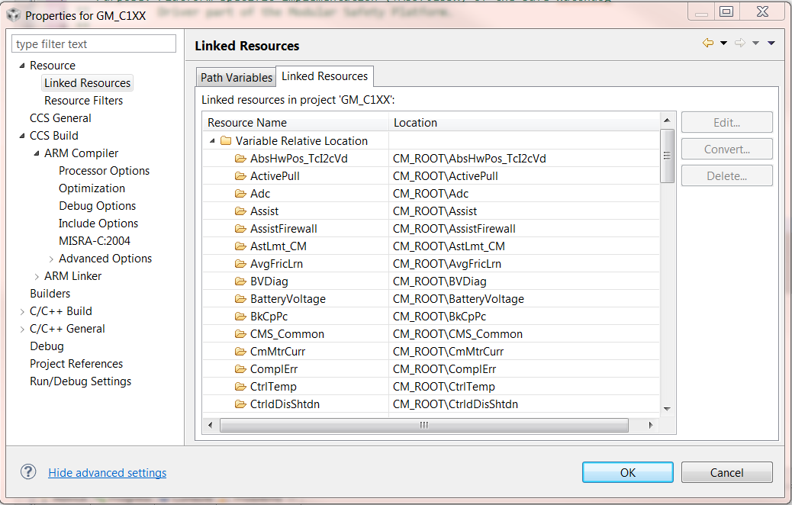

> **Converted document.** Source: `GM_C1XX_EPS_TMS570/HLDD/Build Environment.docx` (Word .docx, converted automatically; formatting, tables and figures preserved as Markdown — consult the original for normative layout).

## References

The following references were used in assistance with the creation of this document and the rationale for some of the configuration settings.

1. ARM Optimizing C/C++ Compiler v4.6 (spnu151f.pdf)
2. Cortex-R4 and Cortex-R4F Revision r1p3 Technical Reference Manual (DDI0363E_cortexr4_r1p3_trm.pdf)
3. Texas Instruments Assembly Language Tools Enhanced High-End Timer (NHET) Assembler User’s Guide (spnu490.pdf)
4. AUTOSAR realtime operating system MICROSAR OS TMS570 SafeContext Technical Reference v5.00 (TechnicalReference_MicrosarOS_TMS570SafeContext.pdf)
5. ARM Assembly Language Tools (spnu118j.pdf)
## ARM Cortex R4

### Make Process

This project uses a generated Makefile to perform the build process.  The makefile generator included with the CCSv5 installation is used to generate the Makefile for the build.

### C/C++ Build

#### ARM/Thumb Mode Compile Settings

All files compiled in this project are compiled in thumb mode with the exception of the files listed in Table 1: ARM Mode Files.

| **File** | **Rationale** |
| --- | --- |
| TMS570_Startup\src | TMS570_Startup\src |
| AppStartup.c | This file contains _c_init00 which is vectored to by the reset vector.  At the moment, it is understood that every function directly entered by a vector from the vector table should be compiled in ARM mode. |
| sys_core.asm | The .arm directive in the source is a preprocessor to compile in ARM mode. |
| sys_memory.asm | The .arm directive in the source is a preprocessor to compile in ARM mode. |
| fiqintvect.asm | ISR reference to Isr_ESHM, which is in ARM mode. |
| TMS570_uDiag\src | TMS570_uDiag\src |
| Cd_uDiagESM.c | Contains Isr_ESHM which is a category 1 interrupt and §8.3 of [4] states “Note: Category 1 interrupt functions must always be compiled for 32bit ARM mode!” |
| Cd_uDiagVIM.c | Present configuration. No real need for this to be in ARM mode. |
| dabort.asm | The .arm directive in the source is a preprocessor to compile in ARM mode. |
| pabort.asm | The .arm directive in the source is a preprocessor to compile in ARM mode. |
| undefinst.asm | The .arm directive in the source is a preprocessor to compile in ARM mode. |
| GM_C1XX_EPS_TMS570\SwProject\Source\BSW\Os | GM_C1XX_EPS_TMS570\SwProject\Source\BSW\Os |
| osekasm.asm | §11 of [4] requires all Os assembly files to be compiled in ARM mode |
| GM_C1XX_EPS_TMS570\SwProject\Source\BSW\VStdLib | GM_C1XX_EPS_TMS570\SwProject\Source\BSW\VStdLib |
| vstdlib.c | Unknown where requirement is for ARM mode compilation.  It fails on the inline assembly when compiled in Thumb mode. |
| GM_C1XX_EPS_TMS570\SwProject\Source\BSW\Wdg | GM_C1XX_EPS_TMS570\SwProject\Source\BSW\Wdg |
| Wdg_TMS570LS3x.c | Present configuration. No real need for this to be in ARM mode. |
| GM_C1XX_EPS_TMS570\SwProject\Source\BSW\WdgIf | GM_C1XX_EPS_TMS570\SwProject\Source\BSW\WdgIf |
| WdgIf.c | Present configuration. No real need for this to be in ARM mode. |
| GM_C1XX_EPS_TMS570\SwProject\Source\BSW\WdgM | GM_C1XX_EPS_TMS570\SwProject\Source\BSW\WdgM |
| WdgM.c | Present configuration. No real need for this to be in ARM mode. |
| WdgM_Checkpoint.c | Present configuration. No real need for this to be in ARM mode. |
| GM_C1XX_EPS_TMS570\SwProject\Source\CDD\BasicSysSrvc | GM_C1XX_EPS_TMS570\SwProject\Source\CDD\BasicSysSrvc |
| Interrupts.c | §6.7.2 of [1] requires all compiler intrinsic functions to be compiled in ARM mode.  Interrupts.c is using compiler intrinsic calls to enable/disable FIQ. |
| GM_C1XX_EPS_TMS570\SwProject\Source\CDD\MtrCtrl | GM_C1XX_EPS_TMS570\SwProject\Source\CDD\MtrCtrl |
| MtrCtrl_Irq.c | Motor control ISR is a category 1 interrupt and §8.3 of [4] states “Note: Category 1 interrupt functions must always be compiled for 32bit ARM mode!” |

        - Table 1: ARM Mode Files
#### File Optimization Settings

All files compiled in this project are compiled with *Optimization Level* set to two (2) and *Optimization for Speed* set to three (3). Files that do not use these default optimization levels are shown in Table 2: Optimized Files.

| **File** | **Optimization Level** | **Optimize for Speed** | **Rationale** |
| --- | --- | --- | --- |
| GM_C1XX_EPS_TMS570\SwProject\Source\BSW\Os | GM_C1XX_EPS_TMS570\SwProject\Source\BSW\Os | GM_C1XX_EPS_TMS570\SwProject\Source\BSW\Os | GM_C1XX_EPS_TMS570\SwProject\Source\BSW\Os |
| osekasm.asm | 3 | 5 | Present configuration. No rationale for the optimized level or speed. |
| GM_C1XX_EPS_TMS570\SwProject\Source\BSW\VStdLib | GM_C1XX_EPS_TMS570\SwProject\Source\BSW\VStdLib | GM_C1XX_EPS_TMS570\SwProject\Source\BSW\VStdLib | GM_C1XX_EPS_TMS570\SwProject\Source\BSW\VStdLib |
| vstdlib.c | 3 | 5 | Present configuration. No rationale for the optimized level or speed. |
| GM_C1XX_EPS_TMS570\SwProject\Source\BSW\WdgIf | GM_C1XX_EPS_TMS570\SwProject\Source\BSW\WdgIf | GM_C1XX_EPS_TMS570\SwProject\Source\BSW\WdgIf | GM_C1XX_EPS_TMS570\SwProject\Source\BSW\WdgIf |
| WdgIf.c | 3 | 5 | Present configuration. No rationale for the optimized level or speed. |
| GM_C1XX_EPS_TMS570\SwProject\Source\BSW\WdgM | GM_C1XX_EPS_TMS570\SwProject\Source\BSW\WdgM | GM_C1XX_EPS_TMS570\SwProject\Source\BSW\WdgM | GM_C1XX_EPS_TMS570\SwProject\Source\BSW\WdgM |
| WdgM.c | 3 | 5 | Present configuration. No rationale for the optimized level or speed. |
| GM_C1XX_EPS_TMS570\SwProject\Source\CDD\BasicSysSrvc | GM_C1XX_EPS_TMS570\SwProject\Source\CDD\BasicSysSrvc | GM_C1XX_EPS_TMS570\SwProject\Source\CDD\BasicSysSrvc | GM_C1XX_EPS_TMS570\SwProject\Source\CDD\BasicSysSrvc |
| Interrupts.c | 3 | 5 | Present configuration. No rationale for the optimized level or speed. |
| GM_C1XX_EPS_TMS570\SwProject\Source\CDD\MtrCtrl | GM_C1XX_EPS_TMS570\SwProject\Source\CDD\MtrCtrl | GM_C1XX_EPS_TMS570\SwProject\Source\CDD\MtrCtrl | GM_C1XX_EPS_TMS570\SwProject\Source\CDD\MtrCtrl |
| MtrCtrl_Irq.c | 3 | 5 | Motor control ISR is a frequently triggered ISR with a strict deadline, so fast processing is mandatory. |

        - Table 2: Optimized Files
#### Excluded Files

The following tables show the files that are excluded from each build configuration that is configured in the project.

##### Release Build Configuration

| **File** | **Rationale** |
| --- | --- |
| TMS570_Startup\src | TMS570_Startup\src |
| BootStartup.c | Not required by the application |
| sys_startup.c | Not required by the application |

        - Table 3: Release Build Configuration Excluded Files
#### Project Properties

The following sections describe the settings used within the project properties for the Resource, General, and Build sections.

The values listed in the “cfg” columns in the following sections refer to the following:

- **A** – Default for All build configurations
- **R** – The Release build configuration
- **D** – The Debug build configuration
  - Not Implemented – CPU use with all debug info enabled produces an executable not capable of meeting deadlines and is not capable of approximating a “Release” build system at this time.
- **U **– CPU Usage Metrics Build
  - Not implemented – Metrics builds are performed by running a set of scripts in the Tools folder located within the project. The script will add the files needed to perform a metrics build and is compiled using the release build configuration.
- **P **– The Profiling build configuration
  - Not Implemented TBD – according to compiler guide the debug info should not be enabled when profiling.
- **F** – Fault Injection build configuration
##### Resources

##### Linked Resources

The following resources are used within Code Composer Studio for linking to directories within the host system.

##### Path Variables

The path variables defined below specify locations in the file system. The variables can include other path variables with the syntax “${VAR}.”

| **N****ame** | **Cfg** | **Value** | **Rationale** |
| --- | --- | --- | --- |
| CCS_BASE_ROOT | A | << Install Path >> | Value is automatically determined. |
| CCS_INSTAL_ROOT | A | << Install Path >> | Value is automatically determined. |
| CG_TOOL_ROOT | A | << Install Path >> | Value is automatically determined. |
| ECLIPSE_HOME | A | << Install Path >> | Value is automatically determined. |
| PARENT_LOC | A | << Install Path >> | Value is automatically determined. |
| PROJECT_LOC | A | << Install Path >> | Value is automatically determined. |
| WORKSPACE_LOC | A | << Install Path >> | Value is automatically determined. |
| CM_ROOT | A | ${PROJECT_LOC}\..\.. | Defines the base folder for the project which contains all of the software components included for a build. The path variable is used with the linked resources to bring the components into the project. |

##### Linked Resources

The linked resources tab provides all the link paths within the project. The image below shows a project using a path variable for linked resources included in the project.

Figure 1: Linked Resources Defined in a Project

##### Resource Filters

The following resource filters are applied to the build environment.

| **N****ame** | **Cfg** | **Value** | **Rationale** |
| --- | --- | --- | --- |
| Include Only: | Include Only: | Include Only: | Include Only: |
| *[None]* |  |  |  |
| Exclude All: | Exclude All: | Exclude All: | Exclude All: |
| UTP Folders | A | *Filter Type: *Exclude All | Removes access to the UTP folders in each software component from Code Composer Studio’s view of the project tree. The UTP folders are used for unit testing and not used as part of the build. |

##### General

| **Attribute Name** | **Cfg** | **Value** | **Cmd**** Line Opt** | **Rationale** |
| --- | --- | --- | --- | --- |
| Device | Device | Device | Device | Device |
| Variant | A |  |  | This is the microprocessor selected for the  for EA3.0 |
| Advanced settings | Advanced settings | Advanced settings | Advanced settings | Advanced settings |
| Device endianness | A | be32 | -be32 | ARM is migrating future devices to big-endian, so big-endian is the desired setting for this project to be compatible with future devices.  The option be32 is selected to provide a big-endian program with big-endian encoded instructions. |
| Compiler version | A | TI v4.9.5 |  | TI v4.9.5 contains all the features necessary to support EPS production programs at this time. |
| Output Format | A | eabi (ELF) | --abi=eabi | The “eabi” format option is required to support use of floating point. |
| Linker command file | A |  |  |  |
| Runtime support library | A | rtsv7R4_T_be_v3D16_eabi.lib |  | Run-time support (rts) library that supports the following: |

##### Build

| **Attribute Name** | **Cfg** | **Value** | **Cmd**** Line Opt** | **Rationale** |
| --- | --- | --- | --- | --- |
| Builder | Builder | Builder | Builder | Builder |
| Use default build command | R | Not Selected |  | Custom build command defined in the next line. |
|  | F | Selected |  | Uses options defined in other settings to generate command. |
| Build Command | R | ${CCS_UTILS_DIR}/bin/gmake | - | -s: Silent operation, do not print the commands as they are executed. This option was included to help save compile time by generating less output to the console window in Code Composer Studio. |
|  | F | ${CCS_UTILS_DIR}/bin/gmake-j |  |  |
| Generate Makefiles automatically | A | Selected |  | Uses the built-in makefile generator of Code Composer Studio to generate the makefile for the compiler. |
| Behavior – Build Settings | Behavior – Build Settings | Behavior – Build Settings | Behavior – Build Settings | Behavior – Build Settings |
| Stop on first build Error | A | Selected |  |  |
| Use Parallel build | A | Selected (use parallel jobs = ) |  | See above for option -j . |
| Behavior – Build Settings | Behavior – Build Settings | Behavior – Build Settings | Behavior – Build Settings | Behavior – Build Settings |
| Build on resource save (Auto Build) | A | Selected *Make build Target:* all |  | Default settings |
| Build (Incremental Build) | A | Selected *Make build Target:* all |  | Default settings |
| Clean | A | Selected *Make build Target:* clean |  | Default settings |
| Steps – Pre-build Steps | Steps – Pre-build Steps | Steps – Pre-build Steps | Steps – Pre-build Steps | Steps – Pre-build Steps |
| Command | A |  |  |  |
| Description | A |  |  |  |
| Steps – Pre-build Steps | Steps – Pre-build Steps | Steps – Pre-build Steps | Steps – Pre-build Steps | Steps – Pre-build Steps |
| Command | A | "${PROJECT_ROOT}/postbuild.bat" "${BuildArtifactFileBaseName}" |  | Runs a batch that is maintained by Nexteer. The batch file performs a few tasks at the end of the build, including: Run checksum and ECC over the created out file, generating files needed for PDX container creation to support customer tools, creating an hex format output of the file, and performing an archiving script to zip up the output deliverables, source files, and documentation. |
| Description | A | Create flash image: Intel-HEX |  |  |
| Build Variables | Build Variables | Build Variables | Build Variables | Build Variables |
|  | A |  |  | CM_ROOT is used to link the components to the project. |
| Environment | Environment | Environment | Environment | Environment |
|  | A |  |  | Values are determined by the install path of Code Composer, the works space, and the compiler tools. These are populated automatically by Code Composer Studio. |
| Link Order | Link Order | Link Order | Link Order | Link Order |
|  | A |  |  | No link order is currently required. |
| Dependencies | Dependencies | Dependencies | Dependencies | Dependencies |
|  | A |  |  | No dependencies are currently required. |

##### ARM Compiler

| **Attribute Name** | **Cfg** | **Value** | **Cmd**** Line Opt** | **Rationale** |
| --- | --- | --- | --- | --- |
| Command | A | "${CG_TOOL_CL}" |  | Default settings |
| Command-line pattern | A | ${command} ${flags} ${inputs} |  | Default settings |

##### Processor Options

| **Attribute Name** | **Cfg** | **Value** | **Cmd**** Line Opt** | **Rationale** |
| --- | --- | --- | --- | --- |
| Target processor version | A | 7R4 | -mv7R4 | TMS570 has an ARM7 Cortex R4 core |
| Designate code state, 16-bit(thumb) or 32-bit | A | 16 | --code_state=16 | 16 is the default selection for EPS project for thumb mode.  Table 1: ARM Mode Files shows all files which are being compiled in 32 bit mode. |
| Specify floating point support | A | VFPv3D16 | --float_support=vfpv3d16 | The Cortex R4 implements the VFPv3-D16 architecture per §1.2 of [2] |
| Application binary interface | A | eabi | --abi=eabi | eabi is required when using floating point unit |
| Little endian code | A | Not Selected | --little_endian, -me | ARM is migrating away from the little-endian architecture, so Nexteer should not use little-endian in the design. |

##### Optimization Options

| **Attribute Name** | **Cfg** | **Value** | **Cmd**** Line Opt** | **Rationale** |
| --- | --- | --- | --- | --- |
| Optimization | Optimization | Optimization | Optimization | Optimization |
| Optimization level | A | 2 | -O2 | Level 2 selected because it is the default level of optimization and is also the level of optimization used on the 28x platform. |
| Optimize for speed | A | 3 | --opt_for_speed=3 | Level 3 enables optimizations geared towards improving the code performance/speed with a low risk of worsening of impacting code size. |

##### Debug Options

| **Attribute Name** | **Cfg** | **Value** | **Cmd**** Line Opt** | **Rationale** |
| --- | --- | --- | --- | --- |
| Debugging model | R | Full symbolic debug | --symbdebug:drawf, -g | DWARF debug format is required when using floating point for the EABI support. Skeletal build not used because the debugging information was removed for all static symbols, only global symbols were available. |
|  | F | Symbolic debug for program analysis | --symbdebug:skeletal | An old option setting that was not updated to use the same settings as the release build option. The fault injection build is a special case build used for testing. |
| Optimize fully in the presence of debug directives | R | Selected | --optimize_with_debug | Combined with the full symbolic debug, the compiled binary will contain debugging information needed for system development but it will be optimized to reduce the impact to the binary execution. |
|  | F | Not Selected |  | To our knowledge, with the skeletal build, the debugging symbols available should be almost identical. |
| Specify DWARF version | A | 2 | --symdebug:dwarf_version=2 | DWARF 2 format is being selected because there is a known errata with compiler when DWARF 3 is selected. |

##### Include Options

| **Attribute Name** | **Cfg** | **Value** | **Cmd**** Line Opt** | **Rationale** |
| --- | --- | --- | --- | --- |
| Specify a preinclude file | A | None specified |  | All include files are strictly specified in the source files.  This option is not used. |
| Add dir to #include search path | A |  |  | The file attached shows the current list of includes as of 29July13. |

##### MISRA-C 2004

| **Attribute Name** | **Cfg** | **Value** | **Cmd Line Opt** | **Rationale** |
| --- | --- | --- | --- | --- |
|  | A | None specified | --check_misra | QAC is used during EPS software development for official MISRA conformance checking.  MISRA checking is not enabled in the project due to the additional warnings that are produced. |

##### Advanced Options

##### Language Options

| **Attribute Name** | **Cfg** | **Value** | **Cmd Line Opt** | **Rationale** |
| --- | --- | --- | --- | --- |
| C/C++ Dialect | A | None selected |  | Embedded C++ is not being used in this project. |
| Language mode | A | None selected |  | Leaving this blank provides the default level of normal ANSI/ISO mode, which provides warnings for all non-ANSI/ISO features used in the program.  All warnings are justified at the end of each build, so if a non-ANSI/ISO feature is required the warning will be justified in the warning justification document. |
| Create precompiled header file as named | A | None specified | --create_pch | Not using precompiled header file option at this time.  It can be used to decrease build times. |
| Disable intrinsic functions | A | Not Selected | --no_intrinsics, -pn | Although direct use of intrinsic functions must be avoided in all portable files (e.g. AUTOSAR compliant) the use of an intrinsic in a macro replacement defined in a target specific file could be allowed, so intrinsic functions are left as enabled. |
| Multibyte character support | A | Not Selected | --multibyte_chars, -pc | Default is to disable support.  There is no known reason to enable this support for this project. |
| Allow extern C functions to propagate exceptions | A | Not Selected | --extern_c_can_throw | Default is to disable support.  This option is related to C++ function external linkage to C files.  The project is written only in C, so support for this is not needed. |
| Precompiled header file for compilation | A | None specified | --use_pch | Not using precompiled header file option at this time.  It can be used to decrease build times. |
| Enable C++ exception handling | A | Not Selected | --exceptions | C++ language is not used in this project. |
| Automatically create/use precompiled headers | A | Not Selected | --pch | Not using precompiled header file option at this time.  It can be used to decrease build times. |
| Output xref listing to .crl file | A | Not Selected | --gen_acp_xref, -px | Cross-reference listing file not required for common debugging.  Disabled by default. |
| Specify precompiled  header path | A | None specified | --pch_dir | Not using precompiled header file option at this time.  It can be used to decrease build times. |
| Floating Point mode | A | None selected | --fp_mode=relaxed | Relaxed can result in faster code with some loss of accuracy and does not conform with ISO.  Strict should be selected to ensure ISO conformance. Current configuration uses relaxed. |
| Do not delete unreferenced static variables | A | Not Selected | --keep_unneeded_statics | In general, keeping unreferenced static variables needlessly allocates memory.  This is not currently necessary in the project. |
| Support C++ run-time type information | A | Not Selected | --rtti, -rtti | C++ language is not used in the project. |
| Treat C files as C++ files | A | Not Selected | --cpp_default, -fg | C++ language is not used in the project. |
| Enable support for GCC extensions | A | Not Selected | --gcc | This option enables GCC features that are not found in the ANSI C standard.  Leaving disabled to comply with the ANSI C standard. |
| Ignore inline keyword | A |  | --no_inlining, -pi | Although the inline keyword is not part of the ANSI/ISO standard, it has been used in past projects when required.  If used, then the inlining functionality should be performed. |
| Info on considered unused precompiled headers | A | Not Selected | --pch_verbose | Not using precompiled header file option at this time.  It can be used to decrease build times. |
| Do static early template instantiation | A | Not Selected | --static_template_instantiation | Templates are a feature of the C++ language.  C++ is not being used in this project. |
| Program mode compilation | A | Not Selected | --program_level_compile, -pm | This option is only applicable when using opt_level=3.  This project is currently using 2. |
| Output raw listing to .rl file | A | Not Selected | --getn_acp_raw, -pl | Raw listing file is not archived as part of an official release. In an effort to reduce the Debug build time; this option is disabled because it is not normally needed when developing.  It can be enabled in a developer’s local build if a particular need arises. |

##### Parser Preprocessing Options

| **Attribute Name** | **Cfg** | **Value** | **Cmd Line Opt** | **Rationale** |
| --- | --- | --- | --- | --- |
| Mode | A | Automatic |  | Default option.  There is no reason at this time to change to manual mode. |

##### Predefined Symbols

| **Attribute Name** | **Cfg** | **Value** | **Cmd Line Opt** | **Rationale** |
| --- | --- | --- | --- | --- |
| Pre-define NAME | A | APPLICATION | --define=APPLICATION | Required for Application build of Vector AUTOSAR |
| Undefine NAME | A | None specified |  | Not required |

##### Diagnostic Options

| **Attribute Name** | **Cfg** | **Value** | **Cmd Line Opt** | **Rationale** |
| --- | --- | --- | --- | --- |
| Quiet Level | A |  | --quiet, -q | Suppress common compiler non-diagnostic output.  Remarks, errors and warnings will still be generated, as well as feature specific status. |
| Verbose diagnostics | A | Not Selected | --verbose_diagnostics, -pdv | When using the CCSv5 environment, the Error window links directly to the source line of the error.  The additional information provided by this is not normally required for debugging. |
| Treat diagnostic <id> as warning | A | 225 | --diag_warning, -pdsw | Treats implicit functions are warnings. |
| Set error limit to <count> | A | Not specified | --set_error_limit, -pdel | The default is 100 when this is not specified. |
| Generate user information file | A | Not Selected | --gen_aux_user_info, -b | Unclear what this file exactly contains.  The default behavior is being kept. |
| Output diagnostic to .err file | A | Not Selected | --write_diagnostics_file, -pdf | There is no need for this file at this time.  The same information is displayed in the standard output window. |
| Treat diagnostic <id> as remark | A | None specified | --diag_remark, -pdsr | No need at this time to alter the default error/warning reporting of the compiler. |
| Treat diagnostic <id> as error | A | None specified | --diag_error, -pdse | No need at this time to alter the default error/warning reporting of the compiler. |
| Emit diagnostic identifier numbers | A | Selected | --display_error_number, -pden | Displaying the diagnostic number generally doesn’t provide any additional useful information, however enabled in present configuration. |
| Suppress warnings | A | Not Selected | --no_warnings, -pdw | All warning should be listed for debug and also for logging in the build output for the release. |
| Treat warnings as errors | A | Not Selected | --emit_warnings_as_errors, -pdew | At this time certain warnings are allowed for a released build.  All warnings are justified in a warnings document provided with the release. |
| Suppress diagnostic <id> | A | 232 | --diag_suppress, -pds | 232 – Non-Standard Type for a bitfield is suppressed due to the large number of remarks generated for TI register definition structures.  This diagnostic remark is not considered critical and is being disabled to allow the diagnostic output to be meaningful and not cluttered with this remark. |
| Issue remarks | A |  | --issue_remarks, -pdr | All remarks should be listed for debug and also for logging in the build output for the release. |
| Print version numbers for each tool | A | Not Selected | --tool_version, -version | Tool versions are suppressed for Debug build because they clutter the standard output window and are very rarely required to solve a problem when debugging. |

##### Runtime Model Options

| **Attribute Name** | **Cfg** | **Value** | **Cmd Line Opt** | **Rationale** |
| --- | --- | --- | --- | --- |
| Place each function in a separate subsection | A | None selected | --gen_func_subsections, -ms | Default behavior is off.  In general this optimization would not produce any benefit for the EPS application with properly designed libraries.  This is being disabled until a need for it arises. |
| Use linker-generated file to remove dead functions | A | None specified | --use_dead_funcs_list | Benefit from use of this option requires building the software twice.  Additionally, the quality tools used during the development process should identify all dead functions and appropriate actions should be taken by the build manager/developers to remove the dead functions. |
| Generate unaligned loads and stored | A | None selected | --unaligned_access | Since faults can be generated when accessing memory out of alignment, the feature is turned off. |
| Designate enum type | A | packed | --enum_type | Default is packed for EABI.  This project is using floating point which requires EABI. |
| Force alignment of structures to <bytecount> bytes | A | None specified | --alight_structs | There is no known reason why structure alignment would be necessary in this project. |
| Reserve as global register | A | None specified | --global_register, -r | There is no need to reserve a register for global use at this time in the EPS application. |
| Allow reassociation of sat arithmetic | A | None selected | --sat_reassoc | It is not clear what this option does when it is enabled.  It is also not clear if off is the default.  None specified is the default and until understanding this parameter is the selection. |
| Compile for power profiling | A | Not Selected | --profile:power | Disable support of the TI profiling tool for Release builds because the profiler support causes additional code size overhead. |
| Enable 16 bit code | A | Selected | --thumb_state, -mt | Thumb is the default selection for EPS project in order to reduce the memory footprint.  Table 1: ARM Mode Files shows all files which are being compiled in 32 bit mode. |
| Allow reassociation of FP arithmetic | A | None selected | --fp_reassoc | This option is automatically set when the fp_mode is specified.  The fp_mode is specified as strict in this document, which causes this option to be set to “No”.   “Yes” will cause ANSI violations. |
| Enums may be char/short, instead of int | A | Not Selected | --small_enum, --small-enum | The default selection is not selected, however it is unclear how this option differs from the enum_type packed option. |
| Enable dynamic stack overflow checking | A | Not Selected | --stack_overflow_check, -mo | There is not enough information in [1] to determine what effect this option has on the compiled code.  The default is disabled.  The stack overflow checks included with the OSEK OS should provide the required overflow detection capability, so usage of this option seems unlikely. |
| Specify whether constants can be embedded in code sections | A | Not Selected | --embedded_constants | Can only be turned off for Cortex M devices. |
| Generates SIMD instructions targeting Neon | A | Not Selected | --neon | Option is not applicable to TMS570. |
| Specify how to treat plain chars | A | unsigned | --plain_char=unsigned | Treating chars as unsigned is the default behavior and is the behavior of the previous EPS project. |
| Specify length of maximum branch chain | A | Not specified | --max_branch_chain, -ab | Branch chaining is supported in 16-BIS mode only, which is currently not enabled. The default length is 10.  Leaving this setting unspecified until it becomes applicable. |
| Chars signed by default | A | Not Selected | --signed_chars, -mc | This option seems to be redundant with the –plain_char option. |
| No dual state support | A | Not Selected | --disable_dual_state, -md | This option is only applicable when using the TIABI.  It is not applicable to the EABI used for this project (See Application Binary Interface selection option rationale) |
| Prevent generation of branch chains in Thumb mode | A | Not Selected | --disable_branch_chaining | 16-bit code is not enabled at the moment, so this option has no effect.  If 16-bit code is being used, then the usage of branch chains could be disabled in time critical code where execution time is more important that code density. |
| Compile for breakpoint-based profiling | A | Not Selected | --profile:breakpt | Disable the profiling option to allow full optimization of the compiled software. |

##### Advanced Optimizations

| **Attribute Name** | **Cfg** | **Value** | **Cmd Line Opt** | **Rationale** |
| --- | --- | --- | --- | --- |
| Generate optimized source interlisted assembly | A | Not Selected | --optimizer_interlist, -os | Enabling this option may prevent some optimizations from occurring.  For the Release build all optimizations for the selected optimization level are desired to be applied. |
| Specify call assumptions when optimizing | A | None selected | --call_assumptions, -op | This option is not applicable, unless using optimization level 3 (--opt_level=3).  This project is using optimization level 2 (See Optimization Level selection for more details) |
| Specify threshold for automatic inlining | A | Not Specified | --auto_inline, -oi | When no auto inline threshold is specified, the decision to inline a function at a particular call-site is based on an algorithm that attempts to optimize benefit and cost. |
| Inline functions only called once | A |  | --single_inline | Enabled during release build to save the calling/return overhead when source level debugging is less likely to be required. |
| Remove entry/exit hooks from the inlined functions | A | No | --remove_hooks_when_inlining | Entry/Exit hooks are not being used in this project, so this option does not apply.  It is being left at is default value. (See Entry/Exit Hook Options for more info) |
| Generate Optimizer information file at level[0-2] | A | None selected | --gen_opt_info, -on | This option only applies when Optimization Level 3 is selected (--opt_level=3).  This project is using Optimization Level 2 (see Optimization Level setting for more info) |
| Assume called funcs hidden aliases(rare) | A | No | --aliased_variables, -ma | Based on the description of this option in §3.4 of [1], this worst-case aliasing assumption does not need to be applied for this software project. |

##### Entry/Exit Hook Options

| **Attribute Name** | **Cfg** | **Value** | **Cmd Line Opt** | **Rationale** |
| --- | --- | --- | --- | --- |
| Insert this call at the entry to each function | A | Not specified | --entry_hook | No entry hook is currently being specified for this software project. |
| Pass caller’s name or address to entry hook | A | Not selected | --entry_parm | No entry hook is currently being specified for this software project. |
| Insert this call at the exit from each function | A | Not specified | --exit_hook | No exit hook is currently being specified for this software project. |
| Pass caller’s name or address to exit hook | A | Not selected | --exit_parm | No exit hook is currently being specified for this software project. |

##### Library Function Assumptions

| **Attribute Name** | **Cfg** | **Value** | **Cmd Line Opt** | **Rationale** |
| --- | --- | --- | --- | --- |
| Level of printf support required | A | None selected | --printf_support | This option does not apply because printf support is not required in this project, thus the library is not linked in. |
| File does not define any RTS library func(def.) | A | Not Selected | --std_lib_func_not_defined, -ol2 | Per §3.2.1 of [1] this option is only applicable when using Optimization level 3 (--opt_level=3).  This project is using Optimization level 2. |
| File redefines an RTS library function. | A | Not Selected | --std_lib_func_redefined, -ol0 | Per §3.2.1 of [1] this option is only applicable when using Optimization level 3 (--opt_level=3).  This project is using Optimization level 2. |
| File contains an RTS library function. | A | Not Selected | --std_lib_func_defined, -ol1 | Per §3.2.1 of [1] this option is only applicable when using Optimization level 3 (--opt_level=3).  This project is using Optimization level 2. |

##### Assembler Options

| **Attribute Name** | **Cfg** | **Value** | **Cmd Line Opt** | **Rationale** |
| --- | --- | --- | --- | --- |
| Keep the generated assembly language (.asm) file | A |  | --keep_asm, -k | .asm files are not saved as part of the release build process and are generally not referenced after a build. unless debugging, so they are not generated for release build. |
| Source interlist | A | None selected | --src_interlist | Source interlisted files are only used for debug. |
| Generate listing file | A | Not Selected | --asm_listing, -al | listing files are  not saved as part of the release build process and are generally not referenced, unless debugging, so they are not generated for release build. |
| Keep local symbols in output file | A | Not Selected | --output_all_syms, -as | This option puts labels in the symbol table.  At this time the benefit from that the additional label information provides is not know to be used, therefore this option is left at its default value so as to not increase the size of the output file. |
| Do no generate .clink for .const sections | A | Not Selected | --no_const_clink | The default behavior is to remove unreferenced global constant arrays at link time. |
| Simulate source ‘.copy filename’ | A | None specified | --copy_file, -ahc | There is no need to insert special assembly instructions into the beginning of the assembly files. |
| Symbol names are not case-significant | A | Not Selected | --syms_ignore_case, -ac | Default behavior is that symbol names are case significant.  There is no reason to ignore symbol case. |
| Use unified assembly language | A | Not Selected | --ual | This option doesn’t apply to the TMS570 because it is using an ARMv7 core for which UAL syntax is the default. Leaving this value at its default of not selected. |
| Undefine assembly symbol NAME | A | None specified | --asm_undefine, -au | This project does not require undefining assembly defines. |
| Simulate source ‘.include filename’ | A | None specified | --include_file, -ahi | This project does not require including a generic include into all assembly files. |
| Pre-define assembly symbol NAME | A | None specified | --asm_define, -ad | This project does not require defining assembly defines. |
| Generate first-level assembly include file list | A | Not Selected | --asm_includes, -api | This file is not required for the release build and is not foreseen to be used for typical debugging. |
| Generate cross reference file | A | Not Selected | --cross_reference, -ax | This file is not required for the release build and is not foreseen to be used for typical debugging. |
| Generate assembly dependency information | A | Not specified | --asm_dependency, -apd | This file contains information suitable for input to a standard make utility.  At the moment, the make process is controlled by the managed make process, so this file is not required. |

##### File Type Specifier

| **Attribute Name** | **Cfg** | **Value** | **Cmd Line Opt** | **Rationale** |
| --- | --- | --- | --- | --- |
| File is a C file (default for .c/no ext) | A | None specified | --c_file, -fc | Default behavior of .c as a C source file is desired for this project. |
| File is an assembly file (default for .asm) | A | None specified | --asm_file, -fa | Default behavior of .asm as a assembly source file is desired for this project. |
| File is an object file (default for .obj) | A | None specified | --obj_file, -fo | Default behavior of .obj as an object file is desired for this project. |
| File is a C++ file (default for .C .cpp. cc) | A | None specified | --cpp_file, -fp | This option does not apply to this project since C++ is not being used.  Default behavior is acceptable for this project. |

##### Directory Specifier

| **Attribute Name** | **Cfg** | **Value** | **Cmd Line Opt** | **Rationale** |
| --- | --- | --- | --- | --- |
| Mode | A | Automatic |  | Default is Automatic Mode.  There is no reason to change from the default. |
| Temporary file directory | A | None specified | --temp_directory, -ft | Default is current directory.  There is no reason to change from the default. |
| Assembly file directory | A | None specified | --asm_directory, -fs | Default is current directory.  There is no reason to change from the default. |
| Preprocessor file directory | A | None specified | --pp_directory | Default is current directory.  There is no reason to change from the default. |
| Compilation output file name, can override | A | None specified | --output_file, -fe | Default is current directory.  There is no reason to change from the default. |
| Object file directory | A | None specified | --obj_directory, -fr | Default is current directory.  There is no reason to change from the default. |
| Listing/xref file directory | A | None specified | --list_directory, -ff | Default is Object file directory.  There is no reason to change from the default. |

##### Default File Extensions

| **Attribute Name** | **Cfg** | **Value** | **Cmd Line Opt** | **Rationale** |
| --- | --- | --- | --- | --- |
| Extension for object files | A | None specified | --obj_extension, -eo | Default is .obj and is the desired extension. |
| Extension for listing files | A | None specified | --listing_extension, -es | Default is .lst and is the desired extension. |
| Extension for C++ files | A | None specified | --cpp_extension, -ep | Default is .cpp.  C++ is not used in this project, so this setting doesn’t matter. |
| Extension for assembly files | A | None specified | --asm_extension, -ea | Default is .asm and is the desired extension. |
| Extension for C files | A | None specified | --c_extension, -ec | Default is .c and is the desired extension. |

##### Command Files

| **Attribute Name** | **Cfg** | **Value** | **Cmd Line Opt** | **Rationale** |
| --- | --- | --- | --- | --- |
| Command Files | Command Files | Command Files | Command Files | Command Files |
| Read options from specified file | A | None specified | --cmd_file, -@ | Currently all command line options are being specified via the CCSv5 Properties dialog selection and appending the commands from an additional command file to the compiler execution command is not necessary. |

##### ARM Linker

| **Attribute Name** | **Cfg** | **Value** | **Cmd Line Opt** | **Rationale** |
| --- | --- | --- | --- | --- |
| Command | A | "${CG_TOOL_CL}" |  | Default values |
| Command-line pattern: | A | ${command} ${flags} ${output_flag} ${output} ${inputs} |  | Default values |

##### Basic Options

| **Attribute Name** | **Cfg** | **Value** | **Cmd Line Opt** | **Rationale** |
| --- | --- | --- | --- | --- |
| Basic Options | Basic Options | Basic Options | Basic Options | Basic Options |
| Specify output file name | A | "EPS_GM_C1xx_dbg.out" | --output_file, -o= | See EPS Naming conventions. |
| Set C system stack size | A | Not specified | --stack_size, -stack | The .stack section is specified as a number of sub-stack sections in the linker command file to allocate space for each of the TMS570 operating mode stacks.  For this reason, it is not necessary to specify the stack size via this command option. |
| Input and output sections listed into <file> | A | "EPS_GM_C1xx_dbg.map" | --map_file, -m | See EPS Naming conventions. |
| Heap size for C/C++ dynamic memory allocation | A | 0 | --heap_size, -heap | Dynamic memory allocation is not performed in this project. |

##### File Search Path

| **Attribute Name** | **Cfg** | **Value** | **Cmd Line Opt** | **Rationale** |
| --- | --- | --- | --- | --- |
| File Search Path | File Search Path | File Search Path | File Search Path | File Search Path |
| Include library file or command file as input | A | "rtsv7R4_T_be_v3D16_eabi.lib" | --library, -l | Run-time support library for the TMS570 ARM core compile in big-endian mode.  This library supplies the definitions for memcpy, memmove, memset, __aeabi_idivmod, etc ., that are required for building files in the project. |
| Add <dir> to library search path | A | "${CG_TOOL_ROOT}/lib" | -search_path, -i | At the moment the RTS library installed with the tool chain selected is used directly from the install directory. |
| Reread libraries; resolve backward references | A | Selected | --reread_libs, -x | Enabling this option provides a more robust way of resolving references in by removing the linker operation order dependency. |
| Search libraries in priority order | A | Not Selected | --priority, -priority | This option does not apply to this project.  Libraries designed for use in this project will not contain definitions for the same function. |
| Disable automatic RTS selection | A | Selected |  | Automatic RTS selection is not desired for this project.  The project should be structured so that a change in library selection is controlled by a change request. |

##### Advanced Options

##### Command File Preprocessing

| **Attribute Name** | **Cfg** | **Value** | **Cmd Line Opt** | **Rationale** |
| --- | --- | --- | --- | --- |
| Pre-define preprocessor macro _name_to_value_ | R |  |  |  |
| Pre-define preprocessor macro _name_to_value_ | F |  |  |  |
| Undefine preprocessor macro _name_ | A | Not specified | --undefine | Preprocessor macro expressions are not used within the linker command file for this project. |
| Don’t use C preprocessor for command files | A | Not Selected | --disable_pp | C preprocessor is not used for command files in this project. |

##### Diagnostics

| **Attribute Name** | **Cfg** | **Value** | **Cmd Line Opt** | **Rationale** |
| --- | --- | --- | --- | --- |
| Verbose diagnostics |  | Not Selected | --verbose_diagnostics | Default setting |
| Treat diagnostic <id> as warning | A | None specified | --diag_warning | No need at this time to alter the default error/warning reporting of the linker. |
| Set error limit to <count> | A | Not specified | --set_error_limit | The default error limit for the linker is 100.  This is acceptable for this project. |
| Treat diagnostic <id> as remark | A | None specified | --diag_remark | No need at this time to alter the default error/warning reporting of the linker. |
| Treat diagnostic <id> as error | A | None specified | --diag_error | No need at this time to alter the default error/warning reporting of the linker. |
| Warn if an unspecified output section is created | A | Selected | --warn_sections, -w | Warnings for unspecified output sections should be issued so that the appropriate action can be taken.  All output sections should be explicitly allocated in this project. |
| Emit diagnostic identifier numbers | A | Not Selected | --disaypl_error_number | Displaying the diagnostic number generally doesn’t provide any additional useful information, unless one would like to see the diagnostic number for purposes of altering the diagnostic reaction. |
| Suppress warnings | A | Not Selected | --no_warnings | All warning should be listed for debug and also for logging in the build output for the release. |
| Treat warnings as errors | A | Not Selected | --emit_warnings_as_errors, -pdew |  |
| Suppress diagnostic <id> | A | None specified | --diag_suppress | No need at this time to alter the default error/warning reporting of the linker. |
| Issue remarks | A | Selected | --issue_remarks | All remarks should be listed for debug and also for logging in the build output for the release. |
| Don’t demangle symbol names in diagnostics | A | Not Selected | --no_demangle | Name demangleing is applicable to C++ source, which is not used in this project. |

##### Linker Output

| **Attribute Name** | **Cfg** | **Value** | **Cmd Line Opt** | **Rationale** |
| --- | --- | --- | --- | --- |
| Detailed link information data-base into <file> | A |  | --xml_link_info, -xml_link_info | Default setting. |
| Produce absolute executable object file (default) | A | Not Selected | --absolute_exe | Presently no need for this output. |
| Display attribute settings in map file | A | Not specified | --mapfile_contents | Default setting |
| List removed dead functions into file | A | Not specified | --generate_dead_funcs_list | Default setting |
| Create a ROM object | A | Not Selected | --rom | No need for this option. |
| Produce a relocatable output module | A | Not Selected | --relocatable, -r | No need for this option. |

##### Symbol Management

| **Attribute Name** | **Cfg** | **Value** | **Cmd Line Opt** | **Rationale** |
| --- | --- | --- | --- | --- |
| Strip symbol table and line number entries | A | Not Selected | --no_symtable, -s | Default setting |
| Do not localize symbols matching pattern | A | Not specified | --globalize | Default setting |
| Scan libraries for duplicate symbol definitions | A | Not Selected | --scan_libraries, -scanlibs | Default setting |
| Add <sym> to symbol table as an unresolved symbol | A | Not specified | --undef_sym, -u | No symbols to add as an unresolved symbol. |
| Make the symbols matching pattern local | A | Not specified | --localize | Default setting |
| Make all global symbols static | A | Not Selected | --make_static, -h | Default setting |
| Specify program entry point for the output module | A | Not specified | --entry_point, -e | No entry point required. |
| Exclude symbols matching pattern from hiding | A | Not specified | --unhide | No requirements to unhide any symbols |
| Specify symbols/sections to be retained by linker | A | Not specified | --retain | No symbols or sections that need to be retained |
| Don’t make global symbol static if | A | Not specified | --make_global, -g | Nothing required to be added in this section |
| Hide symbols matching pattern | A | Not specified | --hide | No symbols required to be hidden |
| No type merging in symbolic debugging information | A | Not Selected | --no_sym_merge, -b | Default setting. |

##### Runtime Environment

| **Attribute Name** | **Cfg** | **Value** | **Cmd Line Opt** | **Rationale** |
| --- | --- | --- | --- | --- |
| Initialization model | A | Link using ROM auto initialization model (--rom_model, -c) | --rom_model, -c | The linker defines cinit as the starting address of the .cinit section. The C boot routine uses this symbol as the starting point for autoinitialization. Using the ram_model option sets the cinit to -1 which indicates that the initialization tables are not in memory, so no initialization is performed at run time which is not desired. |
| ARM big endian modes | A | Link big-endian code in be-32 format | --be32 | Selected to provide a big-endian program with big-endian encoded instructions. |
| Default fill value for holes in output sections | A | Not specified | --file_value, -f | Default value. |
| Generate far call trampolines | A | None selected | --trampolines | No need for this feature at this time, left to default value. |
| Set C arg/argv memory size | A | Not specified | --arg_size, -args | No need for this feature at this time, left to default value. |

##### Link Optimization

| **Attribute Name** | **Cfg** | **Value** | **Cmd Line Opt** | **Rationale** |
| --- | --- | --- | --- | --- |
| Eliminate sections not needed in the executable | A | Off | --unused_section_elimination | Sections should not be removed that are defined; therefore this option is turned off. |
| Aggressively reduce the size of the DWARF information | A | Off | --compress_dwarf | For ELF object files, the --compress_dwarf option eliminates duplicate information that could not be removed through the use of ELF COMDAT |
| Compress ELF sections copied using copy tables | A | Not specified | --copy_compression | No compression is required, therefore left blank. |
| Compress ELF C style auto initialization data | A | Not specified | --cinit_compression | No compression is required, therefore left blank. |

##### Miscellaneous

| **Attribute Name** | **Cfg** | **Value** | **Cmd Line Opt** | **Rationale** |
| --- | --- | --- | --- | --- |
| Miscellaneous | Miscellaneous | Miscellaneous | Miscellaneous | Miscellaneous |
| Add <function> to preferred placement order list | A | Not specified | --preferred_order | No order preferred. |
| Disable conditional linking ignore .clink | A | Not Selected | --disable_clink, -j | According to page 86 in [5], “under the ELF EABI model, the linker assumes that all sections are eligible for removal via conditional linking. Therefore, the .clink directive has no effect under EABI.” |
| Strict compatibility checking | A | None selected | --strict_compatibility | Using the default value to disable the check due to the possibility of false compatibility errors when linking in object files built with an older toolset, or |
| Zero initialize ELF uninitialized sections | A | Off | --zero_init | Set to off otherwise initialization to zero of all RAM with unspecified init values will be generated into the cinit table.  This is not necessary as the hardware RAM initialization will perform this step. |
| Select trampoline minimization algorithm | A | None selected | --minimize_trampolines | Default setting. |
| Minimum space between non-adjacent trampolines | A | Not specified | --trampoline_min_spacing | Default setting. |

##### Dynamic Linking Support Options

| **Attribute Name** | **Cfg** | **Value** | **Cmd Line Opt** | **Rationale** |
| --- | --- | --- | --- | --- |
| Add directory to end of dynamic library search path | A | Not specified | --runpath | Feature is not required currently for this project. |
| Export specified symbol | A | Not specified | --export | Feature is not required currently for this project. |
| Specify ELF shared object file name | A | Not specified | --soname | Feature is not required currently for this project. |
| Force all import references to bind during static linking | A | None selected | --forced_static_binding | Feature is not required currently for this project. |
| Add directory to beginning of dynamic library search path | A | Not specified | --rpath | Feature is not required currently for this project. |
| Specify the symbol name of the initialization code | A | Not specified | --init | Feature is not required currently for this project. |
| Specify the symbol name of the finalization code | A | Not specified | --fini | Feature is not required currently for this project. |
| Import specified symbol | A | Not specified | --import | Feature is not required currently for this project. |
| Generate dynamic executable or dynamic library | A | None selected | --dynaimc | Feature is not required currently for this project. |

#### Post Build

Upon completion of the build a set of activities is executed on the build outputs via execution of the postbuild.bat file launched by the CCS build process.

| **Utility Name** | **Description** | **Installation Instructions** |
| --- | --- | --- |
| hex470 | TI provided tool used to generate a hex/s19 record file required as input by the other utilites | Archived in the project under Tools |
| nowECC.exe | TI provided tool used to generate ECC data for the Flash memory. | Archived in the project under Tools |
| SWE Generator | BMW provided tool to generate the BMW required programming files. | Archived in the project under Tools |
| Hexview | Vector provided utility used to fill the Hex file image | Archived in the project under Tools |
| Common Checksum Tool (CCT) | Nexteer developed checksum calculation utility | Archived in project under Tools |
| WinZip® Command Line Support Add-On | This utility adds command line interface support to WinZip. | Download from http://www.winzip.com/downcl.htm |

        - Table 5: Required Post Build Utilities
## NHET

### Make Process

This NHET component consists of two source files (*.het) and thus the make process is controlled via a batch file that performs the following steps:

1. Invoke the hetp Assembler for all HET source files (*.het)
2. Copy the *.h output files to the appropriate directory. The *.c output files are already in the correct folder location.
### Tool Settings

#### Assembler

The following commands are performed as part of step 1 of the batch file described in the earlier section.

*hetp -hc32 -n0 **-v2 Nhet_Prog.het*

*hetp -hc32 -n1 -v2 Nhet2_Prog.het*

| **Cmd Line Opt** | **Rationale** |
| --- | --- |
| -hc32 | This option produces the .c and .h files necessary to integrate the NHET project with the main project. Also this option must be used with -nx (see below) |
| -nx | Specifies the x-th HET module in the device. Also this option must be used with -hc32. The 65nm Gladiator parts contain two NHET modules. |
| -v2 | Support enabled for additional instructions compared to NHET version 1. Required for 65nm Gladiator parts that contain NHET version 2. |

## Appendix

### Debug Output Files

This section lists the optional Debug Output file options that are not selected in the normal build configurations.

| File Type |  |
| --- | --- |
| Cross-Reference Listing Information |  |
| Raw Listing File |  |

## Revision Control Log

| **Item #** | **Rev #** | **Change Description** | **Date ** | **Author Initials** |
| --- | --- | --- | --- | --- |
| 1 | 1.0 | Initial Creation for C1xx Bev | 08/08/16 | CP |
