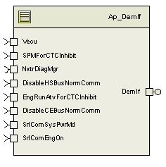
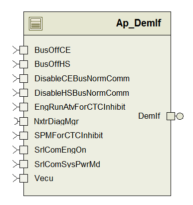

> **Converted document.** Source: `GM_C1XX_EPS_TMS570/SwProject/DemIf/doc/DemIf_MDD.docx` (Word .docx, converted automatically; formatting, tables and figures preserved as Markdown — consult the original for normative layout).

## Module -- DEM Interface

## High-Level Description

This module provides a server port to the Nexteer Common Diagnostic manager which is a conduit to allow implementation of customer specific functionality in the path to asserting a customer DTC.  At the moment this module reads the customer specific fault masking signals and provides the necessary “fault masking” logic.

Note that “fault masking” is not intended to inhibit the fail action of the system which is always taken by the Nexteer Diagnostic manager for asserted NTC’s.

Each DTC has a calibration constant that represents which fault masking signals are relevant to inhibit or not the fail. This calibration constant is represented by a bitmap and the fault is only set as a DTC if this mask matches the fault masking signals.

## Figures

### Diagram – Component

### Fault signals mask (bitmap representation)

| **Bit ****15** | **Bit ****14** | **Bit ****13** | **Bit ****12** | **Bit ****11** | **Bit ****10** | **Bit ****9** | **Bit ****8** |
| --- | --- | --- | --- | --- | --- | --- | --- |
| Reserved | Reserved | Reserved | Reserved | Reserved | Reserved | Reserved |  |
| **Bit ****7** | **Bit ****6** | **Bit ****5** | **Bit ****4** | **Bit ****3** | **Bit ****2** | **Bit ****1** | **Bit ****0** |
|  |  | U007300 status bit 1 != TRUE | 5 seconds delay after crank require and under voltage recovery | 9V < Vbatt < 16V | 6V < Vbatt < 16V | EngRunAtv == TRUE | PwrMd == Run |

## Variable Data Dictionary

| Module Inputs | Module Outputs | Module Outputs |
| --- | --- | --- |
| SPMForCTCInhibit_Cnt_lgc | SPMForCTCInhibit_Cnt_lgc |  |
| Vecu_Volt_f32 | Vecu_Volt_f32 |  |
| DisableHSBusNormComm_Cnt_lgc | DisableHSBusNormComm_Cnt_lgc |  |
| EngRunAtvForCTCInhibit_Cnt_lgc | EngRunAtvForCTCInhibit_Cnt_lgc |  |
| DisableCEBusNormComm_Cnt_lgc | DisableCEBusNormComm_Cnt_lgc |  |
| SrlComEngOn_Cnt_lgc | SrlComEngOn_Cnt_lgc |  |
| SrlComSysPwrMd_Cnt_enum | SrlComSysPwrMd_Cnt_enum |  |
| Dem_NvData | Dem_NvData |  |

### Module Internal Variables

| Variable Name | Type / Resolution | Legal Range | Legal Range | Software Segment |
| --- | --- | --- | --- | --- |
| Dem_NvData_BufferOpt | Dem_OptimizedNvMDataType | N/A | N/A | DEMIF_START_SEC_VAR_NOINIT_UNSPECIFIED |
| DemIf_DelayInhibitCtrl_M_Str | DemIf_DelayInhibitCtrl_Struct | N/A | N/A | DEMIF_START_SEC_VAR_CLEARED_UNSPECIFIED |

#### User defined typedef definition/declaration

This section documents any user types uniquely used for the module.

| Typedef Name | Element Name | User Defined Type | Legal Range | Legal Range |
| --- | --- | --- | --- | --- |
| Dem_OptimizedNvMDataType | consistencyPattern[DEM_NVDATA_PATTERN_SIZE] | Uint8 | 0 | FULL |
|  | chronoPriMemUsed | Dem_DtcChronoRefType | 0 | FULL |
|  | primaryStack[DEM_MAX_NUMBER_EVENT_ENTRY][DEM_MAX_SNAPSHOT_RECORD_SIZE+1] | Uint8 | 0 | FULL |
|  | chronoPriMem[DEM_MAX_NUMBER_EVENT_ENTRY] | Dem_ChronoPriMemType |  |  |
|  | dtcStatusByte[D_NUMOFDEMEVENTS_CNT_U08+1] | Dem_DtcStatusByteType | 0 | FULL |
|  | dtcAgingCounter[DEM_MAX_NUMBER_EVENT_ENTRY] | Uint8 | 0 | FULL |
|  | firstFailedEvent | Dem_EventIdType | 0 | FULL |
|  | firstConfirmedEvent | Dem_EventIdType | 0 | FULL |
|  | mostRecentFailedEvent | Dem_EventIdType | 0 | FULL |
|  | mostRecentConfirmedEvent | Dem_EventIdType | 0 | FULL |
|  | terminatingPattern[DEM_NVDATA_PATTERN_SIZE] | Uint8 | 0 | FULL |
| CTCInhibitStrType_Structure | CTCNumber_Cnt_u32 | Uint32 | 0 | FULL |
|  | CTCInhibitMaskPtr_Cnt_u16 | Const Uint16 * | 0 | FULL |
| DemIf_DelayInhibitCtrl_Struct | TimerHandler_mS_M_u32p0 | Uint32 | 0 | FULL |
|  | PrevSysPwrMdSignal_Cnt_M_enum | SysPwrMd | 0 | 3 |
|  | IsDelayElapsed_Cnt_M_lgc | Bollean | FALSE | TRUE |

## Constant Data Dictionary

### Calibration Constants

| Constant Name |
| --- |
| k_CtcInhibitMask417654_Cnt_u16 |
| k_CtcInhibitMask44604B_Cnt_u16 |
| k_CtcInhibitMask446058_Cnt_u16 |
| k_CtcInhibitMask44605A_Cnt_u16 |
| k_CtcInhibitMask454500_Cnt_u16 |
| k_CtcInhibitMask456D00_Cnt_u16 |
| k_CtcInhibitMask456E42_Cnt_u16 |
| k_CtcInhibitMask480003_Cnt_u16 |
| k_CtcInhibitMask480011_Cnt_u16 |
| k_CtcInhibitMask480012_Cnt_u16 |
| k_CtcInhibitMaskC07300_Cnt_u16 |
| k_CtcInhibitMaskC07700_Cnt_u16 |
| k_CtcInhibitMaskC10000_Cnt_u16 |
| k_CtcInhibitMaskC10100_Cnt_u16 |
| k_CtcInhibitMaskC12100_Cnt_u16 |
| k_CtcInhibitMaskC14000_Cnt_u16 |
| k_CtcInhibitMaskC15900_Cnt_u16 |
| k_CtcInhibitMaskC26A00_Cnt_u16 |
| k_CtcInhibitMaskC40171_Cnt_u16 |
| k_CtcInhibitMaskC40271_Cnt_u16 |
| k_CtcInhibitMaskC41571_Cnt_u16 |
| k_CtcInhibitMaskC42271_Cnt_u16 |
| k_CtcInhibitMaskC45A71_Cnt_u16 |
| k_CtcInhibitMaskC56B71_Cnt_u16 |
| k_CtcInhibitMaskD83300_Cnt_u16 |
| k_CtcInhibitMaskE50271_Cnt_u16 |

### Program(fixed) Constants

#### Embedded Constants

##### Local

| Constant Name | Resolution | Units | Value |
| --- | --- | --- | --- |
| D_DELAYINHIBITTIME_MS_U16 | 1 | mS | 5000 |
| D_DELAYINHIBITUNDER_VOLTS_F32 | 1 | Volts | 9.0 |

##### Global

| Constant Name |
| --- |
| DEM_DTC_KIND_ALL_DTCS |
| DEM_NVDATA_PATTERN_SIZE |
| DEM_MAX_NUMBER_EVENT_ENTRY |
| DEM_MAX_EXTDATA_RECORD_SIZE |
| DEM_SNAPSHOTS_PER_DTC |
| DEM_MAX_SNAPSHOT_RECORD_SIZE |
| DEM_NUMBER_OF_EVENTS |

#### Module specific Lookup Tables Constants

| Constant Name | Resolution | Value | Software Segment |
| --- | --- | --- | --- |
| T_CTCTestEnables_Cnt_str | 1 | {0x417654U, &k_CtcInhibitMask417654_Cnt_u16} | DEMIF_START_SEC_CONST_UNSPECIFIED |

## Functions/Macros used by the Sub-Modules

### Library Functions / Macros

The library and functions / Macros that are called by the various sub modules are identified below,

Rte_Call_SystemTime_GetSystemTime_mS_u32

Rte_IRead_DemIf_Per1_SrlComSysPwrMd_Cnt_enum

Rte_Call_SystemTime_DtrmnElapsedTime_mS_u16

Rte_Read_SPMForCTCInhibit_Cnt_lgc

Rte_Read_EngRunAtvForCTCInhibit_Cnt_lgc

Rte_Read_Vecu_Volt_f32

### Data Hiding Functions

### Global Functions/Macros Defined by this Module

#### Global Function DemIf_RestartDem

| **Function Name** | DemIf_RestartDem | Type | Min | Max |
| --- | --- | --- | --- | --- |
| **Arguments Passed ** | None |  |  |  |
| **Return Value** | N/A |  |  |  |

##### Description

Call Dem_Init()

#### Global Function DemIf_SetEventStatus

| **Function Name** | DemIf_SetEventStatus | Type | Min | Max |
| --- | --- | --- | --- | --- |
| **Arguments Passed ** | EventId | UInt8 | FULL | FULL |
|  | EventStatus | NxtrDiagMgrStatus | FULL | FULL |
| **Return Value** | E_OK | Std_ReturnType | 0 | 0 |

##### Design Rationale

This function incorporates the DTC inhibiting logic required for a subset of the DTCs.  Note that the requirements call out inhibiting during bus off conditions, but during a bus off condition, the NTCs are already prevented from being set, and therefore the DTCs cannot be set anyways.  Because of this reason, a bus off condition check is not required in the logic.

##### Description

#### Global Function DemIf_SetOperationCycleState

| **Function Name** | DemIf_SetOperationCycleState | Type | Min | Max |
| --- | --- | --- | --- | --- |
| **Arguments Passed ** | NxtrOperationCycleId | NxtrOpCycle | FULL | FULL |
|  | NxtrCycleState | NxtrOpCycleState | FULL | FULL |
| **Return Value** | N/A |  |  |  |

##### Description

Call Dem_SetOperationCycleState(NxtrOperationCycleId, NxtrCycleState)

#### Global Function DemIf_DemShutdown

| **Function Name** | DemIf_DemShutdown | Type | Min | Max |
| --- | --- | --- | --- | --- |
| **Arguments Passed ** | None |  |  |  |
| **Return Value** | N/A |  |  |  |

##### Description

Dem_Shutdown()

Dem_NvData_Buffer = Dem_NvData

### Local Functions/Macros Used by this MDD only

#### DemIf_Init

| **Function Name** | DemIf_Init | Type | Min | Max |
| --- | --- | --- | --- | --- |
| **Arguments Passed ** | None |  |  |  |
| **Return Value** | N/A |  |  |  |

##### Description

Dem_NvData = Dem_NvData_Buffer

#### DemIf_DelayInhibitInit

| **Function Name** | DemIf_DelayInhibitInit | Type | Min | Max |
| --- | --- | --- | --- | --- |
| **Arguments Passed** | None |  |  |  |
| **Return Value** | None |  |  |  |

##### Description

Initialize (reset) the inhibit delay used for some DTCs in order to not set DTCs during ignition transition.

#### DemIf_DelayInhibitPer

| **Function Name** | DemIf_DelayInhibitPer | Type | Min | Max |
| --- | --- | --- | --- | --- |
| **Arguments Passed** | None |  |  |  |
| **Return Value** | None |  |  |  |

##### Description

Periodic function to control the inhibit delay status.

#### DemIf_IsDelayInhibitPassed

| **Function Name** | DemIf_IsDelayInhibitPassed | Type | Min | Max |
| --- | --- | --- | --- | --- |
| **Arguments Passed** | None |  |  |  |
| **Return Value** | Return TRUE if the delay passed | boolean | FALSE | TRUE |

##### Description

Check if the delay passed.

#### DemIf_GetEcuStatusMask

| **Function Name** | DemIf_GetEcuStatusMask | Type | Min | Max |
| --- | --- | --- | --- | --- |
| **Arguments Passed** | None |  |  |  |
| **Return Value** | Bitmap value for each criteria for inhibit a DTC. | uint16 | 0 | FULL |

##### Description

Get the ECU status for each criterion in a bitmap representation of the input fault signals. Check the bitmap masks macros for more details (D_INHMASK).

## Software Module Implementation

### Runtime Environment (RTE) Initial Values

This section lists the initial values of data written by this module but controlled by the RTE. After RTE initialization, the data in this table will contain these values.

| Data | Value |
| --- | --- |
| SPMForCTCInhibit_Cnt_lgc | FALSE |
| Vecu_Volt_f32 | 5.0 |
| DisableHSBusNormComm_Cnt_lgc | FALSE |
| DisableCEBusNormComm_Cnt_lgc | FALSE |
| EngRunAtvForCTCInhibit_Cnt_lgc | FALSE |
| SrlComEngOn_Cnt_lgc | FALSE |
| SrlComSysPwrMd_Cnt_enum | Off |

### Initialization Functions

None

### Periodic Functions

#### Per: DemIf_Per1

##### Design Rationale

None

##### Program Flow Start

N/A

##### Store Module Inputs to Local copies

##### Processing

Call DemIf_DelayInhibitPer().

##### Store Local copy of outputs into Module Outputs

N/A

##### Program Flow End

N/A

### Fault Recovery Functions

### Shutdown Functions

### Interrupt Functions

### Serial Communication Functions

## Execution Requirements

### Execution Sequence of the Module

(Describe in words relevant details about the execution sequence of the different sub modules.)

### Execution Rates for sub-modules called by the Scheduler

| Function Name | Calling Frequency | System State(s) in which the function is called |
| --- | --- | --- |
| DemIf_RestartDem | On server invocation | N/A |
| DemIf_SetEventStatus | On server invocation | N/A |
| DemIf_SetOperationCycleState | On server invocation | N/A |
| DemIf_DemShutdown | On server invocation | N/A |
| DemIf_Init | Once At Init | Cold Init |
| DemIf_Per1 | 10mS | All |

### Execution Requirements for Serial Communication Functions

| Function Name | Sub-Module called by (Serial Comm Function Name) |
| --- | --- |
| <None> |  |

## Memory Map Definition Requirements

### Sub Modules (Functions)

| Name of Sub Module | Software Segment |
| --- | --- |
| DemIf_RestartDem |  |
| DemIf_SetEventStatus |  |
| DemIf_SetOperationCycleState |  |
| DemIf_DemShutdown |  |
| DemIf_Init |  |
| DemIf_Per1 |  |

### Local Functions

| Name of Sub Module | Software Segment |
| --- | --- |

## Known Issues / Limitations With Design

1. None
## Revision Control Log

| **Rev #** | **Change Description** | **Date ** | **Author Initials** |
| --- | --- | --- | --- |
| 1 | Initial version | 07/29/12 | LWW |
| 2 | Added new scheme to inhibit the DTCs using calibration bitmap masks. | 12/04/14 | GMN |
