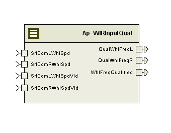

> **Converted document.** Source: `GM_C1XX_EPS_TMS570/SwProject/WIRInputQual/doc/WIR_Input_Qualification_MDD.docx` (Word .docx, converted automatically; formatting, tables and figures preserved as Markdown — consult the original for normative layout).

## pointsModule  --

## High-Level Description

This module is responsible for performing the qualification of the Wheel Speed inputs to the Wheel Imbalance Rejection algorithm.

## Figures

### Diagram – Function Data Sharing

This diagram shows all data that is shared between functions within the module.

No Shared Data

#### Diagram – Function (Name)

This diagram describes the functional characteristics and data flow of a given function.

## Variable Data Dictionary

For details on module input / output variable, refer to the Data Dictionary for the application.  Input / output variable names are listed here for reference.

| Module Inputs | Module Outputs | Module Outputs |
| --- | --- | --- |
| SrlComLWhlSpdVld_Cnt_lgc | SrlComLWhlSpdVld_Cnt_lgc | QualWhlFreqL_Hz_f32 |
| SrlComRWhlSpdVld_Cnt_lgc | SrlComRWhlSpdVld_Cnt_lgc | QualWhlFreqR_Hz_f32 |
| SrlComLWhlSpd_Hz_f32 | SrlComLWhlSpd_Hz_f32 | WhlFreqQualified_Cnt_lgc |
| SrlComRWhlSpd_Hz_f32 | SrlComRWhlSpd_Hz_f32 |  |

### Module Internal Variables

This section identifies the name, range and resolutions for module specific data created by this module.  If there are no range restrictions on the variable, the term “FULL” is placed into the table for legal range.

| Variable Name | Resolution | Legal Range | Legal Range | Software Segment |
| --- | --- | --- | --- | --- |
| PrevQualWhlSpdLeft_Hz_M_f32 | single precision float | 0 | 40 | CLEARED_32 |
| PrevQualWhlSpdRight_Hz_M_f32 | single precision float | 0 | 40 | CLEARED_32 |
| QualLevelLeft_Cnt_M_u16 | 1 | 0 | 10 | CLEARED_16 |
| QualLevelRight_Cnt_M_u16 | 1 | 0 | 10 | CLEARED_16 |
| QualErrAccLeft_Cnt_M_u16 | 1 | FULL | FULL | CLEARED_16 |
| QualErrAccRight_Cnt_M_u16 | 1 | FULL | FULL | CLEARED_16 |

#### User defined typedef definition/declaration

This section documents any user types uniquely used for the module.

| Typedef Name | Element Name | User Defined Type | Legal Range | Legal Range |
| --- | --- | --- | --- | --- |
| None |  |  |  |  |

## Constant Data Dictionary

### Calibration Constants

This section lists the calibrations used by the module.  For details on calibration constants, refer to the Data Dictionary for the application.

| Constant Name |
| --- |
| k_WhlSpdQPStep_Cnt_u16 |
| k_WhlSpdQLimit_Cnt_u16 |
| k_WhlSpdQNStep_Cnt_u16 |
| t_FreqScaleTblX_Hz_u7p9 |
| k_WhlSpdQualDiag_Cnt_Str |

### Program(fixed) Constants

#### Embedded Constants

All embedded constants whose values are provided in Eng units will be evaluated to the equivalent counts by using the FPM_InitFixedPoint_m() macro within the #define statement.

##### Local

| Constant Name | Resolution | Units | Value |
| --- | --- | --- | --- |
| D_WHLSPDMIN_HZ_F32 | single precision float | Hz | 0 |
| D_WHLSPDMAX_HZ_F32 | single precision float | Hz | 40 |

##### Global

This section lists the global constants used by the module.  For details on global constants, refer to the Data Dictionary for the application.

| Constant Name |
| --- |
| <None> |

#### Module specific Lookup Tables Constants

(This is for lookup tables (arrays) with fixed values, same name as other tables)

| Constant Name | Resolution | Value | Software Segment |
| --- | --- | --- | --- |
| None |  |  |  |

## Functions/Macros used by the Sub-Modules

### Library Functions / Macros

The library and functions / Macros that are called by the various sub modules are identified below,

1. Limit_m
2. Min_m
3. FPM_FloatToFixed_m
4. DiagPStep_m
5. DiagNStep_m
6. DiagFailed_m
### Data Hiding Functions

1. <None>
### Global Functions/Macros Defined by this Module

#### Global Function #1

| **Function Name** | None | Type | Min | Max | UTP Tol. |
| --- | --- | --- | --- | --- | --- |
| **Arguments Passed ** |  |  |  |  |  |
| **Return Value** |  |  |  |  |  |

##### Description

(Place flowchart/design for local function)

### Local Functions/Macros Used by this MDD only

#### Qualify Wheel Speed

| **Function Name** | QualifyWhlSpd | Type | Min | Max | UTP Tol. |
| --- | --- | --- | --- | --- | --- |
| **Arguments Passed ** | WhlSpd_Ptr_T_f32 | pointer to float32 | 0 | 40 |  |
|  | PrevQualWhlSpd_Ptr_T_f32 | pointer to float32 | 0 | 40 |  |
|  | WhlSpdValid_Cnt_T_lgc | boolean | FALSE | TRUE |  |
|  | QualLevel_Ptr_T_u16 | pointer to uint16 | 0 | 10 |  |
| **Return Value** | N/A |  |  |  |  |

##### Description

#### Wheel Speed In Range Check

| **Function Name** | WhlSpdInRange | Type | Min | Max | UTP Tol. |
| --- | --- | --- | --- | --- | --- |
| **Arguments Passed ** | WhlSpd_Hz_T_f32 | float32 | 0 | 40 |  |
| **Return Value** | InRange_Cnt_T_lgc | boolean | FALSE | TRUE | 0 |

##### Description

#### Wheel Speed Qualification Check

| **Function Name** | WhlSpdQualCheck | Type | Min | Max | UTP Tol. |
| --- | --- | --- | --- | --- | --- |
| **Arguments Passed ** | QualLevel_Cnt_T_u16 | uint16 | 1 | 10 |  |
|  | InRange_Cnt_T_lgc | boolean | FALSE | TRUE |  |
|  | QualErrAcc_Ptr_T_u16 | pointer to uint16 | FULL | FULL |  |
| **Return Value** | WhlSpdQualfied_Cnt_T_lgc | Boolean | FALSE | TRUE | 0 |

##### Description

## Software Module Implementation

### Runtime Environment (RTE) Initial Values

This section lists the initial values of data written by this module but controlled by the RTE. After RTE initialization, the data in this table will contain these values.

| Data | Value |
| --- | --- |
| SrlComLWhlSpdVld_Cnt_lgc | FALSE |
| SrlComRWhlSpdVld_Cnt_lgc | FALSE |
| SrlComLWhlSpd_Hz_f32 | 0 |
| SrlComRWhlSpd_Hz_f32 | 0 |
| QualWhlFreqL_Hz_f32 | 0 |
| QualWhlFreqR_Hz_f32 | 0 |
| WhlFreqQualified_Cnt_lgc | TRUE |

### Initialization Functions

None

### Periodic Functions

#### Per: _Per1

##### Design Rationale

None

##### Program Flow Start

Rte_Call_WIRInputQual_Per1_CP0_CheckpointReached()

##### Store Module Inputs to Local copies

WhlSpdLeftValid_Cnt_T_lgc = Rte_IRead_WIRInputQual_Per1_SrlComLWhlSpdVld_Cnt_lgc()

WhlSpdLeft_Hz_T_f32 = Rte_IRead_WIRInputQual_Per1_SrlComLWhlSpd_Hz_f32()

WhlSpdRightValid_Cnt_T_lgc = Rte_IRead_WIRInputQual_Per1_SrlComRWhlSpdVld_Cnt_lgc()

WhlSpdRight_Hz_T_f32 = Rte_IRead_WIRInputQual_Per1_SrlComRWhlSpd_Hz_f32()

##### Processing

##### Store Local copy of outputs into Module Outputs

Rte_IWrite_WIRInputQual_Per1_QualWhlFreqL_Hz_f32(WhlSpdLeft_Hz_T_f32)

Rte_IWrite_WIRInputQual_Per1_QualWhlFreqR_Hz_f32(WhlSpdRight_Hz_T_f32)

Rte_IWrite_WIRInputQual_Per1_WhlFreqQualified_Cnt_lgc(WhlFreqQualified_Cnt_T_lgc)

##### Program Flow End

Rte_Call_WIRInputQual_Per1_CP1_CheckpointReached()

### Fault Recovery Functions

None

### Shutdown Functions

None

### Interrupt Functions

None

### Serial Communication Functions

None

## Execution Requirements

### Execution Sequence of the Module

(Describe in words relevant details about the execution sequence of the different sub modules.)

### Execution Rates for sub-modules called by the Scheduler

This table serves as reference for the Scheduler design

| Function Name | Calling Frequency | System State(s) in which the function is called |
| --- | --- | --- |
| WIRInputQual_Per1 | 2ms | ALL |

### Execution Requirements for Serial Communication Functions

| Function Name | Sub-Module called by (Serial Comm Function Name) |
| --- | --- |
| <None> |  |

## Memory Map Definition Requirements

### Sub Modules (Functions)

This table identifies the software segments for functions identified in this module.

| Name of Sub Module | Software Segment |
| --- | --- |
| WIRInputQual_Per1 | RTE_START_SEC_AP_WIRINPUTQUAL_APPL_CODE |

### Local Functions

This table identifies the software segments for local functions identified in this module.

| Name of Sub Module | Software Segment |
| --- | --- |
| QualifyWhlSpd | N/A (Inline with calling function) |
| WhlSpdInRange | N/A (Inline with calling function) |
| WhlSpdQualCheck | N/A (Inline with calling function) |

## Known Issues / Limitations With Design

1. Inline function defined in globalmacro.h are not unit tested
## Revision Control Log

| **Item #** | **Rev #** | **Change Description** | **Date ** | **Author Initials** |
| --- | --- | --- | --- | --- |
| 1 | 1 | Initial version | 29-July-13 | LWW |
