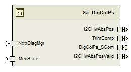
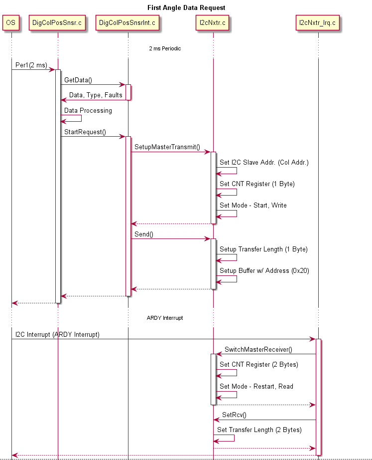
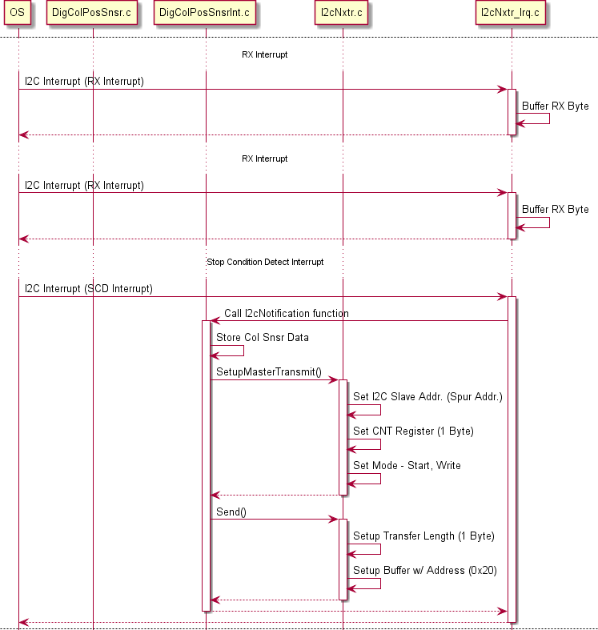
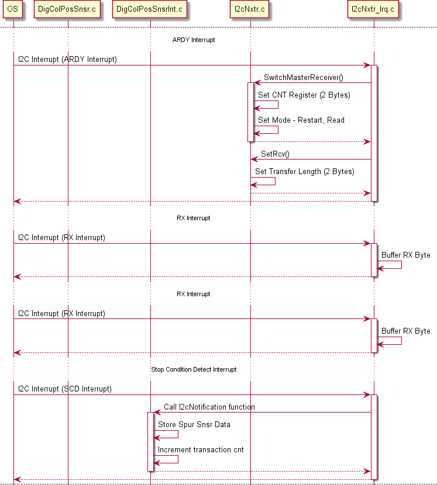
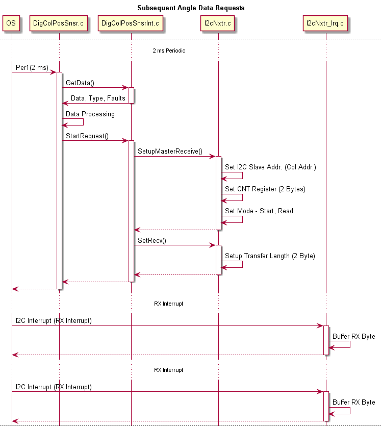
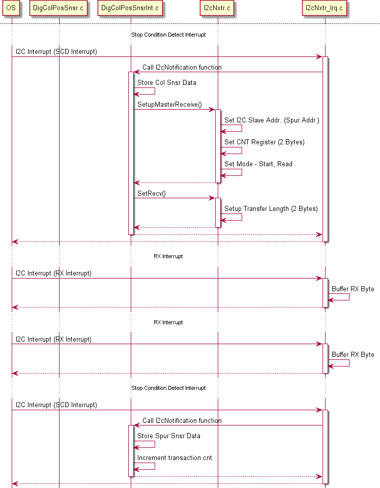

> **Converted document.** Source: `DigColPs/doc/DigColPs_MDD.docx` (Word .docx, converted automatically; formatting, tables and figures preserved as Markdown — consult the original for normative layout).

**Module Design Document**

**For**

**DigColPs**

**VERSION: ****1**

**DATE: ****-2016**

**Prepared By: **

**Software Engineering Group****,**

**Nexteer Automotive,**

** Saginaw,** **MI****, ****USA**

**Location:** The official version of this document is stored in the Nexteer Configuration Management System.

**Revision History**

| **Sl. No.** | **Description** | **Author** | **Version** | **Date** |
| --- | --- | --- | --- | --- |
| 1 | Initial component creation | Jared | 1 | 21-Aug-13 |
| 2 | Updates for anomalies 5895, 5906, and 5721 – vernier fault polarity, filter init, and new TrimComplete output | Jared | 2 | 20-Nov-13 |
| 3 | Updated for FDD rev.003. | Rijvi | 3 | 03-Mar-14 |
| 4 | Updated for FDD rev.005 | Rijvi | 4 | 20-Mar-14 |
| 5 | Updated for FDD rev.006 | Rijvi | 5 | 26-Mar-14 |
| 6 | Updated for FDD rev 007. A6680 fix added | Selva | 6 | 13-May-14 |
| 7 | Updated to FDD rev 008 | Jared | 7 | 27-Jun-14 |
| 8 | Updated to FDD rev 009, v10,  v11 | Selva | 8 | 31-July-14 |
| 9 | Ranges updated for UTP; | Selva | 9 | 10-Oct-14 |
| 10 | Fixed Anomaly EA31992 : Position Trim data loss if read all does not complete | JK | 10 | 20-Jul-15 |
| 11 | Updated to FDD rev 015 | JK | 11 | 05-May-16 |
| 12 | Updated to FDD rev 016 | JK | 12 | 31-May-16 |
| 13 | Updated for utp comments | JK | 13 | 27-Jul-16 |

**Table of Contents**

## Abbrevations And Acronyms

| Abbreviation | Description |
| --- | --- |
| DFD | Design functional diagram |
| MDD | Module design Document |
|  | <ADD  more to the table if applicable> |

## References

| Sr. No. | Title | Version |
| --- | --- | --- |
| 1 | MDD Guidelines | EA3 01.04.00 |
| 2 | Software Naming Conventions | 2.0 |
| 3 | Coding standards | 2.1 |
| 4 | ES 20D FDD | 01 |
|  | <Add if more available> |  |

## DIGCOLPS & High-Level Description

The digital column position sensor component reads sensor data from the digital column position sensor interface and processes the raw angle data into handwheel position in degrees and determines the validity of that angle

## Design details of software module

### Graphical representation of DIGCOLPS

### Data Flow Diagram

### Sub-Module level DFD

None

### COMPONENT FLOW DIAGRAM

None

## Variable Data Dictionary

### User defined typedef definition/declaration

| Typedef Name | Element Name | User Defined Type | Legal Range | Legal Range |
| --- | --- | --- | --- | --- |
| None | - | - | - | - |

### Variable definition for enumerated types

| Enum  Name | Element Name | Value |
| --- | --- | --- |
| None | - | - |
| None | - | - |
| None | - | - |

## Constant Data Dictionary

### Program(fixed) Constants

### Embedded Constants

### Local

| Constant Name | Resolution | Units | Value |
| --- | --- | --- | --- |
| D_INVSPURRATIO_ULS_F32 | Single Precision Float | Uls | (1.0F / 2.2F) |
| D_SPURRATIO_ULS_F32 | Single Precision Float | Uls | 2.2F |
| D_INVDUALSPURRATIO_ULS_F32 | Single Precision Float | Uls | (1.0F / 2.0F) |
| D_DUALSPURRATIO_ULS_F32 | Single Precision Float | Uls | 2.0F |
| D_ONEREV_DEGREESPREV_F32 | Single Precision Float | Deg/Rev | 360.0F |
| D_VERNIERANGLECENTEROFF_DEG_F32 | Single Precision Float | Deg | 900.0F |
| D_HWANGLEATCENTER_DEG_F32 | Single Precision Float | Deg | 180.0F |
| D_ANGLEZEROODDPARITY_CNT_U16 | 1 | Cnt | 0x1000U |
| D_ANGLEDATA_CNT_U08 | 1 | Cnt | 1U |
| D_ERRORREG_CNT_U08 | 1 | Cnt | 3U |
| D_EXTERRORREG_CNT_U08 | 1 | Cnt | 4U |
| D_MAXHWPOS_HWDEG_F32 | Single Precision Float | HwDeg | 900.0F |
| D_VERNIERLEVEL_CNT_U08 | 1 | Cnt | 0U |
| D_COLUMNREVS_CNT_U08 | 1 | Cnt | 1U |
| D_SPURREVS_CNT_U08 | 1 | Cnt | 2U |
| D_VERNIERLEVELNO_CNT_U08 | 1 | Cnt | 3U |
| D_COLSPURTBLXSIZE_CNT_U08 | 1 | Cnt | 17U |
| D_DUALSPURTBLXSIZE_CNT_U08 | 1 | Cnt | 22U |
| D_TRIMCOMPLETE_CNT_U16 | 1 | Cnt | 1U |
| D_TRIMNOTCOMPLETE_CNT_U16 | 1 | Cnt | 4488U |
| D_I2CHWTRIMTRANSCNT_ULS_U08 | 1 | Uls | 6U |
| D_I2CHWORIGINALSENSOR_CNT_U16 | 1 | Cnt | 0x0000U |
| D_I2CHWTRIMINSENSOR_CNT_U16 | 1 | Cnt | 0x0001U |
| D_I2CHWDUALSPURSENSOR_CNT_U16 | 1 | Cnt | 0x0002U |
| D_I2HW11TO10TRATIO_ULS_F32 | Single Precision Float | Uls | 1.1F |
| D_SNSRREINITTIME_MS_U32 | 1 | mS | 10U |
| D_SNSRERRORBIT_CNT_U16 | 1 | Cnt | 0x4000U |
| D_ANGREGIDBIT_CNT_U16 | 1 | Cnt | 0x8000U |
| D_ANGLEMASK_CNT_U16 | 1 | Cnt | 0x0FFFU |
| D_COMMORPARITYERR_CNT_U08 | 1 | Cnt | 0x3E |

### Global

| Constant Name |
| --- |
| None |

### Module specific Lookup Tables Constants

| Constant Name | Resolution | Value | Software Segment |
| --- | --- | --- | --- |
| T2_ColSpurVernierLUT_Cnt_s16 | 1 | { | DIGCOLPS_START_SEC_CONST_16 |
| T2_DualSpurVernierLUT_Cnt_s16 | 1 | { | DIGCOLPS_START_SEC_CONST_16 |

## Software Module Implementation

### Sub-Module Functions

None

### Initialization Functions

### Init: DIGCOLPS_Init1

### Design Rationale

None

### Module Outputs

None

### PERIODIC FUNCTIONS

### Per: DIGCOLPS_Per1

### Design Rationale

This periodic function is responsible for processing all the sensor related communication faults,parity error bits for both Column and Spur sensors.It also performs the diagnostics for I2C Communication fault NTC-0X6D.

Additionaly this periodic function supports sensor to recover in case of EMC failure.

### Store Module Inputs to Local copies

None

### (Processing of function)………

Refer to Simulink model in FDD

### Store Local copy of outputs into Module Outputs

None

### Per: DIGCOLPS_Per2

### Design Rationale

This periodic function calculates the absolute Handwheel angles  and its validity based on the Vernier Look up table implementation and also performs the diagnostic functions related to Vernier Data and Sensor Error Data

### Store Module Inputs to Local copies

MecState_Cnt_T_enum = Rte_IRead_DigColPs_Per2_MecState_Cnt_enum()

### (Processing of function)………

Refer to Simulink model in FDD

### Store Local copy of outputs into Module Outputs

Rte_IWrite_DigColPs_Per2_I2CHwAbsPosValid_Cnt_lgc(I2CHwPosValid_Cnt_T_lgc)

Rte_IWrite_DigColPs_Per2_I2CHwAbsPos_HwDeg_f32(I2CAbsHwPos_HwDeg_T_f32)

Rte_IWrite_DigColPs_Per2_TrimComp_Cnt_lgc(TrimComplete_Cnt_T_lgc)

### Per: DIGCOLPS_Per3

### Design Rationale

None

### Store Module Inputs to Local copies

None

### (Processing of function)………

Refer to Simulink model in FDD

### Store Local copy of outputs into Module Outputs

None

### Non PERIODIC FUNCTIONS

None

### Interrupt Functions

None

### Serial Communication Functions

### SComm: DigColPs_SCom_CustClrTrim

### Design Rationale

This function performs the customer clear trim functionality for Column and Spur angles

### Store Module Inputs to Local copies

None

### (Processing of function)………

Refer to Simulink model in FDD

### Store Local copy of outputs into Module Outputs

None

### SComm: DigColPs_SCom_CustSetTrim

### Design Rationale

This function performs the customer set trim functionality for Column and Spur angles

### Store Module Inputs to Local copies

None

### (Processing of function)………

Refer to Simulink model in FDD

### Store Local copy of outputs into Module Outputs

None

### SComm: DigColPs_SCom_NXTRClrTrim

### Design Rationale

This function performs the Nexteer manufacturing service clear trim functionality for Column and Spur angles

### Store Module Inputs to Local copies

None

### (Processing of function)………

Refer to Simulink model in FDD

### Store Local copy of outputs into Module Outputs

None

### SComm: DigColPs_SCom_NXTRSetTrim

### Design Rationale

This function performs the Nexteer manufacturing service set trim functionality for Column and Spur angles

### Store Module Inputs to Local copies

None

### (Processing of function)………

Refer to Simulink model in FDD

### Store Local copy of outputs into Module Outputs

None

### Local Function/Macro Definitions

### Local Function #1

| **Function Name** | OddParityFault | Type | Min | Max |
| --- | --- | --- | --- | --- |
| **Arguments Passed ** | Input_Cnt_T_u16 | uint16 | 0U | 65535U |
| **Return Value** | Error_Cnt_T_lgc | boolean | FALSE | TRUE |

### Description

Refer to “OddParityFault” block in Per1 of Simulink model in FDD

### Local Function #2

| **Function Name** | DiagnosticThreshold | Type | Min | Max |
| --- | --- | --- | --- | --- |
| **Arguments Passed ** | FaultPresent_Cnt_T_lgc | boolean | FALSE | TRUE |
| **Arguments Passed ** | AccumulatorPtr_Cnt_T_u16 | DiagSettings_Cnt_T_str | FULL | FULL |
| **Return Value** | DiagFailed_Cnt_T_lgc | boolean | FALSE | TRUE |

### Description

Refer to “Diagnostic Threshold” block in Per2 of Simulink model in FDD

### LOCALFUCNTION #3

| **Function Name** | VernierLookup | Type | Min | Max |
| --- | --- | --- | --- | --- |
| **Arguments Passed ** | VernierLUT_Cnt_T_s16 | boolean | See 6.1.2 | See 6.1.2 |
| **Arguments Passed ** | LookupTableXSize_Cnt_T_u08 | DiagSettings_Cnt_T_str | 17U* | 22U* |
| **Arguments Passed ** | Level_Deg_T_f32 | Deg | -792.0F | 360.0F |
| **Arguments Passed ** | ColRevPtr_Cnt_T_u08 | Cnt | 0U | 9U |
| **Arguments Passed ** | SpurRevPtr_Cnt_T_u08 | Cnt | 0U | 10U |
| **Arguments Passed ** | VernierLevelNo_Cnt_T_u08 | Cnt | 1U | 22U |
| **Return Value** | None | - | - | - |
| * LookupTableXSize_Cnt_T_u08  table can be of two size (17 or 22). It’s not a range but two discrete values | * LookupTableXSize_Cnt_T_u08  table can be of two size (17 or 22). It’s not a range but two discrete values | * LookupTableXSize_Cnt_T_u08  table can be of two size (17 or 22). It’s not a range but two discrete values | * LookupTableXSize_Cnt_T_u08  table can be of two size (17 or 22). It’s not a range but two discrete values | * LookupTableXSize_Cnt_T_u08  table can be of two size (17 or 22). It’s not a range but two discrete values |

### Description

Refer to “Vernier Level & Revolution Calc” block in Per2 of Simulink model in FDD

### Local Function #4

| **Function Name** | ComputeRoughTurns | Type | Min | Max |
| --- | --- | --- | --- | --- |
| **Arguments Passed ** | Delta_Deg_T_f32 | float32 | -360.0F | 360.0F |
| **Arguments Passed ** | RoughTurnAccPtr_Cnt_T_s16 | sint16 | -5 | 5 |
| **Return Value** | RoughTurnCount_Deg_T_f32 | float32 | -1800.0F | 1800.0F |

### Description

Refer to “Compute Rough Turns” block in Per1 of Simulink model in FDD

### Local Function #5

| **Function Name** | ConstrainOneRevs | Type | Min | Max |
| --- | --- | --- | --- | --- |
| **Arguments Passed ** | Input_Deg_T_f32 | float32 | -1800.0F | 1800.0F |
| **Return Value** | Input_Deg_T_f32 | float32 | 0.0F | 360.0F |

### Description

Refer to “ConstrainOneRev” block in Per1 of Simulink model in FDD

### Local Function #6

| **Function Name** | I2CCommFltDiag | Type | Min | Max |
| --- | --- | --- | --- | --- |
| **Arguments Passed ** | I2CSensCommFlts_Cnt_T_u08 | uint8 | 0U | 255U |
| **Return Value** | None | - | - | - |

### Description

Refer to “I2C Diagnostic” block in Per1 of Simulink model in FDD

### Local Function #7

| **Function Name** | I2CSnsrDataCheck | Type | Min | Max |
| --- | --- | --- | --- | --- |
| **Arguments Passed ** | I2CHwColAngle_Cnt_T_u16 | uint16 | 0U | 65535U |
| **Arguments Passed ** | I2CHwSpurAngle_Cnt_T_u16 | uint16 | 0U | 65535U |
| **Arguments Passed ** | ColSensorFault_Cnt_T_lgc | boolean | FALSE | TRUE |
| **Arguments Passed ** | SpurSensorFault_Cnt_T_lgc | boolean | FALSE | TRUE |
| **Arguments Passed ** | ColRegisterFaultCnt_T_lgc | boolean | FALSE | TRUE |
| **Arguments Passed ** | SpurRegisterFaultCnt_T_lgc | boolean | FALSE | TRUE |
| **Return Value** | None | - | - | - |

### Description

This function is responsible for checking sensor related data the I2C receives like Sensor Faults,Register Faults

for both column and spur angles.

### Local Function #8

| **Function Name** | I2CSnsrReInitMaxTry | Type | Min | Max |
| --- | --- | --- | --- | --- |
| **Arguments Passed ** | I2CSensCommFlts_Cnt_T_u08 | uint8 | 0U | 255U |
| **Return Value** | I2CHwDataType_Cnt_T_u08 | uint8 | 0U | 4U |

### Description

Refer to “Max Try Logic” block in Per1 of Simulink model in FDD

### Local Function #9

| **Function Name** | SnsrFltDiag | Type | Min | Max |
| --- | --- | --- | --- | --- |
| **Arguments Passed ** | I2CHwColAngle_Cnt_T_u16 | uint16 | 0U | 65535U |
| **Arguments Passed ** | I2CHwSpurAngle_Cnt_T_u16 | uint16 | 0U | 65535U |
| **Arguments Passed ** | I2CHwDataType_Cnt_T_u08 | uint8 | 0U | 4U |
| **Arguments Passed ** | I2CSensCommFlts_Cnt_T_u08 | uint8 | 0U | 255U |
| **Arguments Passed ** | ColParityErrorEvt_Cnt_T_lgc | boolean | FALSE | TRUE |
| **Arguments Passed ** | SpurParityErrorEvt_Cnt_T_lgc | boolean | FALSE | TRUE |
| **Return Value** | None | - | - | - |

### Description

Refer to “Get Sensor Fault Parameter Data ” block in Per2 of Simulink model in FDD

### Local Function #10

| **Function Name** | VernCorrlnFltDiag | Type | Min | Max |
| --- | --- | --- | --- | --- |
| **Arguments Passed ** | VernCorrDetect_Cnt_T_lgc | boolean | FALSE | TRUE |
| **Arguments Passed ** | SkipStepFltDetect_Cnt_T_lgc | boolean | FALSE | TRUE |
| **Return Value** | None | - | - | - |

### Description

This function is responsible for setting /reset the NTC 0x6C - NTC_Num_HWACrossChecks based on the inputs vernier correlation fault ,skip step fault and vernier out of range error.

### Local Function #11

| **Function Name** | ChkVernCorrlnError | Type | Min | Max |
| --- | --- | --- | --- | --- |
| **Arguments Passed ** | VernierLevelNo_Cnt_T_u08 | uint8 | 1U | 22U |
| **Arguments Passed ** | VernDiagError_Deg_T_f32 | float32 | -1800.0F | 1800.0F |
| **Arguments Passed ** | TrimComplete_Cnt_T_lgc | boolean | FALSE | TRUE |
| **Return Value** | VernCorrDetect_Cnt_T_lgc | boolean | FALSE | TRUE |

### Description

Refer to “Check Vernier Correlation Error” block in Per1 of Simulink model in FDD

### Local Function #12

| **Function Name** | ChkSkipStepError | Type | Min | Max |
| --- | --- | --- | --- | --- |
| **Arguments Passed ** | AbsVernLevelDiff_Cnt_T_u08 | uint8 | 0U | 22U |
| **Arguments Passed ** | TrimComplete_Cnt_T_lgc | boolean | FALSE | TRUE |
| **Return Value** | SkipStepFltDetect_Cnt_T_lgc | boolean | FALSE | TRUE |

### Description

Refer to “Check Skip Step Error” block in Per1 of Simulink model in FDD

### GLObAL Function/Macro Definitions

### GLObAL Function #1

| **Function Name** | None | Type | Min | Max |
| --- | --- | --- | --- | --- |
| **Arguments Passed ** | - | - | - | - |
| **Return Value** | - | - | - | - |

### Description

(Place flowchart/design for local function)

None

### TRANSIENT FUNCTIONS

None

## Unit Test Considerations

None

## Known Limitations With Design

None

## UNIT TEST CONSIDERATION

None

## Appendix

None
